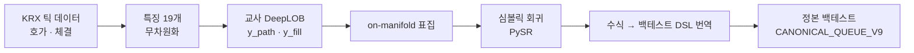

# Symbolic Finance

**KRX 틱 데이터 → DeepLOB → 심볼릭 증류 → 진입 조건 수식**

한국 주식 틱 데이터로 시계열 딥러닝 모델(DeepLOB)을 학습하고, 그 모델을 **심볼릭 증류**해 사람이 읽을 수 있는 짧은 **진입 조건 수식**("언제 사는가")으로 바꾼 뒤, 청산 규칙을 고정한 정본 백테스트로 검증한 연구 기록이다.
기간은 2026-09-03 ~ 2026-09-14이다.

> **심볼릭 증류**: 복잡한 딥러닝 모델(교사)의 예측을 짧은 수식으로 근사하는 방법. 딥러닝이 잡음을 걸러 준 신호 위에서 수식을 찾기 때문에, 원데이터에 곧바로 수식 탐색을 돌릴 때보다 잡음을 덜 외운다.

전체 과정·수치·해석은 **[`EXPERIMENT-RECORD.md`](EXPERIMENT-RECORD.md)** 에 한곳에 모여 있다. 이 README는 그 입구다.

---

## 한 줄 결론

> **수식을 뽑아내는 장치는 제대로 작동한다. 그런데 딥러닝이 시장에서 읽어내는 신호 자체가 작다.**
> 안 본 종목·안 본 날 기준 설명력(R²)은 어떤 방식으로 해도 0.01~0.03이고, 이 정도로는 왕복 수수료 23bp를 넘지 못한다.
> 데이터를 22배로 늘리면 조금 오르고(+0.003), 틱 크기로 종목을 나눠도 "되는 종목군"이 따로 떨어져 나오지 않는다.

---

## 파이프라인



| 설계 장치 | 뜻 |
| --- | --- |
| **청산 고정** | 진입과 청산을 함께 찾으면 무엇이 성과를 만들었는지 가를 수 없다. 청산을 못 박아 미지수를 진입식 하나로 줄인다 |
| **검증 관문** | 본 실험 전에, 답이 알려진 시장 미시구조 법칙 5개(마이크로프라이스 · 주문흐름 선형 · 집계 임팩트 · 다중 스케일 변동성 · 체결 군집)를 증류로 되찾을 수 있는지 먼저 본다 |
| **on-manifold 표집** | 실제 시장에 존재하는 상태 근처에서만 교사에게 질의한다 |
| **무차원화** | 가격·시간·수량을 스프레드·평균 잔량 등 자연 단위로 나눠 종목을 가로지르는 수식이 나오게 한다 |
| **다중 시험 계산** | 수식 후보 40개는 백테스트를 40번 한 것으로 취급하고 시도 횟수를 기록한다 |

**실행 계약** (`CANONICAL_QUEUE_V9`, 탐색하지 않는 상수):

```
진입   BID1 지정가, 10초 / 100틱 안에 체결 대기
청산   gross −120bp 손절 · 최고 ASK1 대비 −30bp 추적 손절 · 최대 보유 900초
비용   왕복 23bp (스프레드는 체결가에 이미 포함)
```

**예측 대상 `y_path`**: 진입 후 30초 뒤 BID1로 팔았을 때의 순수익(수수료 차감)을 진입 시점의 (스프레드 + 수수료)로 나눈 값. 체결 여부 `y_fill`도 함께 학습한다.

---

## 단계별 흐름

| 폴더 | 기간 | 한 일 | 결론 |
| --- | --- | --- | --- |
| [`0902`](0902/) 파이프라인 구축 | 09-03 ~ 09-09 | 틱 적재 → 교사 → 심볼릭 회귀 → 수식 번역 → 정본 백테스트를 끝까지 잇기. 검증 관문 1·2차 | 파이프라인은 돈다. 관문은 5개 중 1개만 통과해 **중단** |
| [`0909`](0909/) 관문 실패 원인 규명 | 09-09 ~ 09-10 | 법칙을 증류 없이 데이터에서 직접 측정, 교사 채점을 안 본 종목 기준으로, 관문 재설계 두 번 | 증류는 데이터에 **있는 법칙은 찾고 없는 법칙은 못 찾는다**(5개 전부 일치). 관문을 고치니 **진행** |
| [`0910`](0910/) 본 실험 | 09-10 ~ 09-11 | 전종목 하루치로 DeepLOB 학습 → 증류 → 진입 수식 → 백테스트, 시드 3개 | 수식은 경제적으로 말이 되고 시드 간 재현된다. 그러나 **모든 층에서 손실**, 성공 주장 불가 |
| [`0911`](0911/) 데이터 규모·종목군 진단 | 09-11 ~ 09-14 | ① 3일 전체 학습 → 다음 날 시험 ② 틱 크기별 종목군 분석 ③ 학습 데이터 양에 따른 R² 곡선 | 데이터 증가 효과 **있으나 작음**. 종목군 판정 **애매**. 곡선은 **포화** |

---

## 주요 결과

### 교사(DeepLOB) 설명력 — 안 본 종목 기준

| 실험 | 학습 데이터 | 평가 | R² |
| --- | --- | --- | --- |
| 0910 본 실험 | 하루, 저마찰 종목 20만 행 | 같은 날 중간마찰 종목 | 0.0150 ~ 0.0153 (시드 3개) |
| 0911 곡선 | 3일 풀에서 20만 ~ 200만 행 | 같은 기간 중간마찰 종목 | 0.0179 ~ 0.0213 |
| 0911 종목군 분석 | 이틀, 200만 행 | 다음 날, 안 본 종목 | 0.0091 |
| 0911 3일 전체 학습 | 3일, 4,444만 행 | 다음 날, 안 본 종목 | **0.0122** |

### 0910 — 증류된 진입 수식과 경제성

시드 2의 1순위 수식 (상위 5%에서 매수):

```
tanh(호가불균형 + 큐불균형·공격적주문흐름20 + 공격적주문흐름100 + 스프레드비용비) · 0.1385 − 1.0886
```

"사겠다는 쪽이 많고, 최근 사들이는 체결이 몰렸고, 비용 대비 스프레드가 유리할 때 산다." 시드 1도 독립적으로 같은 형태에 도달했다.

| 의사결정당 손익 (bps) | 저마찰 L (학습) | 중간 M (선택) | 고마찰 H (최종 평가) |
| --- | --- | --- | --- |
| 시드 1 | −0.980 | −0.576 | **−0.415** |
| 시드 2 | −0.974 | −0.528 | **−0.460** |
| 나이브 (`book_imbalance`) | −1.193 | −0.781 | −0.797 |
| 영점 근사 | −1.773 | −1.240 | −1.222 |

- 시드 1·2는 나이브보다 약 45% 덜 잃고, 순서가 세 층에서 똑같다. 그러나 **어느 층에서도 총 순손익이 0을 넘지 못했다.**
- 실제 진입 1,031번의 원장 분해: **방향이 계속 틀림 70%** · 수익 남김 14% · 방향은 맞는데 비용 못 넘김 13% · 초반 오르다 뒤집힘 3%. 비용이 아니라 방향이 문제이므로 임계나 보유 시간 조정으로는 고쳐지지 않는다.

### 0911 — R²가 낮은 이유

| 후보 | 답 |
| --- | --- |
| 데이터가 부족했다 | **조금 맞다.** 3일·22배로 늘리면 ΔR² **+0.00309** [+0.00208, +0.00576] (종목 단위 짝지은 부트스트랩). 그러나 곡선은 금방 평평해지고 절대 수준은 0.012 |
| 종목 풀이 이질적이다 | **깔끔한 분리는 없다.** 가장 나쁜 종목군도 0보다 크고, 순서가 틱 크기를 따르지 않는다. 가장 나은 곳은 큰틱·고유동 |
| DeepLOB이 선형 모델보다 나은가 | 최고점은 비슷하고, **안 본 종목에서 덜 무너진다** (릿지 대비 +0.011 [+0.003, +0.016]) |

---

## 연구 규칙

- **사전등록**: 결과를 보기 전에 판정 기준을 적고 커밋한다(`PREREG-*.md`). 실행 뒤 바꿀 일이 생기면 원문을 두고 이유를 따로 남긴다.
- **봉인 날짜**: 마지막에 단 한 번만 여는 홀드아웃. 0911부터는 `20260420` 이후 6거래일이며, **지금까지 한 번도 열지 않았다.**
- **판정 규칙은 알려진 답이 있는 합성 데이터로 먼저 돌려 본다.** 0911에서도 판정 규칙 결함 3개를 실측 전에 잡았다.
- **재고 나서 말한다.** 작은 표본을 곱해 추정했다가 여러 번 틀린 기록이 [`EXPERIMENT-RECORD.md` §8](EXPERIMENT-RECORD.md)에 남아 있다.
- **코드베이스는 `0902/` 하나.** 뒤 폴더들은 설계·실행·기록을 담고 0902 모듈을 읽기 전용으로 불러 쓴다.

---

## 레포 구성

```
.
├── EXPERIMENT-RECORD.md      전체 실험 기록 (여기서 시작)
├── SESSION-LOG.md            0902~0910 대화 흐름 기록
├── symbolic-distillation-for-market-microstructure.md   연구 계획서
├── symbolic-distillation-lecture.md                     강의: 심볼릭 증류
├── timeseries-deeplearning-lecture.md                   강의: 시계열 딥러닝
│
├── 0902/                     코드베이스 + 검증 관문 1·2차
│   ├── sd/                   파이프라인 (config · universe · ticks · labels · dimensionless ·
│   │                         manifold · teacher/ · sr/ · compile/ · replay · e0/)
│   ├── vendor/framework/     정본 백테스트 프레임워크 동결 사본 (+ sqrt·tanh 패치, PATCHES.md)
│   ├── tests/                pytest
│   └── DESIGN.md · PLAN.md · ROADMAP.md · SDD-LEDGER.md · PREREG-E0-V2.md
│
├── 0909/                     관문 실패 원인 규명
│   ├── JOURNEY.md · PROBLEMS.md · PROGRESS.md
│   ├── PREREG-{L0,T1,G2,G3}.md 와 각 REPORT
│   └── l0_measure.py · g2_*.py · g3_*.py · results/
│
├── 0910/                     본 실험
│   ├── SCALE-MEASUREMENT.md · DESIGN.md · PREREG.md · RESULTS.md · ANALYSIS.md
│   ├── MODEL-CANDIDATES.md   다음 모델 후보 조사 (TLOB/MLPLOB, LOBFrame 등)
│   ├── run/                  시드별 실행 드라이버
│   └── scale/                규모 실측 스크립트
│
├── 0911/                     데이터 규모 · 종목군 · 곡선 진단
│   ├── DESIGN.md · PREREG-GROUPS.md · PREREG-MINIBATCH.md
│   ├── RESULTS-GROUPS.md · RESULTS-MINIBATCH.md · PROGRESS.md
│   ├── scale/                학습 표본 크기 대비 R² 곡선
│   ├── groups/               종목군 분석 · 미니배치 3일 학습 · 결과 JSON
│   ├── gpu_eval/             CPU↔GPU 재현 확인
│   ├── board/                진행보드 보고서 생성
│   └── symbolic_distillation_0911_report.html
│
├── qa_benchmark_survey_0905/ 곁가지 조사: LLM으로 설계한 QA 벤치마크 33편
└── tick_backtest_survey_0909/ 곁가지 조사: 틱 데이터 백테스트 문헌 66항목
```

### 어디서부터 읽을까

1. **[`EXPERIMENT-RECORD.md`](EXPERIMENT-RECORD.md)**: 무엇을 왜 했고, 무엇이 나왔고, 어떻게 해석했는지. §10에 문서 지도가 있다.
2. 과정을 이야기로 읽고 싶으면 [`0909/JOURNEY.md`](0909/JOURNEY.md).
3. 특정 실험의 판정 근거는 해당 폴더의 `PREREG-*.md` → `RESULTS*.md` 순서로 읽는다.
4. 방법론 배경은 [연구 계획서](symbolic-distillation-for-market-microstructure.md)와 두 강의 자료.

---

## 데이터와 실행 환경

### 데이터 (레포에 포함하지 않음)

```
출처       KRX 주식 틱 데이터 (호가 · 체결)
기간       20260316 ~ 20260427, 30 거래일
종목       파일 3,726 → ETF 등 제외 2,570 → 정규장 유효 호가틱 200개 미만 제외 2,507
첫날 규모  정규장 유효 호가틱 23,091,003
3일 규모   70,001,560 행 (20260316 · 17 · 18)
```

종목은 유동성·거래비용으로 저마찰 L(837) · 중간 M(834) · 고마찰 H(836)의 세 층으로 나눈다.

### 환경

작업 서버 기준: Python 3.10 · PyTorch 2.9 (CUDA 12.8) · NumPy 2.1 · pandas 2.3 · PyArrow · SciPy · SymPy · Optuna · Numba · PySR 2.2.1 (Julia 백엔드) · pytest.
0911의 대규모 학습은 GPU(80GB급)에서 돌렸고, 그 전 단계는 CPU 결정론 위에서 돌렸다.

### 다른 환경에서 돌리려면

이 레포는 **연구 기록 보존이 1차 목적**이라 그대로 복제해서 바로 돌아가지는 않는다.

- **틱 원자료가 없다.** 경로는 [`0902/sd/config.py`](0902/sd/config.py)의 `TICK_ROOT`에 있다.
- **절대경로**: 0909~0911의 스크립트는 `/home/dgu/tick/symbolic` 절대경로로 `0902` 모듈을 불러온다. 다른 위치에 두면 이 경로를 바꿔야 한다.
- **정본 프레임워크**: `0902/vendor/framework/`는 원본 프레임워크의 동결 사본이다. `make vendor-diff`는 원본 위치와 비교하므로 원본이 없는 환경에서는 쓸 수 없다.
- **커밋에서 뺀 산출물**: 예측 parquet · 모델 가중치 · 백테스트 원장 · `0902/runs/`는 용량 때문에 커밋하지 않았다. 판정에 쓴 요약 수치는 각 폴더의 결과 JSON과 `RESULTS*.md`에 있다.
- **HTML 보고서**: `*.html` 보고서는 GitHub에서 렌더링되지 않으므로 내려받아 브라우저로 연다.

0902의 테스트와 파이프라인 실행 명령([`0902/README.md`](0902/README.md)):

```bash
cd 0902
make test-fast   # 합성 데이터 테스트만
make test        # 실데이터 테스트 포함
make slice       # 엔드투엔드 슬라이스
```

---

## 답하지 못한 것

- **증류가 기여하는가**: 증류를 뺀 비교(절제 실험)를 본 실험 규모에서 돌린 적이 없다.
- **봉인 날짜 성적**: `20260420` 이후는 열지 않았다.
- **3일 교사로 다시 증류한 수식의 성과**: 0911은 교사까지만 쟀다.
- **체결확률 헤드 보정**: 0910에서 교사 검증 게이트가 실패한 원인.
- **시험일이 하루(3/19)뿐**이라 날짜 간 변동을 모른다.

남은 선택지(3일 교사 재증류, 큰틱·고유동 종목으로 좁히기, MLPLOB 등 모델 교체, 학습 날짜 확대)는 [`EXPERIMENT-RECORD.md` §9](EXPERIMENT-RECORD.md)에 정리돼 있다.
