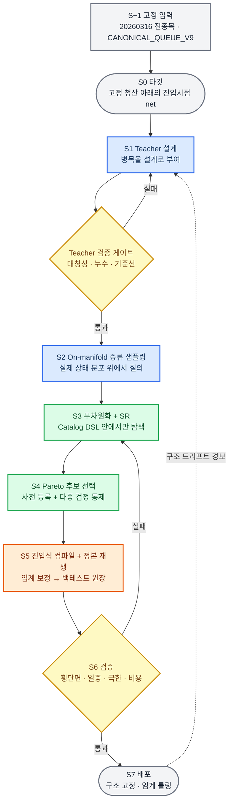
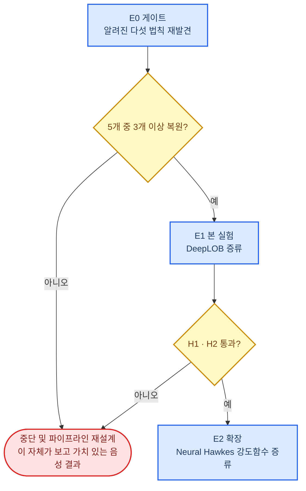
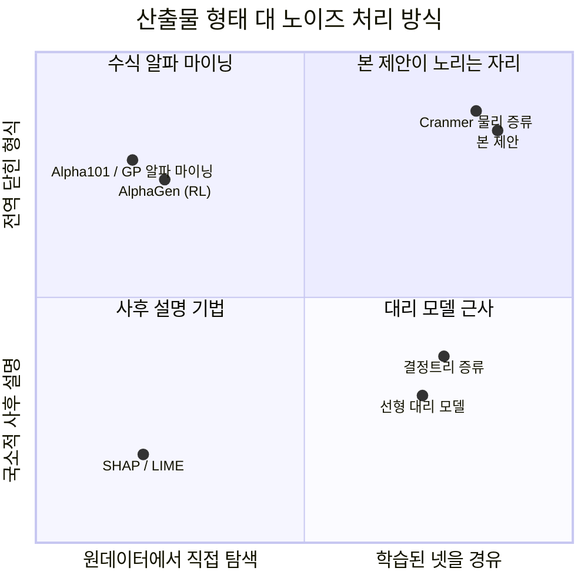

# 시장 미시구조 딥러닝 모델의 심볼릭 증류

_연구 제안서 / 방법론 스펙 — 호가창·틱 데이터를 학습한 딥러닝 모델에서 닫힌 형식(closed-form)의 미시구조 법칙을 추출한다_

| | |
| --- | --- |
| **문서 성격** | 연구 제안서 겸 방법론 사양서. 강의 자료가 아니다 |
| **선행 자료** | [`timeseries-deeplearning-lecture.md`](./timeseries-deeplearning-lecture.md) · [`symbolic-distillation-lecture.md`](./symbolic-distillation-lecture.md) |
| **주 무대** | 호가창(LOB) L2 10호가, 틱/체결 데이터 |
| **실험 입력** | KRX 틱 `20260316` **전종목** — `asset_type=ST` 2,570 종목 · 호가틱 약 2,310만 |
| **실행 기반** | `~/tick/proj_claude_tick_finance/Sandbox_12/framework` · 정본 프로필 `CANONICAL_QUEUE_V9` |
| **최종 산출물** | **LONG 진입 조건 하나.** 닫힌 형식이며 Catalog DSL로 그대로 실행된다. **청산은 백테스트가 고정 상수로 건다** |
| **대상 독자** | 두 선행 자료를 읽었고, 이 방법론을 실제로 실험에 옮기려는 사람 |
| **읽는 법** | §1–2는 왜 하는가, §3은 무엇을 만드는가, §4–7은 어떻게 반증하는가, §8–9는 어떻게 시작하는가 |

---

## 0. 요약

> **한 문장:** 호가창 딥러닝 모델을 교사로 두고, **청산 규칙을 정본 백테스트에 상수로 고정한 채**, 무차원화된 좌표계 위에서 on-manifold 질의를 통해 **닫힌 형식의 LONG 진입 조건**을 추출한 뒤, 그 진입식이 횡단면·체제 외삽 구간에서 원본 모델을 이기는지로 방법론의 성패를 판정한다.

**이 문서가 만드는 것은 딱 하나다.**

```text
입력   20260316 전종목 호가틱 (ST 2,570 종목 · 약 2,310만 호가틱)
  ↓
산출   entry_expression : 시장상태 → boolean        ← 이것 하나만 탐색한다
  ↓
평가   CANONICAL_QUEUE_V9 정본 백테스트가 실행한다
       진입   BID1 지정가, 10초 / 100틱
       청산   gross −120bp 손절 · 최고 ASK1 대비 −30bp 추적 · 최대 900초   ← 고정 상수
       비용   왕복 23bp, 스프레드는 체결가에 이미 포함
```

> 📌 **청산을 탐색하지 않는 것은 축소가 아니라 설계다.** 진입과 청산을 함께 탐색하면 자유도가 곱해지고, 어느 쪽이 성과를 만들었는지 귀속할 수 없다. 청산을 상수로 못 박으면 **미지수가 하나로 줄고**, §4의 모든 비교군이 같은 자 위에서 측정된다. 이것은 정본 백테스트 코드가 이미 강제하는 규율이기도 하다 — `not_searchable`에 청산 주문 정책이 명시되어 있다.

**핵심 주장 네 개.**

1. **금융은 심볼릭 증류가 가장 절실한 도메인이다.** 넷을 끼우는 첫 번째 이유가 노이즈 제거였는데, 금융은 설명 가능한 분산이 1% 미만인 세계다. 넷 없이 원데이터에 SR을 돌리면 100% 노이즈를 수식화한다.
2. **금융에서 압축은 해석가능성의 수단이 아니라 일반화 성능 그 자체다.** Cranmer가 관찰한 "추출된 수식이 외삽에서 원본 GNN을 이긴다"[^c20]는 현상은, 체제가 바뀌고 진짜 OOS가 언제나 외삽인 금융에서 **부수 효과가 아니라 목표**가 된다.
3. **그러나 물리의 절차를 그대로 옮기면 실패한다.** 금융에는 참 법칙의 존재를 가정할 근거가 없고, 입력 공간이 박스가 아니며, 데이터가 적대적이다. 이 문서의 실질적 내용은 그 세 가지를 각각 어떻게 메울 것인가다 — **E0 게이트**, **on-manifold 샘플링**, **무차원화 프로토콜**.
4. **금융에서 "수식"은 실행 계약과 짝을 이룰 때만 검증 가능하다.** 물리의 수식은 그 자체로 예측을 낸다. 금융의 진입식은 큐·비용·청산 규칙이 정해지기 전에는 성과가 정의되지 않는다. 그래서 이 제안은 **실행 프로토콜을 먼저 동결하고**, 그 위에서 진입식 하나만 미지수로 남긴다.

**다섯 개의 기여.**

| # | 기여 | 물리 쪽 대응물 | 왜 새로 필요한가 |
| --- | --- | --- | --- |
| **C1** | **On-manifold 증류 샘플링** | 입력 공간 균등 샘플링 | 시장 상태는 강한 공분산 구조를 가진다. 무작위 질의는 **실존하지 않는 시장 상태**에서 넷의 외삽 아티팩트를 수식화한다 |
| **C2** | **무차원화 프로토콜** | 차원 일관성 검증 | 가격·시간·수량의 자연 단위를 정의하면 탐색 공간이 붕괴하고, **종목을 가로지르는 하나의 수식**이 나온다 |
| **C3** | **구조 안정성 = 알파 소멸 탐지기** | (물리에는 없음) | 시장은 변한다. 계수 드리프트는 정상, **구조 변화는 경보**다. 넷은 이 진단을 줄 수 없다 |
| **C4** | **Pareto front를 다중 검정으로 취급** | Pareto 무릎 선택 | SR이 후보 40개를 뱉으면 백테스트 시도가 40회다. 명시적으로 할인해야 한다[^b14] |
| **C5** | **실행 계약을 상수로 동결한 증류** | (물리에는 없음) | 물리의 수식은 홀로 예측을 낸다. 진입식은 청산·큐·비용이 고정되어야 성과가 정의된다. **미지수를 진입 하나로 줄인다** |

**게이트 구조.** 이 제안은 자기 자신을 먼저 반증하려 한다. §4의 **E0**는 이미 답이 알려진 미시구조 법칙 다섯 개(마이크로프라이스, OFI 선형 법칙, 집계 임팩트 제곱근 법칙, 다중 스케일 RV 결합, Hawkes 커널)를 증류로 **재발견할 수 있는지** 검사한다. 5개 중 3개 이상 실패하면 본 실험으로 넘어가지 않는다. 단일 거래일 L2 스냅샷이라는 입력 제약 때문에 L3·L4는 원 문헌 그대로가 아니라 **하루 안에서 검사 가능한 형태로 격하**된다 — §4 E0에 그 대가를 명시한다.

---

## 1. 문제 정의

### 1.1 두 강의가 만나는 세 지점

두 선행 자료는 독립적으로 쓰였지만, 세 군데에서 정확히 맞물린다. 우연이 아니라 같은 통계적 구조 때문이다.

#### ① SNR 논리가 뒤집혀 들어맞는다

심볼릭 증류에서 딥러닝을 중간에 끼우는 첫 번째 이유는 **노이즈 제거**였다. SR은 노이즈에 극도로 취약하고, 넷은 데이터를 매끄럽게 보간해준다.

그런데 물리는 사실 SNR이 높은 도메인이다. 진자 궤적이나 N-body 시뮬레이션 데이터는 원데이터에 바로 SR을 돌려도 어느 정도 된다. 넷은 있으면 좋은 것이다.

금융은 다르다.

| | 물리 시뮬레이션 | 금융 (수익률) | 금융 (LOB 단기) |
| --- | --- | --- | --- |
| **설명 가능한 분산** | 사실상 100% | **1% 미만**[^gkx] | 수 % 수준 |
| **원데이터 직접 SR** | 대체로 작동 | **구조적으로 불가능** | 위험 |
| **넷의 역할** | 편의 | **필수 전처리** | 필수 |

> 📌 **결론:** 물리에서 딥러닝은 SR의 **보조 도구**였지만, 금융에서는 **진입 조건**이다. 노이즈가 신호의 100배인 데이터에 SR을 직접 돌리면 나오는 것은 법칙이 아니라 정교한 오버피팅이다.

#### ② "근사가 원본을 이긴다"가 생존 조건이 된다

Cranmer 논문에서 가장 반직관적인 결과는 추출된 수식이 학습 분포 밖에서 원본 GNN보다 정확했다는 것이다[^c20]. 이유는 명확하다 — 파라미터 한 개짜리 `1/r²`은 틀릴 자유도가 없다. 편향은 크지만 분산이 거의 0이다.

금융에서 이 구조는 다음과 같이 번역된다.

```text
물리:  학습 영역 밖에서도 맞는다        →  좋은 부수 효과
금융:  체제가 바뀐 뒤에도 맞는다        →  유일하게 의미 있는 성능
```

금융 시계열은 체제 자체가 바뀐다(2008, 2020-03, 금리 국면). 그래서 **진짜 아웃오브샘플은 언제나 외삽이다.** 그리고 최고 수준 학술 연구의 월별 OOS R²가 0.4%인 세계에서[^gkx], 분산을 0으로 만드는 것은 그 자체로 알파다.

<details>
<summary><strong>🔍 설계 근거 — 편향-분산으로 다시 쓰기</strong></summary>

기대 OOS 오차를 `편향² + 분산 + 잡음`으로 분해할 때, 금융은 잡음 항이 압도적으로 크다. 이 상황에서 모델 용량을 늘려 편향을 줄이는 것은 거의 이득이 없고 분산만 키운다. 반대로 용량을 극단적으로 줄이면(파라미터 3개짜리 수식) 편향이 커지지만, 애초에 편향이 전체 오차에서 차지하는 비중이 작다.

즉 **금융의 SNR 구조 자체가 심볼릭 증류에 유리한 편향-분산 균형을 만든다.** 이것이 이 제안의 이론적 근거다. GARCH(1,1)이나 HAR-RV 같은 파라미터 서너 개짜리 모델이 지금도 이기기 어려운 기준선으로 남아 있는 것도 같은 이유다[^garch][^har].

</details>

#### ③ 병목을 걸 자리가 이미 도메인 지식으로 존재한다

Cranmer 방법이 성공한 유일한 이유는 GNN 메시지 벡터에 L1을 걸어 **2~3차원 병목**을 만든 것이었다. 병목이 없으면 SR 입력이 128차원이 되고 탐색 공간이 폭발한다.

금융 딥러닝에는 그런 자리가 이미 아키텍처와 도메인 지식 안에 있다.

| 병목 후보 | 출처 | 자연 차원 | 근거 |
| --- | --- | --- | --- |
| **DeepLOB의 `1×2` 커널 출력** | Zhang et al.[^dlob] | 레벨당 소수 | "가격과 잔량은 짝"이라는 지식이 이미 커널에 새겨져 있다 |
| **주문흐름 불균형(OFI)** | Cont et al.[^ofi] | **1 (스칼라)** | 단일 변수가 단기 가격 변화를 상당 부분 선형 설명한다 |
| **큐 불균형 `I`** | Stoikov[^micro] | 1 | 마이크로프라이스의 핵심 상태변수 |
| **종목 관계 그래프의 메시지** | 관계 GNN 계열 | 설계로 지정 | Cranmer 세팅과 구조적으로 동형 |
| **Hawkes 강도 `λ(t)`** | Bacry et al.[^hawkesfin] | 1 (스칼라 출력) | 신경망 점과정의 출력이 이미 스칼라다[^neuralhawkes] |

> 💡 **관찰:** 금융 미시구조 연구가 지난 20년간 만들어온 것 — OFI, 마이크로프라이스, 큐 불균형, 강도 함수 — 은 전부 **저차원 요약 통계**다. 심볼릭 증류가 필요로 하는 병목이 이미 문헌으로 존재한다. 이것이 이 방법론을 금융 미시구조에 적용할 때의 구조적 이점이다.

### 1.2 물리와 금융의 비대칭 — 그대로 옮기면 실패하는 다섯 가지

여기서 정직해야 한다. 앞의 세 지점이 유리한 조건이라면, 다음 다섯은 불리한 조건이고, §3 전체가 이것들에 대한 대응이다.

| # | 물리에서 참인 가정 | 금융에서의 실상 | 이 문서의 대응 |
| --- | --- | --- | --- |
| **A1** | 간결한 참 법칙이 **존재한다** | 존재 보장이 없다. 없을 수도 있다 | **§4 E0 게이트** — 알려진 법칙부터 재발견되는지 먼저 검사 |
| **A2** | 입력 공간을 **균등 샘플링**해도 된다 | 시장 상태는 강한 공분산 구조를 가진다. 균등 질의 = 존재하지 않는 상태 | **§3 S2 On-manifold 샘플링** |
| **A3** | **단위가 주어져 있다** (kg, m, s) | 자연 단위가 명시되지 않는다. 종목마다 스케일이 다르다 | **§3 S3 무차원화** |
| **A4** | 법칙은 **시간에 대해 불변**이다 | 알파는 소멸하고 체제는 바뀐다 | **§3 S7 구조 드리프트 모니터링** |
| **A5** | 데이터는 **중립적**이다 | 참여자가 서로를 예측한다. 발견은 스스로를 무효화한다 | **§5 발견 이후 구간 별도 검증**, §6 |

> ⚠️ **A1이 가장 무겁다.** Cranmer는 `F = Gm₁m₂/r²`라는 정답이 있었기 때문에 방법론이 작동함을 보일 수 있었다. 금융에서 "우리가 수식을 하나 찾았다"는 것만으로는 아무 증거도 되지 않는다. **그럴듯한 오버피팅 수식은 아주 잘 나온다.** 그래서 §4의 게이트 구조가 이 제안의 형식적 핵심이다.

### 1.3 목적을 다시 쓴다: 발견이 아니라 규제된 알파 압축

위의 A1 때문에, 이 연구의 프레이밍을 물리에서 그대로 가져오면 안 된다.

| | 물리 판 | 금융 판 (본 제안) |
| --- | --- | --- |
| **목표 진술** | 자연 법칙의 발견 | **규제된 알파 압축**(regularized alpha compression) |
| **산출물의 형태** | 스칼라 함수 `f(x)` | **boolean 진입식** `entry(x)` + 그것을 실행하는 고정 청산 계약 |
| **성공의 정의** | 참 법칙과 일치 | **외삽 구간에서 원본 넷 이상의 백테스트 net** |
| **수식의 지위** | 자연에 대한 주장 | **강한 귀납 편향을 가진 예측기** + 감사 가능한 진술 |
| **부수 효과** | 해석가능성 | 해석가능성 + **구조 드리프트 감시** |

이 재프레이밍은 방어적 후퇴가 아니라 **평가 가능성을 확보하기 위한 것**이다. "법칙을 발견했다"는 검증할 수 없지만, "수식이 2020년 3월 구간에서 넷보다 정확했다"는 검증할 수 있다.

> 📌 **판단 기준으로 삼을 문장:** 이 연구의 산출물은 *"시장은 이렇게 움직인다"* 가 아니라 *"이 진입식은 넷과 같은 것을 학습했고, 넷보다 짧으며, 넷이 무너지는 곳에서 덜 무너지고, 고정 청산 아래에서 넷보다 덜 잃는다"* 이다.

### 1.4 이미 존재하는 것과의 경계

금융에서 "수식을 탐색한다"는 발상 자체는 새롭지 않다. 명시적으로 구분하고 시작해야 한다. (상세는 §9)

| 인접 분야 | 하는 일 | 본 제안과의 결정적 차이 |
| --- | --- | --- |
| **Formulaic alpha mining**<br/>(Alpha101[^a101], AutoAlpha[^autoalpha], AlphaGen[^alphagen]) | GP/RL로 **원데이터에서 바로** 알파 수식 탐색 | **넷을 거치지 않는다.** 노이즈에 직접 노출되고, 질의도 개입도 불가능하다 |
| **Post-hoc 설명**<br/>(SHAP, LIME) | 학습된 모델의 **국소** 기여도 근사 | 닫힌 형식이 아니고, 외삽하지 않으며, 그 자체로 배포 가능한 예측기가 아니다[^rudin] |
| **물리의 심볼릭 증류**<br/>(Cranmer[^c20], AI Feynman[^aif]) | 넷을 경유해 참 법칙 복원 | **A1 가정을 쓸 수 없다.** 게이트와 무차원화로 대체한다 |
| **Agent 기반 진입식 탐색**<br/>(이 저장소의 정본 워크플로) | 언어모델이 가설을 쓰고 Optuna가 임계를 고른다 | **넷을 경유하지 않는다.** 가설의 출처가 도메인 지식이지 데이터가 아니다. §4 E1의 비교군 (g)로 직접 대조한다 |

---

## 2. 가설

반증 가능한 형태로 넷을 세운다. 각 가설에는 기각 조건이 붙는다.

| ID | 가설 | 기각 조건 |
| --- | --- | --- |
| **H1**<br/>**압축 가능성** | 병목을 가진 LOB 딥러닝 모델의 병목 함수는, 복잡도 20 이하의 닫힌 형식 수식으로 **인샘플 성능의 70% 이상을** 유지하며 근사된다 | 세 타깃 모두에서 복잡도 20 이하 후보가 인샘플 R² 비율 0.7 미만 |
| **H2**<br/>**외삽 우위** | 추출된 진입식은 **외삽 구간**에서 원본 넷과 같거나 더 나은 성능을 보인다. 단일 거래일 입력에서 외삽은 세 축으로 정의한다 — **횡단면**(학습에 안 쓴 고마찰층), **일중**(오전 학습 → 오후 평가), **익일**(`20260317` 이후) | 세 축 모두에서 진입식이 넷보다 유의하게 나쁨 |
| **H3**<br/>**구조 안정성** | 수식의 **구조**는 계수보다 훨씬 안정적이며, 구조가 바뀌는 시점은 시장 체제 변화와 대응한다 | 롤링 재증류에서 구조가 매 윈도우 바뀜 (= SR이 노이즈를 보고 있음) |
| **H4**<br/>**병목 필요성** | 성공 여부는 병목 차원에 강하게 의존하며, 병목 없이는 복원되지 않는다 | 병목 차원 `{1,2,3,8,32}` 전체에서 결과가 무차별 |
| **H5**<br/>**무차원 보편성** | 무차원 좌표에서 추출한 진입식은 **종목·기간을 가로질러 같은 구조와 O(1) 임계**를 갖는다. 2,570 종목 횡단면이 이 가설의 주 검정 표본이다 | 종목별 임계의 변동계수가 1을 초과 |
| **H6**<br/>**실행 생존** | 진입식은 **고정 청산·왕복 23bp 비용·큐 대기를 모두 통과한 뒤에도** 총 net이 양수다. 그리고 그 개선이 결정 수 감소만으로 설명되지 않는다 | 정본 백테스트 총 net ≤ 0, 또는 net 개선이 `scorable` 감소로 전부 설명됨 |

> 💡 **H5가 특히 검증 가능한 이유:** Sirignano와 Cont는 전 종목을 하나로 학습한 보편 모델이 종목별 모델보다 일관되게 정확하다는 것을 대규모로 보였다[^sc19][^sirignano]. 만약 그 보편성이 실재한다면, **무차원 좌표에서 종목 간 수식이 일치해야 한다.** H5는 그 실증 결과에 대한 구조적 설명을 제안하는 동시에, 그 결과를 이용해 자신을 검증한다. 이 제안이 하루치 전종목을 입력으로 쓰는 첫째 이유가 이것이다 — **2,570 종목 횡단면은 하루 안에서도 H5를 검정할 표본을 준다.**

> ⚠️ **H6는 나머지 다섯과 성격이 다르다.** H1~H5는 증류 방법론에 대한 주장이고, H6는 **그 산출물이 거래 가능한가**에 대한 주장이다. H6 기각이 H1~H5를 기각하지는 않는다 — 압축과 외삽 우위가 성립하면서도 마찰이 알파를 다 먹을 수 있다. 그 경우 §7 F5에 따라 학술 주장만 남기고 실무 주장을 철회한다. **둘을 섞어 보고하지 않는다.**

---

## 3. 방법론 사양

### 전체 파이프라인



선행 자료의 5단계 파이프라인과 비교하면 **다섯 개가 추가되었다** — S−1 고정 입력, Teacher 검증 게이트, S2의 on-manifold 제약, S3의 무차원화, 그리고 S5의 진입식 컴파일·정본 재생. S7에서 S1으로 되돌아가는 점선이 금융 특유의 고리다.

> 📌 **읽는 순서에 대한 주의:** S−1이 첫 단계인 것은 형식이 아니다. **데이터와 실행 계약이 먼저 동결되지 않으면 S0의 타깃 자체를 정의할 수 없다.** 이 파이프라인에서 타깃은 "미래 가격"이 아니라 "고정 청산 규칙 아래에서 이 진입이 실제로 얼마를 벌었나"이기 때문이다.

---

### S−1 — 고정 입력: 데이터와 실행 계약 ★

**탐색을 시작하기 전에 두 가지를 동결한다. 이후 어느 단계도 이 둘을 건드리지 않는다.**

#### ① 데이터 계약

| 항목 | 값 |
| --- | --- |
| **루트** | `/home/dgu/tick/tickdata_krx/20260316/` |
| **파일명 규칙** | `{6자리코드}_{종목명}_20260316.parquet` — 종목명에 `_`가 없어 3필드로 안전하게 파싱된다 |
| **종목표** | 같은 폴더의 `stock_batch_20260316.parquet` (4,236행). `issue_code`가 파일명 앞부분과 1:1로 맞는다 (`standard_code`는 맞지 않는다) |
| **선택 규칙** | 아래 사다리. 각 조건이 몇 개를 거르는지 명시한다 |
| **선택 결과** | **2,570 종목** — KOSPI 871 · KOSDAQ 1,699 |
| **규모** | 총 37,448,102행 / 2.4 GB. 그중 **정규장 유효 호가틱 23,091,003** (data_type==12 ∩ 09:00–15:30 ∩ 유효 호가). 나머지는 체결행과 장외 시간 |
| **종목당 중앙값** | 4,166행. 전일 거래대금 중앙값 5.8억 |
| **세션** | 09:00:00 ~ 15:30:00 KST. `local_time`은 `HHMMSSuuuuuu` 정수 |
| **호가 깊이** | 10호가 양측 (`ask1..10_price/quantity`, `bid1..10_price/quantity`) |
| **체결행** | `data_type==11`. `askbid_type` 1 = 매도 주도, 2 = 매수 주도 |

**선택 사다리.** 한 줄로 적으면 어느 조건이 무엇을 걸렀는지 보이지 않는다.

| 단계 | 조건 | 남는 수 | 거른 것 |
| --- | --- | --- | --- |
| 0 | `stock_batch` 전체 | 4,236 | — |
| 1 | `asset_type == "ST"` | 2,720 | ETF 1,075 · ETN 389 · 리츠 25 · 외국주식 12 · DR 9 · 펀드류 6 |
| 2 | `issue_code`가 6자리 **숫자** | **2,661** | 59 — 영문자 포함 코드 (스팩·일부 우선주, 예 `33637K`·`0044K0`) |
| 3 | 그 날 틱 parquet이 정확히 하나 | **2,570** | 91 — 종목표에는 있으나 그날 틱 파일이 없음 |
| 4 | 정규장 유효 호가틱 ≥ 200 | **2,507** | 63 — 층화 대상에서만 제외 (§3 S2). 재생에서는 남긴다 |

`asset_type`은 그 날짜의 상품 분류다. **파일명만으로는 구를 수 없다** — ETF도 `0000D0` 같은 6자리 코드를 쓰기 때문이다.

> 📌 **2단계와 3단계를 나눠 적는 이유.** 정본 코드의 `stock_batch_symbols()` 는 2단계까지만 하고 **2,661** 을 돌려준다. 3단계(틱 파일 교집합)는 그 다음 `materialize()` 가 한다. 두 수를 한 줄에 뭉치면 어느 쪽을 재현해야 하는지 알 수 없다.

<details>
<summary><strong>🔍 설계 근거 — 왜 이 선택 규칙을 그대로 쓰는가</strong></summary>

이 규칙은 본 제안이 새로 정한 것이 아니라 정본 백테스트 코드가 이미 쓰는 것이다 (`framework/modules/common_stock_cache.py`의 `stock_batch_symbols`, 스코프 이름 `ALL_STOCKS_ASSET_TYPE_ST`). 같은 규칙을 쓰는 이유는 하나다 — **증류가 학습한 종목 집합과 백테스트가 실행하는 종목 집합이 정확히 같아야** §5의 비교가 성립한다. 규칙을 새로 만들면 그 차이 자체가 설명되지 않는 성과 차이가 된다.

6자리 숫자 제약은 ST 중 59종목(스팩·일부 우선주의 영문자 포함 코드, 예 `33637K`·`0044K0`)을 추가로 뺀다. 이것은 의도적 보수 선택이 아니라 기존 코드의 결과이므로, **제외된 59종목 명단을 사전 등록 문서에 첨부**하고 이후 바꾸지 않는다.

남은 2,570 안에는 스팩 50 · 관리종목 24 · 우선주 89가 그대로 들어 있다. **빼지 않는다.** 이들은 유동성 꼬리를 대표하고, §3 S2의 층화 표집과 §6의 횡단면 외삽이 바로 이 꼬리에서 판정되기 때문이다. 다만 후보 진입식이 이 소집단에만 걸린다면 그것은 발견이 아니라 표본 편중이므로, S6에서 **소집단 귀속 검사**를 별도로 건다.

</details>

#### ② 실행 계약 — `CANONICAL_QUEUE_V9`

정본 백테스트 프로필을 그대로 상수로 받는다. 출처는 `framework/canonical.py`의 `profile()`이며, 프로필 해시 `d0b91a03541c0cec`를 사전 등록 문서에 박아 둔다.

| 항목 | 규칙 | 이 제안에서의 지위 |
| --- | --- | --- |
| **방향** | LONG 단독 | 고정 |
| **결정 기회** | 포지션이 없는 **매 틱** | 고정 |
| **진입** | BID1 지정가, 최대 10초 또는 100틱 | 고정 |
| **진입 큐** | 게시 시점 BID1 표시 잔량 뒤에서 대기. **가격 이동만으로는 체결되지 않는다** | 고정 |
| **손절** | gross **−120bp**, 그 자리 BID1 **시장가** | 고정 |
| **추적 청산** | 진입 후 **최고 ASK1 대비 −30bp**에서 ASK1 지정가. ASK1이 바뀌면 재게시 | 고정 |
| **지정가 대기** | 최대 60초, 미체결이면 BID1 시장가 | 고정 |
| **최대 보유** | **900초**, 끝에서 BID1 시장가 | 고정 |
| **비용** | 왕복 명시비용 **23bp**를 한 번 차감. 스프레드는 체결가에 이미 포함 — **다시 빼지 않는다** | 고정 |
| **진입식** | 시장상태 → boolean | ★ **유일한 미지수** |

> ⚠️ **스프레드 이중 차감은 이 도메인에서 가장 흔한 회계 오류다.** 체결가가 실제 BID/ASK에서 나오면 스프레드는 이미 손익에 들어 있다. `net = (청산체결/진입체결 − 1)×10⁴ − 23`이며 `spread_bps`를 또 빼지 않는다. 정본 코드는 이것을 `IMPLICIT_IN_FILL_PRICE`라는 이름으로 못 박아 두었다.

#### ③ 어휘 계약 — 실행 가능한 표현식만 탐색한다

SR의 출력이 논문 그림으로 끝나지 않고 **그대로 백테스트에 들어가려면**, 탐색 문법이 실행 문법과 같아야 한다. 그래서 SR 탐색 공간을 정본 Catalog로 제한한다.

| 계층 | 규모 | 내용 |
| --- | --- | --- |
| **원본 필드** | 10 | `bid_price` · `ask_price` · `bid_qty` · `ask_qty` (각 10레벨) · `time_s` · `local_time` · `buy_volume` · `sell_volume` · `buy_max_price` · `sell_min_price` |
| **feature** | **36** | `book_imbalance` · `queue_imbalance_best` · `microprice_dev_bps` · `ofi_cks_1` · `ofi_depth_5` · `ofi_depth_10` · `spread_bps` · `vamp_bbo` · `signed_aggr_flow_20` · `mid_return_5t_bps` … |
| **연산자** | **26** | `compare` · `all` · `any` · `ratio` · `rolling_zscore` · `rolling_mean` · `rolling_std` · `persistence` · `sequence` · `crossover` · `level_aggregate` … |
| **차원** | **7** | `price` · `return` · `quantity` · `dimensionless` · `price_per_quantity` · `count` · `boolean` |

> 💡 **이 어휘가 §3 S3의 무차원화와 정확히 맞물린다.** Catalog는 이미 모든 feature에 `dimension`을 붙이고 표현식을 타입 검사한다 — `all(mid_price, ...)` 같은 것은 실행 전에 결정적으로 실패한다. **금융에 차원 해석을 도입한다**는 C2의 주장이 이 저장소에서는 이미 코드로 구현되어 있고, 이 제안은 그 위에 무차원 **그룹**을 얹는다. §3 S3 참조.

#### ④ 하루를 쓰는 이유와 그 대가

| | 하루 전종목이 주는 것 | 하루가 못 주는 것 |
| --- | --- | --- |
| **표본** | 2,570 종목 × 약 2,310만 호가틱. 횡단면 표본으로는 충분하다 | 시계열 표본은 1점이다 |
| **검정 가능** | **H1**(압축) · **H4**(병목) · **H5**(무차원 보편성) · **H6**(실행 생존) | **H3**(구조 안정성)은 하루로 검정할 수 없다 |
| **외삽** | 횡단면 외삽 · 일중 외삽 | **체제 외삽은 불가능하다.** 2020-03도, 금리 국면도 이 하루에 없다 |
| **알려진 법칙** | L1 · L2 · L5는 그대로 검사 가능 | L3(제곱근)은 메타주문이 없어 **집계 임팩트 프록시로 격하**. L4(HAR-RV)는 일봉이 없어 **일중 다중 스케일 RV로 대체** |

> ⚠️ **정직하게 기록해 둘 것:** 원안의 H2는 "체제 외삽"이었고 그것이 이 제안의 핵심 주장이었다. 단일 거래일 입력에서 그 주장은 **온전히 검정되지 않는다.** §2 H2를 횡단면·일중·익일 세 축으로 재정의한 것은 약화이지 등가 교환이 아니다. 체제 외삽을 되찾는 최소 확장은 이미 갖춰져 있다 — 같은 루트에 `20260316`부터 `20260427`까지 **거래일 30일**이 있고, 정본 워크플로가 Discovery / Validation / Final 세 날짜를 받는 구조다. **하루로 증류하고, 나머지 29일은 건드리지 않은 채 재생에만 쓴다**는 것이 이 제안의 분할 원칙이다 (§3 S6).

---

---

### S0 — 타깃 선택: 청산이 타깃을 정의한다

**첫 번째 결정이 프로젝트의 성패를 이미 절반 이상 결정한다.** 그런데 S−1에서 청산을 동결한 순간, 그 결정의 상당 부분이 **이미 내려져 있다.**

#### 타깃은 고르는 것이 아니라 유도되는 것이다

청산 규칙이 고정이면 임의의 후보 진입 틱 `i`에 대해 결과가 **일의적으로 정의된다.** 그 틱에서 BID1 지정가를 걸고, 정본 규칙대로 기다리고, 정본 규칙대로 나간다. 그 원장 한 줄이 라벨이다.

```text
진입 후보 틱 i
   │
   ├─ 체결되지 않음         →  status = UNFILLED,  net = 0
   ├─ 체결 + 평가창 관측불가 →  status = CENSORED, 라벨 없음 (버린다, 0으로 세지 않는다)
   └─ 체결 + 청산 완료      →  status = FILLED,   net = (청산체결/진입체결 − 1)×10⁴ − 23
```

그래서 **교사의 타깃은 "미래 가격"이 아니라 "결정 시점의 기대 net"이다.**

```text
y(x_i)  =  P(fill | x_i)  ×  E[ net_bps | fill, x_i ]
           └── 큐 헤드 ──┘     └──── 경로 헤드 ────┘
```

| 헤드 | 예측 대상 | 왜 나누는가 |
| --- | --- | --- |
| **큐 헤드** | 10초/100틱 안에 BID1 지정가가 체결될 확률 | 체결은 큐 상태의 함수다. 가격 예측과 섞으면 두 신호가 서로를 가린다 |
| **경로 헤드** | 체결 조건부 net bps | 방향 예측. 여기가 진짜 알파가 있다면 있을 자리다 |

> 📌 **이 분해가 왜 중요한가.** 지정가 매수는 **역선택**을 산다 — 잘 체결되는 순간이 대체로 나쁜 순간이다. 두 헤드를 하나로 합쳐 학습하면 넷은 "체결 잘 되는 상태"를 찾아 큐 헤드만 최적화하고, SR은 그 결과를 방향 법칙인 양 수식화한다. **나눠 두면 §4에서 어느 쪽이 이겼는지 귀속할 수 있다.**

#### 보조 타깃 — 청산을 무시한 순수 경로

원장 라벨은 청산 규칙이 섞여 있어 밀도가 낮다(미체결이 많다). 그래서 **모든 호가틱에서 계산되는 보조 타깃**을 함께 둔다: 진입 후 30초 동안 ASK1 매수가 대비 BID1 경로의 net. 정본 코드가 `diagnostic_cohort`로 이미 계산하며, 청산 규칙을 타지 않는다.

| 타깃 | 밀도 | 청산 개입 | 용도 |
| --- | --- | --- | --- |
| **`y_exec`** 원장 net | 낮음 (체결에 조건부) | 있음 | **최종 판정.** S5 정본 재생 |
| **`y_path`** 30초 경로 net | 높음 (거의 모든 틱) | 없음 | **교사 학습 주 신호.** 증류 라벨 |

> ⚠️ **`y_path`로 학습하고 `y_exec`로 판정한다.** 순서를 뒤집으면 안 된다. `y_exec`로 직접 학습하면 넷이 청산 규칙의 특이점(정확히 −120bp 손절선, 정확히 900초 만료)을 외워 버리고, 그 수식은 청산 파라미터가 조금만 바뀌어도 무너진다. **진입식은 청산에 대해 강건해야 한다.**

#### 무차원화 — 마찰이 자연 단위다

net bps를 그대로 쓰면 안 된다. 이 날짜 실측으로 종목별 스프레드 중앙값은 최소 4.0bp에서 최대 283bp까지 벌어지고, 10분위 10.9bp와 90분위 49.7bp 사이만 봐도 **4.6배**다. 그 차이를 정규화하지 않으면 SR은 **유동성 등급을 설명하는 항**을 붙이고, 그것을 알파로 착각한다.

```text
y* = net_bps / (spread_bps + 23)
     └─────────────────────────┘
        왕복 마찰 1단위당 몇 배를 벌었나
```

분모는 이 종목·이 시각에 한 번 왕복하는 데 드는 실제 비용이다. `y* > 1`은 "마찰을 넘겼다"는 뜻이고, 종목을 가로질러 같은 의미를 갖는다. Catalog에 이미 `spread_to_round_trip_cost_ratio`가 있어 **분모가 feature로도 관측된다.**

#### 여전히 유효한 금지 목록

| 타깃 | 왜 금지인가 |
| --- | --- |
| **가격 수준 예측** | 나이브 예측기가 이미 완벽하게 푼다. R² 0.99는 정보 0이다 |
| **일봉 수익률 방향** | 선형 자기상관이 0에 가깝다[^cont01]. 증류할 신호 자체가 없다. 그리고 이 입력에는 일봉이 없다 |
| **개별 종목 단독 학습 타깃** | 샘플 부족. 보편 모델 논리에 반한다[^sc19]. **2,570 종목을 하나로 학습한다** |
| **청산 시점 정보를 쓴 라벨** | 진입 결정 시점에 알 수 없다. 라벨은 진입 틱까지의 정보로만 조건화되어야 하고, 미래는 **결과**에만 들어간다 |
| **`y_exec` 직접 학습** | 위 참조. 넷이 청산 파라미터를 외운다 |

#### E0 전용 타깃

E0(§4)은 방법론 검증이므로 진입식이 아니라 **알려진 함수의 복원**을 본다. 이 타깃들은 E0에서만 쓰고 E1으로 넘기지 않는다.

| 타깃 | SNR | 병목 | 알려진 정답 | 하루 입력에서의 상태 |
| --- | --- | --- | --- | --- |
| **마이크로프라이스 조정** `(P_micro − P_mid)/s` | 높음 | ✅ 큐 불균형 | ✅ Stoikov[^micro] | **그대로 검사 가능** (L1) |
| **단기 중간가 변화** (틱 시계) | 중간 | ✅ OFI | ✅ 선형 근사[^ofi] | **그대로 검사 가능** (L2) |
| **집계 체결 임팩트** | 중간 | ✅ 서명 체결량 / 심도 | △ 제곱근 법칙[^sqrt][^toth] | **프록시로 격하** (L3) — 메타주문이 없다 |
| **일중 다중 스케일 RV** | 높음 | ✅ 다중 스케일 | △ HAR-RV[^har]의 일중 유사물 | **대체 형태** (L4) — 일봉이 없다 |
| **체결 강도** `λ(t)` | 중간 | ✅ 스칼라 출력 | ✅ Hawkes 커널[^hawkesfin] | **그대로 검사 가능** (L5) |

---

### S1 — Teacher 설계: 병목을 설계로 부여한다

#### 원칙

> **병목은 사후에 찾는 것이 아니라 사전에 설계하는 것이다.**

Cranmer 방법의 핵심은 GNN이 우연히 저차원 표현을 학습하기를 기다린 것이 아니라, 메시지 벡터에 L1을 걸어 **강제한** 것이다. 금융에서도 마찬가지다.

#### 세 가지 병목 패턴

**패턴 A — 명시적 잠재 병목 (권장 기본값)**

```text
LOB 텐서 (T × 40)          ← 10호가 양측 (가격·잔량)
      ↓  [DeepLOB 축약 인코더]
      z ∈ R^d               ← d ∈ {1, 2, 3}, L1 페널티
      ↓
   ┌──┴──┐
   │     │
 [g_path] [g_fill]          ← 얕은 디코더 둘 (S0의 두 헤드)
   │     │
  ŷ*    p̂_fill              ŷ* = 마찰 정규화 net,  p̂ = 체결확률
```

SR을 어디에 걸 것인가는 **해석 우선순위와 실행 가능성이 갈리는 지점**이다. 둘을 나눠 적는다.

| 대상 | 입력 | 해석 가치 | **실행 가능** | 무엇을 얻는가 |
| --- | --- | --- | --- | --- |
| **`X → ŷ*`** (교사 전체) | 무차원 좌표 | 중간 | ✅ **그대로 진입식** | 방향 법칙 후보 → **진입식의 몸통** |
| **`X → p̂`** (교사 전체) | 무차원 좌표 | 중간 | ✅ **그대로 가드** | 체결 가능성 → **진입식의 실행 가드** |
| `g_path: z → ŷ*` | `d ≤ 3` | 높음 | ❌ | 요약이 어떻게 쓰이는가 |
| `g_fill: z → p̂` | `d ≤ 3` | 높음 | ❌ | 체결 판정이 어떻게 쓰이는가 |
| `enc: X → z` | 무차원 좌표 | 높음 | (합성 시 ✅) | 무엇이 요약되었는가 (특징 발견) |

> ⚠️ **`z` 공간의 수식은 실행할 수 없다.** `z`는 학습된 병목이라 Catalog feature가 아니고, 백테스트가 그것을 계산할 방법이 없다. `g: z → ŷ` 를 1순위로 두는 것은 **해석의 순서**이지 진입식을 얻는 경로가 아니다. 실행 가능한 진입식은 `X → ŷ*` 를 직접 적합해서 얻거나, `enc`와 `g`를 각각 풀어 **합성**해야 나온다.

**그럼 병목은 왜 거는가.** 정규화 때문이다. 교사를 `d ≤ 3` 병목으로 조이면 `ŷ*`가 `X`의 **저복잡도 함수**가 되고, 그래야 SR이 짧은 수식으로 근사할 수 있다. 병목은 SR의 *입력*이 아니라 **SR이 풀 문제를 쉽게 만드는 장치**다 — 이것이 §2 H4(병목 필요성)의 실질적 내용이며, `d ∈ {1,2,3,8,32}` ablation이 직접 검정한다.

| 경로 | 언제 쓰나 |
| --- | --- |
| **단일 단계** `X → ŷ*` | **기본값.** 진입식이 한 번에 나온다. 오차가 한 번만 쌓인다 |
| **2단 합성** `enc` ∘ `g` | 해석이 목적일 때. 오차가 두 번 쌓이고 합성 단계가 하나 더 필요하다. `enc`는 입력이 넓어 훨씬 어렵고, 무차원화(S3)가 여기서 결정적으로 작동한다 |

> 💡 **최종 진입식은 두 조각의 `all(...)`이 된다.** `g_path`에서 나온 방향 조건과 `g_fill`에서 나온 실행 가드를 `all`로 묶는다. 이 형태는 Catalog DSL의 `all` 연산자에 그대로 대응하고, §4에서 **두 조각의 기여를 따로 지울 수 있게** 해 준다.

**패턴 B — 구조적 병목 (아키텍처가 이미 쪼개준 경우)**

DeepLOB의 `1×2` 커널은 이미 (가격, 잔량) 쌍을 하나의 개념으로 묶는다[^dlob]. 이 커널의 출력을 **레벨별 스칼라 함수**로 보고 각각에 SR을 적용하면, "레벨 `k`의 기여도 함수"를 얻는다. 물리의 "쌍 상호작용 메시지"와 정확히 같은 구조다.

**패턴 C — 그래프 메시지 병목 (Cranmer 동형)**

종목 관계 그래프 GNN에서 메시지 함수 `m(v_i, v_j, e_ij)`에 SR을 적용한다. 이 경우 추출되는 것은 **lead-lag 전이 함수**다. 본 문서의 주 무대는 아니지만(§4 E2 대안), 구조적으로는 원 논문과 가장 가깝다.

#### Teacher 검증 게이트 — 반드시 통과해야 S2로 간다

> ⚠️ **교사가 오염되어 있으면 증류는 그 오염을 수식으로 고정할 뿐이다.** 이것이 금융 심볼릭 증류의 가장 흔한 실패 경로다.

| 검사 | 방법 | 통과 기준 |
| --- | --- | --- |
| **누수 감사** | 선행 자료 §13 누수 체크리스트 전항 | 전항 통과 |
| **나이브 기준선 대비** | 마지막 값 유지, 이동평균, OFI 선형 | 유의하게 우위 |
| **매수/매도 반전 대칭** | `f(swap(bid, ask)) ≈ −f(x)` 를 넷에 **질의**해 확인 | 상관 −0.9 이하 |
| **스케일 준불변** | 잔량 전체에 `λ`를 곱했을 때 출력 변화 | 무차원 예측 대상은 거의 불변 |
| **무시 변수 확인** | 각 입력축에 대한 기울기 크기 | 도메인 상식과 부합 |
| **불확실성 캘리브레이션** | 앙상블 분산 vs 실제 오차 | 단조 관계 |
| **큐 헤드 실측 대조** | `p̂_fill` vs 정본 원장의 실제 `FILLED / (FILLED+UNFILLED)` | 10분위 신뢰도 곡선이 대각선 부근 |
| **역선택 부호 확인** | `p̂_fill` 상위 구간의 실제 `y_path` 평균 | **음수여야 정상.** 양수면 큐 모델이나 라벨을 의심한다 |

> ⚠️ **마지막 줄이 이 게이트의 숨은 핵심이다.** 지정가 매수가 잘 체결되는 상태는 대체로 파는 쪽이 급한 상태다. `p̂_fill`이 높은 구간에서 `y_path`가 양수로 나온다면, 그것은 발견이 아니라 **큐 모델이 낙관적이거나 라벨에 미래가 새고 있다는 신호**다. 정본 큐는 이미 보수적으로 설계되어 있으므로(가격 이동만으로 체결시키지 않는다) 이 검사에서 걸리면 라벨 쪽을 먼저 의심한다.

<details>
<summary><strong>🔍 설계 근거 — 대칭성 검사가 왜 교사 검증 도구인가</strong></summary>

AI Feynman은 넷에 질의해서 대칭성과 분리가능성을 찾아 문제를 재귀적으로 쪼갠다[^aif]. 금융에는 물리만큼 풍부한 대칭성이 없지만, **매수/매도 반전 대칭**은 강력하고 검사하기 쉽다.

그리고 이 검사는 두 가지 역할을 동시에 한다.

1. **탐색 공간 축소** — 이 대칭을 SR 제약으로 걸면 후보의 절반이 사라진다
2. **교사 진단** — 넷이 이 대칭을 깨고 있다면, 그것은 시장의 성질이 아니라 **학습 구간의 방향 편향**(상승장 표본 편중)을 배운 것일 가능성이 높다

두 번째가 더 중요하다. 대칭성 위반은 누수 체크리스트가 잡아내지 못하는 종류의 오염을 잡아낸다.

</details>

---

### S2 — On-manifold 증류 샘플링 ★

#### 문제

선행 자료의 실습 B는 이렇게 되어 있었다.

```python
X_dense = rng.uniform(-3, 3, (50_000, 2))     # 균등 샘플링
y_smooth = net(X_dense)
```

물리에서는 이것이 맞다. 입력 공간이 대체로 박스이고, 넷은 그 박스 안에서 고르게 학습되었기 때문이다.

**금융에서는 이 한 줄이 방법론 전체를 무효화한다.**

| 균등 샘플링이 만드는 상태 | 실제로 존재하는가 |
| --- | --- |
| 스프레드 1틱 + 최우선 잔량 0 | ❌ |
| 변동성 최상위 국면 + 스프레드 최소 | ❌ (레버리지 효과·유동성 동조) |
| 매수·매도 양쪽 심도 동시 최대 + 큐 불균형 극단 | ❌ (정의상 모순) |
| 고변동 + 저거래량 | ❌ (거래량-변동성 상관[^cont01]) |

이런 좌표에서 넷은 **학습한 적 없는 영역을 외삽**하고 있다. 그 출력은 시장에 대한 정보가 아니라 아키텍처 아티팩트다. SR은 그것을 성실하게 수식화한다.

> 📌 **핵심 문장:** 물리의 증류는 "넷에 아무거나 물어봐도 된다"는 전제 위에 있다. **금융에서는 무엇을 물어볼 수 있는지가 먼저 정해져야 한다.**

#### 절차


**⓪ 이 실험에서 매니폴드가 무엇인가.** 추상적으로 두지 않는다. `20260316` 2,570 종목의 약 2,310만 호가틱에서 계산한 **Catalog 36개 feature의 경험적 결합분포**가 매니폴드다. 다만 하나로 뭉치지 않는다 — 유동성 등급이 다르면 실존 영역이 다르기 때문이다.

층은 **이 날짜 이 우주에서 직접 계산한다.** 종목마다 정규장 호가틱의 (스프레드 중앙값, ASK1 잔량 중앙값, 20틱 중간가 변화 절댓값 중앙값) 셋을 재고, **마찰 3분위**를 1축으로, 각 층 안의 **잔량 중앙 분할**을 2축으로 삼는다.

| 마찰층 | 경계 (`spread_bps`) | 종목 수 | 스프레드 중앙값 | ASK1 잔량 중앙값 | 20틱 변화 중앙값 |
| --- | --- | --- | --- | --- | --- |
| **L** 저마찰 | ≤ 18.37 | 837 | 12.99bp | 157 | 5.95bp |
| **M** 중마찰 | 18.37 ~ 32.59 | 834 | 23.61bp | 140 | 10.08bp |
| **H** 고마찰 | > 32.59 | 836 | 43.02bp | 106 | 16.41bp |

2축을 곱하면 6개 층이 되고 크기가 고르다 — `L-shallow` 419 · `L-deep` 418 · `M-shallow` 418 · `M-deep` 416 · `H-shallow` 419 · `H-deep` 417.

> ⚠️ **2,570이 아니라 2,507이 층화 대상이다.** 정규장 유효 호가틱이 200개 미만인 63종목은 층을 매기지 않는다. 분포를 추정할 표본이 없는 종목에 층을 매기면 그 층의 경계가 그 종목 때문에 움직인다. **제외 명단을 사전 등록에 첨부한다.**

<details>
<summary><strong>🔍 설계 근거 — 왜 정본 클러스터(MK01~MK07)를 쓰지 않는가</strong></summary>

정본 저장소에 이미 `framework/universe.py` 의 6축 k-means 클러스터(MK01~MK07)가 있다. 처음에는 그것을 쓰려 했으나 **모집단이 다르다.** 그 클러스터링은 2,668 종목 × `20260316`~`20260424` 우주에서 나왔고, 그 우주에는 **ETF가 섞여 있다.**

| 클러스터 | ST | EF | DR | ETF 제외 후 잔존 |
| --- | --- | --- | --- | --- |
| MK01 | 44 | 38 | — | 44 / 82 |
| MK02 | 75 | 1 | — | 75 / 76 |
| MK03 | 50 | — | — | 50 / 50 |
| MK04 | 100 | — | — | 100 / 100 |
| **MK05** | **1** | **49** | — | **1 / 50** |
| MK06 | 98 | — | 2 | 98 / 100 |
| MK07 | 48 | 2 | — | 48 / 50 |

**MK05는 사실상 ETF 클러스터다** — "잔량이 두껍고 호가가 자주 재배치되는" 성격이 지수 추종 상품의 성격이었다. §3 S−1이 ETF를 제외하므로 MK05는 1종목으로 붕괴하고 MK01은 절반이 날아간다. 게다가 명단은 *core* 표본 508종목뿐이라 2,507 전체를 덮지도 못한다.

**교차확인은 한다.** 정본 라벨이 있는 416종목에서 두 분류가 어떻게 겹치는지 실측했다.

| | L | M | H |
| --- | --- | --- | --- |
| MK01 고활동·고유동성 | **38** | 4 | 2 |
| MK07 고유동성·저호가이동 | **41** | 7 | 0 |
| MK02 매도호가취약 | 38 | 32 | 5 |
| MK04 저호가이동·보통활동 | 45 | 44 | 11 |
| MK06 고비용·고변동성 | 6 | 28 | **64** |
| MK03 초고변동성·초고비용 | 4 | 3 | **43** |

**두 분류가 일치한다.** 고유동성 클러스터(MK01·MK07)는 L에, 고비용 클러스터(MK03·MK06)는 H에 몰린다. 새 층화는 같은 것을 보되 **모집단과 정의가 일치하고, 붕괴하지 않으며, 2,507 전부를 덮는다.**

look-ahead 여부는 정본 클러스터링과 같은 논리로 판정한다 — 미래 수익·PnL·체결 라벨을 쓰지 않으므로 이 층으로 자르는 것 자체는 look-ahead가 아니다.

</details>

> 📌 **신뢰 반경을 층 조건부로 잡는다.** L의 스프레드 13bp와 H의 43bp를 한 분포로 뭉치면, 그 평균 근처는 **어느 층에도 실존하지 않는 상태**가 된다. 전역 마할라노비스 거리가 정확히 이 함정을 판다.

**① 상태 분포 추정.** 세 가지 선택지를 난이도 순으로 둔다.

| 방법 | 장점 | 단점 |
| --- | --- | --- |
| **관측 재사용 + 지터** | 가장 안전. 구현 즉시 | 밀도를 늘리지 못한다 |
| **블록 부트스트랩** | 자기상관·군집 구조 보존 | 새 상태를 만들지 못한다 |
| **코퓰라 / 정규화 흐름 적합** | 진짜로 밀도를 늘린다 | 생성 모델 자체가 오염원이 될 수 있다 |

> 💡 **이 실험에서는 첫 번째로 충분할 가능성이 높다.** 관측이 2,310만 호가틱이고 SR이 실제로 소화하는 표본은 10⁵~10⁶ 규모다. **밀도가 부족한 것은 전체가 아니라 꼬리다** — 스프레드 상위 1%, 심도 하위 1%, 극단 큐 불균형. 생성 모델은 그 꼬리에서만 쓰고, 쓴다면 합성 표본에 `m_i = synthetic` 플래그를 달아 **판정에서 전부 제외**한다.

> ⚠️ 세 번째를 쓸 때는 **생성 모델로 검증하지 않는다**는 규칙을 반드시 지킨다. 합성 상태는 SR의 학습 데이터에만 쓰고, 성능 판정은 항상 실제 관측에서 한다. 그러지 않으면 순환 논리가 된다.

**② 신뢰 반경.** 학습 분포의 마할라노비스 거리 또는 k-NN 거리 기준으로 분위 `α`(기본 0.99)를 잡는다. 그 안은 `on-manifold`, 밖은 `probe`로 플래그한다. **probe 영역은 완전히 버리지 않는다** — H2(외삽 우위)를 검증하려면 통제된 외삽 질의가 필요하기 때문이다. 다만 SR 적합에는 쓰지 않고 **검증에만** 쓴다.

**③ 층화 표집.** 넓은 스프레드, 얕은 심도, 고변동 같은 꼬리 상태는 관측이 드물지만 경제적으로 가장 중요하다. 중요도 가중치 `w_i`를 부여하되, **가중치를 SR 손실에 명시적으로 넘긴다.** 암묵적 리샘플링은 나중에 무엇을 최적화했는지 알 수 없게 만든다.

**④ 불확실성 게이팅.** 앙상블(또는 MC dropout) 분산이 큰 지점은 가중치를 낮추거나 제외한다.

> 💡 **원칙:** 넷이 모르는 곳의 답을 수식으로 만들지 않는다. 이 한 줄이 S2 전체의 요약이다.

**⑤ 조건부 개입 질의.** 물리에서는 한 변수만 흔드는 *ceteris paribus* 개입이 자연스럽다. 금융에서는 그것이 곧 off-manifold다 — 스프레드만 5배 키우고 잔량을 고정하면 실존하지 않는 호가창이 된다.

대신 **조건부 개입**을 쓴다: 변수 `x_j`를 `x_j'`로 옮길 때, 나머지 변수를 추정된 조건부 평균 `E[x_{-j} | x_j']`로 함께 이동시킨다.

> ⚠️ **해석상의 경고를 문서에 남길 것:** 이것은 **넷에 대한 개입**이지 **시장에 대한 개입**이 아니다. 추출된 수식은 넷이 학습한 조건부 기댓값 구조에 대한 진술이며, 인과 주장이 아니다. §6에서 다시 다룬다.

#### 산출물

```text
D_distill = { (x_i, f_θ(x_i), w_i, m_i) }
             x_i  : 시장 상태 (무차원화 전)
       f_θ(x_i)  : teacher 출력 (노이즈 제거된 라벨)
             w_i  : 중요도 가중치
             m_i  : on-manifold / probe 플래그
```

---

### S3 — 무차원화와 SR 사양 ★

#### 무차원화가 물리의 차원 해석에 대응하는 이유

물리에서 SR이 실용적인 큰 이유 하나는 **차원 해석**이다. 단위가 맞지 않는 후보 수식은 애초에 탐색에서 배제된다. Buckingham π 정리에 따라 변수들을 무차원 그룹으로 묶으면 자유도가 줄고, 이를 SR에 결합하는 시도들이 실제로 효과를 보였다[^bpi][^phiso].

금융에는 kg·m·s가 없다. **그러나 자연 단위는 있다.** 명시되지 않았을 뿐이다.

| 차원 | 금융의 자연 단위 | 근거 |
| --- | --- | --- |
| **가격** | 틱 크기 `δ`, 또는 스프레드 `s` | 미시구조의 최소 격자 |
| **시간** | **거래량 시계 / 이벤트 시계** | 시장의 시계는 물리적 시간이 아니다[^afml] |
| **수량** | 최우선 평균 심도 `Q̄`, 또는 ADV `V` | 유동성 스케일 |
| **변동성** | 국면 실현변동성 `σ` | 리스크 스케일 |

#### 무차원 그룹 사전

이 좌표계로 옮긴 뒤에 SR을 돌린다. **오른쪽 열이 이 제안의 실질적 추가분이다** — 각 무차원량이 정본 Catalog에서 실제로 무엇으로 관측되는가.

| 무차원량 | 정의 | 범위 | Catalog에서의 실현 |
| --- | --- | --- | --- |
| **큐 불균형** | `I = (Q_b − Q_a)/(Q_b + Q_a)` | `[−1, 1]` | `book_imbalance` · `queue_imbalance_best` — **이미 무차원 feature로 존재** |
| **마찰비** | `s / (s + c)` | `(0, 1)` | `spread_to_round_trip_cost_ratio` — **S0의 타깃 분모와 같은 양** |
| **정규화 스프레드** | `s / δ` | `≥ 1` | `spread_bps`를 종목 틱크기로 나눠 파생. δ는 KRX 호가단위 규정에서 계산 |
| **심도 집중도** | `Q_1 / Σ_{1..10} Q_k` | `[0, 1]` | `ask_depth_concentration` · `bid_depth_concentration` |
| **정규화 심도** | `Q_k / Q̄` | `> 0` | `level_aggregate` + `ratio` 로 조립. `Q̄`는 종목-일 롤링 |
| **정규화 주문흐름** | `OFI / Q̄` | 실수 | `ratio(ofi_depth_5, rolling_mean(bid_queue_depth_at_l1, ...))` — **L2 법칙의 인수**[^ofi] |
| **서명 체결 강도** | `(V_buy − V_sell)/(V_buy + V_sell)` | `[−1, 1]` | `signed_aggr_flow_20` · `signed_aggr_flow_100` |
| **정규화 가격변화** | `ΔP / s` 또는 `ΔP / (σ√T)` | 실수 | `mid_return_5t_bps` 등을 `spread_bps`로 나눠 파생 |
| **z-정규화 상태** | `(x − μ_w)/σ_w` | 실수 | `rolling_zscore` **연산자로 어느 feature에나 붙는다** |
| **깊은 층 불균형** | 6~10호가 잔량 불균형 | `[−1, 1]` | `deep_depth_imbalance_6_10` |
| **불균형 강도비** | `α / β` (Hawkes) | `[0, 1)` | E2 전용. 시장 내생성[^hawkesfin] |

> 📌 **`rolling_zscore`가 무차원화의 만능 어댑터다.** Catalog에는 `price`·`quantity`처럼 차원 있는 feature가 절반 이상이다. 이들을 그대로 SR에 넣으면 종목 스케일이 수식에 들어온다. `rolling_zscore`를 씌우면 출력 타입이 `dimensionless (sigma)`로 바뀌며 — **코드가 그 타입 변환을 실제로 추적한다.** 규칙 하나로 정리한다: **차원 있는 feature는 비(ratio)나 z-score를 거치지 않고는 SR 입력이 될 수 없다.**

#### 세 가지 이득

| 이득 | 내용 |
| --- | --- |
| **탐색 공간 붕괴** | 변수 개수가 줄고, 상수가 `O(1)`로 정렬되어 상수 최적화 난이도가 급감한다. SR은 NP-hard이므로[^nphard] 이 축소가 실질적 차이를 만든다 |
| **종목 간 보편성** | 무차원 좌표에서는 대형주와 소형주가 같은 수식을 따를 수 있다. **H5** 및 보편 모델 실증[^sc19]과 직결 |
| **검증 축 확보** | 물리의 "차원 일관성 검사"에 대응하는 검증이 생긴다 — 수식이 무차원 그룹만으로 쓰였는가, 상수의 종목 간 분산이 작은가 |

> 📌 **이것이 C2의 핵심 주장이다.** 무차원화는 편의 기법이 아니라, **금융에 차원 해석을 도입하는 절차**이며, §2의 H5를 검증 가능하게 만드는 장치다.

#### SR 사양

```python
from pysr import PySRRegressor

model = PySRRegressor(
    niterations=200,
    binary_operators=["+", "-", "*", "/"],
    unary_operators=[
        "sqrt",      # 시장충격 제곱근 법칙 — 반드시 포함
        "tanh",      # 유동성 포화 / 임팩트 상한
        "log",       # 스케일 압축
        "abs",       # 변동성 · 절대수익률
        "sign",      # 방향 대칭 구조
        "square",
    ],
    # 금지: exp (폭발), sin/cos (금융에 주기적 근거 없음), 고차 다항
    maxsize=20,
    complexity_of_constants=2,   # 상수 남발 억제
    model_selection="best",
    weights=w,                   # ← S2의 중요도 가중치를 명시적으로 전달
)
```

| 설계 결정 | 근거 |
| --- | --- |
| **`sqrt` 필수 포함** | 시장충격 제곱근 법칙이 이 도메인의 대표 비선형이다[^sqrt][^toth]. E0 검증의 전제 |
| **`tanh` 포함** | 유동성은 유한하다. 포화 구조는 실재하는 물리적 제약이다 |
| **`exp` 금지** | 외삽 시 폭발한다. Hawkes 커널을 다룰 때만 예외적으로 허용(E2) |
| **`sin`/`cos` 금지** | 일중 계절성은 별도 특징으로 분리해 넣는다. SR에 주기 함수를 허용하면 노이즈를 주기로 설명한다 |
| **`maxsize ≤ 20`** | 압축이 목적이다. 복잡도가 넷에 근접하면 번역의 의미가 사라진다 |

#### 실행 문법 제약 — SR 출력은 백테스트가 실행할 수 있어야 한다

여기서 원안과 정본 코드가 **실제로 충돌한다.** 숨기지 않고 적어 둔다.

| PySR 연산자 | Catalog에 있는가 | 처리 |
| --- | --- | --- |
| `+` `-` `*` `/` | ✅ `add` `subtract` `multiply` `divide` `ratio` | 그대로 |
| `abs` | ✅ `absolute` | 그대로 |
| `sign` | △ `compare` + `all`/`any`로 우회 | 컴파일 시 분기로 전개 |
| `log` | ✅ `log1p` (정확히 같지는 않다) | 양수 인수에 한해 치환 |
| **`sqrt`** | ❌ **없다** | **Catalog 확장 필요** |
| **`tanh`** | ❌ **없다** | **Catalog 확장 필요** |
| `square` | ✅ `multiply(x, x)` | 그대로 |
| `exp` | ❌ 없다 (금지 대상이기도 하다) | 쓰지 않는다 |

> ⚠️ **결정: `sqrt`와 `tanh` 두 개만 Catalog에 추가한다.** 정본 `framework/catalog.py`의 `OPERATORS`에 단항 연산자 두 개를 더하는 작업이며, **`P0` 사전 등록 이전에 한 번만** 한다. 이유는 두 가지다 — (1) Catalog는 표현식 정체성의 원천이라 실험 도중 바꾸면 이전 후보와 이후 후보가 다른 세계의 것이 된다, (2) L3(제곱근 법칙)은 `sqrt` 없이는 애초에 복원 여부를 물을 수 없다. **추가 후 Catalog 해시를 사전 등록 문서에 기록하고, 실험이 끝날 때까지 어떤 이유로도 다시 건드리지 않는다.**

#### 단조 흡수 — 진입식에서는 겉껍질이 공짜다

이 파이프라인의 산출물은 스칼라 예측이 아니라 **boolean 진입식**이다. 그래서 원안에 없던 축소가 하나 생긴다.

```text
entry(x) = [ s(x) > τ ]

s = g(u) 이고 g 가 순증가면
   [ g(u) > τ ]  ≡  [ u > g⁻¹(τ) ]
   → 최외곽 단조 변환은 임계로 흡수된다. 구조가 아니다.
```

| 함의 | 실무 규칙 |
| --- | --- |
| 최외곽 `sqrt` · `log` · `tanh` · 양수 상수배 · 상수 덧셈은 **진입식을 바꾸지 않는다** | SR 후보를 정규형으로 환원한 뒤 중복을 병합한다. Pareto front의 실질 후보 수 `K`가 줄고, 그만큼 §4의 다중 검정 부담이 줄어든다 |
| 비선형은 **안쪽에 있을 때만** 구조다 | 복잡도 점수를 최외곽 단조 껍질에 대해 매기지 않는다 |
| 이 축소는 스칼라 회귀에는 적용되지 않는다 | E0의 법칙 복원 판정은 원래대로 스칼라 형태로 본다 |

> 💡 **부수 효과 하나가 크다.** `sqrt`·`tanh`가 필요한 자리가 줄어든다. 최외곽에서만 쓰였다면 Catalog 확장 없이도 실행 가능한 진입식이 나온다. **Catalog 확장은 안쪽 `sqrt`가 실제로 나왔을 때를 위한 보험이다.**

#### 임계는 상수가 아니라 분위수다

`τ`를 절대값으로 박으면 2,570 종목에 전이되지 않는다. 스프레드 중앙값이 13bp인 저마찰층과 43bp인 고마찰층에 같은 `book_imbalance > 0.62`를 걸면 두 종목에서 전혀 다른 사건을 고르게 된다.

정본 보정 규약을 그대로 쓴다.

| 항목 | 값 | 왜 |
| --- | --- | --- |
| **임계 종류** | `ROLLING_PRIOR_100_TICKS_QUANTILE` | 종목·시각별로 스스로 적응한다. 무차원이다 |
| **참조 창** | 같은 종목·같은 날 **직전 100틱** (현재 틱 제외) | 미래를 보지 않는다. 하루 입력에서도 성립한다 |
| **분위 격자** | `0.50 · 0.60 · 0.70 · 0.80 · 0.90 · 0.95` | 성긴 격자. 촘촘하게 하면 그 자체가 다중 검정이 된다 |
| **보간** | 없음 (`higher`) | 실제 관측값을 컷으로 쓴다 |
| **최소 관측** | 100틱 | 첫 100틱에는 컷이 없다 → 그 구간은 결정 기회가 아니다 |

> 📌 **이것이 H5를 검정 가능하게 만드는 장치다.** 임계가 분위수면 "종목 간 같은 수식"이라는 주장이 **상수 일치**가 아니라 **분위 일치**로 바뀐다. 후자는 스케일이 6배 다른 종목들 사이에서도 의미가 있는 주장이다.

#### 대칭성 제약

S1에서 넷에 대해 확인한 대칭을 **SR의 하드 제약으로 승격**한다.

| 대칭 | 형태 | 효과 |
| --- | --- | --- |
| **매수/매도 반전** | `f(−I, s, ...) = −f(I, s, ...)` | 후보 공간 절반 제거. `I`의 홀함수만 허용 |
| **스케일 불변** | `f(λQ_b, λQ_a, ...) = f(Q_b, Q_a, ...)` | 무차원화로 자동 충족 |
| **경계 조건** | `I → ±1` 에서 유한, `Q → 0` 에서 임팩트 `→ 0` | 후보 사전 필터 |

구현 방법은 두 가지다 — 후보를 사후 필터링하거나, 대칭을 만족하는 형태로 변수를 미리 변환하는 것. 후자가 효율적이지만 표현력을 제한하므로, **먼저 사후 필터링으로 얼마나 걸러지는지 측정한 뒤** 결정한다.

> ⚠️ **LONG 단독 실행에서 대칭성의 지위가 달라진다.** 정본 프로필은 매수만 한다. 그래서 매수/매도 반전 대칭은 **진입식에 거는 제약이 아니라 교사에 거는 검증**이다 — 스칼라 함수 `g_path`는 대칭이어야 하지만, 그것을 잘라 만든 진입식 `[s(x) > τ]`는 한쪽 꼬리만 쓰므로 당연히 비대칭이다. **둘을 혼동해 진입식에 대칭 제약을 걸면 신호를 통째로 지운다.** 대칭 검사는 S1 게이트에서만 하고, S3의 하드 제약은 `g_path` 적합 단계에만 적용한다.

---

### S4 — Pareto front를 다중 검정으로 취급한다

#### 문제

선행 자료의 심볼릭 증류 강의에서 Pareto front는 "복잡도별 후보를 보고 무릎을 고르는" 도구였다. 물리에서는 이것으로 충분하다 — 정답을 알고 있으므로.

금융에서는 다르다.

```text
Pareto front 후보 K개 (보통 15~40)
      × 랜덤 시드 R회 (보통 10~20)
      × 파이프라인 재실행 횟수 M
      ────────────────────────────
      = 실질 백테스트 시도 횟수 N
```

`N`이 수백에 이르는 것은 예사다. **전략 100개를 시도하면 그중 최고는 순전히 우연으로도 샤프 2가 나온다.** 이것은 비유가 아니라 계산 가능한 통계다[^b14][^harvey].

> ⚠️ **이 절이 없으면 §4의 모든 실험 결과가 무효다.** SR은 구조적으로 다중 검정 기계이며, 금융에 적용할 때 이 사실을 회계하지 않는 것은 방법론적 오류다.

#### 절차

| 단계 | 규칙 |
| --- | --- |
| **① 사전 등록** | 최종 후보 선택 규칙을 **데이터를 보기 전에** 고정하고 문서화한다. 예: *"복잡도 ≤ 12인 후보 중 검증 구간 RankIC 최대"* |
| **② 선택과 평가의 분리** | 후보 선택은 **검증 구간**에서만. 평가는 봉인된 홀드아웃에서 **딱 한 번** |
| **③ 시도 횟수 기록** | `N = K × R × M`을 실험 로그에 기록. **보고서에 반드시 명시** |
| **④ 디플레이티드 샤프** | `N`을 반영해 성과를 할인[^b14]. 유의성은 이 값으로만 주장 |
| **⑤ 구조 복원율을 선택 기준에 포함** | `R`회 중 몇 회에서 **같은 구조**가 나왔는가. 선행 자료의 "재현성 체크"를 정량화한 것 |

> 💡 **⑤가 금융에서 특히 강력한 이유:** 성능 지표는 노이즈에 휘둘리지만, **구조 복원율은 훨씬 안정적인 신호다.** 시드 20회 중 18회에서 `ΔP ∝ I·√(s/δ)` 형태가 나왔다면, 그것은 검증 IC가 0.03이라는 사실보다 더 믿을 만한 증거다. 이 지표를 1급 선택 기준으로 승격할 것을 제안한다.

#### 무엇으로 후보를 고를 것인가 — 분모 함정

정본 백테스트의 지표 정의를 그대로 받는다. 그리고 **그 코드가 실측으로 남긴 경고를 이 제안의 선택 규칙에 그대로 옮긴다.**

| 지표 | 정의 | 지위 |
| --- | --- | --- |
| `total_net_bps` | 왕복 23bp 차감 후 총합 | **1급.** 부호 판정은 이것으로만 |
| `bps_per_decision` | `total_net_bps / scorable` | 1급. `scorable` = 결과를 관측할 수 있는 결정 수 |
| `decisions` · `scorable` · `fills` · `censored` · `unfilled` | 분모 계보 | **함께 보고 필수** |
| `blocked_ratio` | 포지션 보유로 버려진 신호 틱 비율 | 진단용 |
| `legacy_bps_per_attempt` | 신호가 켜진 틱 수로 나눈 값 | **선택에 쓰지 않는다** |

> ⚠️ **비율 지표 하나만 보면 방향을 잃는다.** 정본 저장소가 계약 1,025개에서 실측한 것이다 — 전부 손실 구간이었고, 분자가 음수면 `net/분모`는 분모가 클수록 0에 가까워져 좋아 보인다. 그래서 **더 많이 잃은 후보가 신호를 촘촘히 켰다는 이유로 이겼다** (갈라진 기록 50개 중 40개). 가드는 정반대로 분모를 줄여서 이긴다. **진입식을 좁힐수록 `bps_per_decision`은 좋아지고 `total_net_bps`는 나빠질 수 있다.**

그래서 선택 규칙을 사전 등록할 때 **분모 하한을 함께 박는다.**

```text
후보 자격:   scorable ≥ 200          ← 정본 MIN_DECISIONS
             AND  scorable ≥ 0.10 × (부모 후보의 scorable)
선택 기준:   total_net_bps 최대
동률 처리:   bps_per_decision 최대 → 복잡도 최소 → 구조 복원율 최대
```

> 📌 **하한이 없으면 SR은 반드시 "거래를 거의 안 하는 진입식"으로 수렴한다.** 결정 3건에서 net이 양수인 후보는 발견이 아니라 표본 없음이다. 이것은 가설이 아니라 이 저장소가 이미 겪은 실패 양식이다.

---

### S5 — 진입식 컴파일과 정본 재생 ★

**여기가 이 개정의 중심이다.** SR이 뱉은 것은 스칼라 수식이고, 백테스트가 먹는 것은 boolean 진입식이다. 그 사이를 잇는 단계가 없으면 §4의 결과는 그림으로만 남는다.

#### 다섯 단계


| 단계 | 하는 일 | 실패하면 |
| --- | --- | --- |
| **① 정규형 환원** | S3의 단조 흡수 규칙 적용. 최외곽 순증가 껍질과 양수 상수배를 벗긴다 | — (항상 성공) |
| **② DSL 번역** | 무차원 그룹을 Catalog feature·연산자 조합으로 되돌린다. 스칼라 `s(x)`를 `compare`로 감싸 boolean으로 만든다 | 번역 불가 후보는 **기록하고 탈락**시킨다. 탈락률 자체가 보고 항목이다 |
| **③ 정적 검사** | `validate_expression` — 문법·허용값·**타입**·어휘. 데이터를 읽기 전에 결정적으로 실패한다 | 탈락 |
| **④ 임계 부착** | `UNRESOLVED:q_*` 자리에 분위 격자 `{0.50 … 0.95}`를 넣어 후보 6개로 전개 | — |
| **⑤ 정본 재생** | 2,570 종목 × `20260316` 전 호가틱. 결정·체결·청산·비용을 정본 규칙으로 | — |

#### 산출물의 실제 형태

컴파일 결과는 JSON 하나다. 아래는 **정본 Catalog에서 실제로 검증을 통과하는** 최소 예시다 (출력 타입 `boolean`).

```json
{"op": "all", "args": [
  {"op": "compare",
   "input": {"op": "primitive", "primitive_id": "book_imbalance"},
   "comparator": ">", "value": "UNRESOLVED:q_book_imbalance"},

  {"op": "compare",
   "input": {"op": "rolling_zscore",
             "input": {"op": "primitive", "primitive_id": "ofi_depth_5"},
             "window": 100, "min_observations": 50, "time_basis": "tick"},
   "comparator": ">", "value": 1.0},

  {"op": "compare",
   "input": {"op": "primitive", "primitive_id": "spread_to_round_trip_cost_ratio"},
   "comparator": "<", "value": 0.6}
]}
```

읽으면 이렇다 — **매수 큐가 직전 100틱 기준 상위 `q` 분위이고, 5호가 주문흐름 불균형이 1σ 이상 위로 튀었으며, 스프레드가 왕복비용의 60% 미만일 때 산다.** 세 조각이 각각 S0의 두 헤드에 대응한다: 앞의 둘이 `g_path`(방향), 마지막이 `g_fill`·비용 가드다.

> 💡 **`UNRESOLVED:` 접두어가 임계 자리를 표시한다.** 구조는 SR이 정하고 숫자는 ④가 정한다. 이 분리 덕분에 **같은 구조를 임계만 바꿔 재생**할 수 있고, §2 H5(종목 간 구조 일치)를 임계와 독립적으로 물을 수 있다.

#### 정적 검사가 실제로 무엇을 막는가

```text
{"op":"all", "args":[{"op":"primitive","primitive_id":"mid_price"}]}
  → 표현식 검증 실패 1건:
      - $.args[0]: bool 이 필요한데 numeric/price 이다
```

타입 오류가 **데이터를 읽기 전에** 결정적으로 잡힌다. 그리고 세 가지가 더 걸린다.

| 검사 | 막는 것 |
| --- | --- |
| **어휘 검사** | Catalog 밖 feature. SR이 만든 변수 이름을 그대로 흘려보내지 못한다 |
| **인과성 검사** | 미래를 보는 feature. 진입 결정에 결과가 새는 가장 흔한 경로 |
| **실행 결속 검사** | 계약이 청산·큐·비용을 스스로 정하려 드는 것. **정본이 정하고 진입식은 정하지 못한다** |

> 📌 **③이 이 파이프라인의 진짜 게이트다.** S1 게이트가 교사의 오염을 막는다면, S5 ③은 **수식이 실행 계약을 몰래 바꾸는 것**을 막는다. 후자가 더 은밀하다 — 청산을 살짝 유리하게 바꾼 수식은 백테스트에서 아름답게 나온다.

#### 재생 명령

정본 저장소의 CLI를 그대로 쓴다. 새로 만들지 않는다.

```bash
# 1) 전종목 raw cache 준비 — 종목 선택 규칙이 여기 박혀 있다
python -m framework common-stock-cache \
  --stock-batch \
  --date 20260316 \
  --output framework/FeatureProfileExecutionAligned/CommonStockCache/ALL_STOCKS_ASSET_TYPE_ST

# 2) 후보 진입식 재생 — --strategy-source 로 SR 산출 JSON 을 주입한다
python -m framework research \
  --output framework/Experiments/symbolic_distillation_20260316 \
  --strategy-source <컴파일된_진입식.json> \
  --discovery-date 20260316 \
  --validation-date 20260317 \
  --final-date 20260318
```

| 산출 artifact | 내용 |
| --- | --- |
| `00_research_context.json` | Python·의존성·정본 프로필·실행 소스 SHA-256. **재현의 근거** |
| `04_frozen_strategies.json` | 검증 전에 동결된 후보 전체 |
| `05_validation/…` · `06_final/…` | 고정 재생 결과 |

> ⚠️ **`--strategy-source`로 주입한다는 점이 중요하다.** 정본 워크플로의 기본 경로는 Agent가 진입식을 제안하는 것이다. 이 실험에서 진입식은 **증류가 만든다.** Agent를 끄고 SR 산출물을 주입하면, 정본 백테스트가 **완전히 동일한 조건에서** Agent 산 진입식과 증류 산 진입식을 비교하는 자가 된다 — §4 E1의 비교군 (g)가 여기서 나온다.

#### 원장이 되돌려주는 것

재생은 숫자 하나가 아니라 **결정 단위 원장**을 돌려준다. 이것이 S6 검증과 S7 드리프트 감시의 입력이다.

| 필드 | 내용 |
| --- | --- |
| `status` | `FILLED` · `UNFILLED` · `CENSORED` |
| `cohort` | `NET_RECOVERY` · `EARLY_RECOVERY_LATE_REVERSAL` · `COST_INSUFFICIENT` · `PERSISTENT_ADVERSE` |
| `net_bps` · `gross_bps` | 왕복 23bp 차감 전후 |
| `max_favorable_gross_bps` · `max_adverse_gross_bps` | 30초 경로의 위아래 끝 |
| `early_max_net_bps` | 초반 10초 안에 한 번이라도 양수였는가 |

> 💡 **손실 코호트가 진단을 준다.** `COST_INSUFFICIENT`가 지배적이면 방향은 맞았고 폭이 왕복 23bp를 못 넘긴 것이다 — 진입 타이밍이 아니라 **대상 종목의 마찰**이 문제다. `PERSISTENT_ADVERSE`가 지배적이면 방향 자체가 틀렸다. `EARLY_RECOVERY_LATE_REVERSAL`이 지배적이면 진입은 맞고 **고정 청산이 늦게 잡는 것**이다. 세 번째 경우에만 청산 논의가 정당한데, 그때도 이 실험에서는 청산을 바꾸지 않는다 — **관찰로 기록하고 후속 연구로 넘긴다.** 청산을 열면 §5의 모든 비교가 무효가 된다.

---

### S6 — 검증 프로토콜

선행 자료의 물리용 검증 체크리스트를 금융으로 번역한다. **한 줄씩 대응된다.**

| 물리 체크리스트 | 금융 번역 | 이 실험에서의 구체적 검사 |
| --- | --- | --- |
| **외삽 테스트**<br/>(학습 범위 밖) | **삼중 외삽 테스트** | ① **횡단면** — 학습에 안 쓴 **고마찰층 H**(스프레드 중앙값 > 32.59bp, 836종목)에서 성립하는가 ② **일중** — 오전 학습 → 오후 평가 ③ **익일** — `20260317` 이후 |
| **차원 일관성**<br/>(단위가 맞는가) | **무차원 일관성** | 진입식이 무차원 그룹만으로 쓰였는가. `infer_expression_type`이 각 노드 차원을 실제로 검사한다. 종목을 바꿔도 임계 분위가 같은가 (**H5**) |
| **극한 거동**<br/>(`r→0`, `r→∞`) | **미시구조 극한 거동** | `s → δ`(최소 스프레드), `Q → 0`(심도 소멸), `I → ±1`(일방 큐). **관측 극한으로 검사한다** — 각 극한에 가장 가까운 실측 1퍼센타일 구간에서 진입식이 폭주하지 않는가 |
| **재현성**<br/>(시드 변경) | **구조 복원율 + 종목 간 일치율** | 시드 `R`회, **6개 층**에서 같은 구조가 나오는 비율 |
| **간결성**<br/>(Pareto 무릎) | **간결성 + 결정 수** | 무릎에 있는가. 그리고 **`scorable ≥ 200`을 지키면서 비용 차감 후에도 남는가** |
| *(물리에는 없음)* | **경제적 유의성** | 정본 원장의 `total_net_bps` · `bps_per_decision`. **스프레드·큐 대기·왕복 23bp가 이미 들어 있다** |
| *(물리에는 없음)* | **소집단 귀속 검사** | 성과가 스팩 50 · 관리종목 24 · 우선주 89에 몰려 있지 않은가. 몰려 있으면 발견이 아니라 표본 편중 |
| *(물리에는 없음)* | **알파 소멸 감사** | 진입식이 이미 알려진 것이라면 시장에 반영되었을 수 있다. `20260317`~`20260427` 재생에서 성과가 단조 감소하는지 본다 |
| *(물리에는 없음)* | **Teacher 대비 우위** | **H2의 직접 검사** — 세 외삽 축에서 진입식 ≥ 넷 |
| *(물리에는 없음)* | **분모 귀속 검사** | **H6의 후반부.** net 개선이 `scorable` 감소로 전부 설명되는가. 설명된다면 그것은 가드지 알파가 아니다 |

#### 하루를 어떻게 자를 것인가

시계열 표본이 1점이므로 분할의 주축을 **횡단면**으로 옮긴다. 세 축을 동시에 쓴다.

| 축 | 학습 | 선택 | 최종 평가 | 무엇을 검정하나 |
| --- | --- | --- | --- | --- |
| **횡단면** | **L** 저마찰 837종목 | **M** 중마찰 834종목 | **H** 고마찰 836종목 (봉인) | H5 · H2 ① |
| **일중** | 09:00–12:00 | 12:00–13:00 | **13:00–15:30** | H2 ② |
| **날짜** | `20260316` 전부 | — | **`20260317` (봉인)** | H2 ③ |

> 📌 **횡단면 축이 진짜 외삽인 이유.** L의 스프레드 중앙값은 13bp이고 H는 43bp다. 왕복 명시비용 23bp와 견주면 **L에서는 스프레드가 비용보다 작고 H에서는 두 배**다. 같은 진입식이 두 체제에서 다 살아남는다면 그것은 유동성 등급을 타지 않는다는 뜻이고, H5의 실질적 내용이 바로 그것이다. 층 안에서는 잔량 2분할로 층화 표집해 심도 편중을 막는다.

> 📌 **세 축이 독립적으로 실패할 수 있다는 것이 이 설계의 요점이다.** 횡단면에서만 무너지면 유동성 등급 의존이고, 일중에서만 무너지면 개장 효과에 기댄 것이고, 익일에서만 무너지면 그날 하루의 사건에 기댄 것이다. **하나로 뭉친 지표는 이 셋을 구별하지 못한다.**

> ⚠️ **`20260317`은 딱 한 번 연다.** 그리고 그 이후 날짜(`20260318`~`20260427`, 28거래일)는 **알파 소멸 감사에만** 쓴다 — 후보를 고르는 데 절대 쓰지 않는다. 이 구분을 어기면 사실상 30일 학습이 되고 §4의 시도 횟수 `N`이 폭발한다.

#### 증류 특유의 누수 경로

선행 자료의 퍼지 워크포워드를 그대로 쓰되, **증류 특유의 누수 경로 두 개를 추가로 막는다.**

| 추가 누수 경로 | 어떻게 일어나나 | 방지 |
| --- | --- | --- |
| **Teacher 누수** | 교사 넷이 검증 구간을 보고 학습됨 → 증류 데이터에 미래가 스며듦 | **교사도 fold별로 재학습.** 하나의 교사를 전 구간에 재사용하지 않는다. 횡단면 축에서는 고비용군을 **한 번도 보지 않은** 교사를 따로 학습한다 |
| **무차원화 누수** | `σ`, `Q̄`, `V` 같은 정규화 상수를 전체 구간에서 계산 | **모든 스케일 상수를 학습 구간 롤링으로만** 계산 |
| **임계 누수** | 분위 컷을 하루 전체에서 계산 | 정본 규약대로 **같은 종목·같은 날 직전 100틱**만 참조. 현재 틱은 제외 |
| **종목표 누수** | `stock_batch`의 `previous_day_*`·`reference_price`를 feature로 사용 | **종목 선택에만 쓰고 feature로 쓰지 않는다.** 상한가·하한가는 그날 결정 시점에 알 수 있으므로 예외로 허용하되 사전 등록에 명시 |

> ⚠️ 두 번째가 특히 은밀하다. 무차원화는 이 방법론의 핵심 기여인데, 바로 그 무차원화가 새로운 누수 경로를 만든다. `StandardScaler().fit_transform(전체데이터)`의 고급 버전이다.

> ⚠️ **세 번째는 하루 입력에서 새로 생긴 것이다.** 여러 날을 쓰면 "전날 분위수"라는 자연스러운 무누수 참조가 있다. 하루뿐이면 그 참조가 없어서, 그날 전체 분포로 컷을 잡고 싶은 유혹이 생긴다. **그것은 오후 정보로 오전 결정을 내리는 것이다.** 정본 코드의 기본값(`ROLLING_PRIOR_100_TICKS_QUANTILE`)이 이미 올바른 쪽이므로 바꾸지 않으면 된다.

---

### S7 — 배포와 구조 드리프트 모니터링 ★

#### 운용 원칙

> **구조는 고정하고, 임계 분위만 롤링 재보정한다.**

```text
확정 구조:   entry(x) = all(
                 book_imbalance          >  q_I,
                 rolling_zscore(ofi_5)   >  z*,
                 spread_to_rt_cost_ratio <  r*
             )
             └──────────────────────────────────────┘
                구조 — 재증류 전까지 고정. AST 해시로 동결한다

롤링 재보정:  q_I  ←  같은 종목·같은 날 직전 100틱 분위수 (틱마다 자동)
             z*, r*  ←  최근 N거래일 재생 성적으로 격자 위에서만 이동
```

임계가 이미 분위수라 **일상적 적응은 자동으로 일어난다.** 롤링 재적합이 필요한 것은 격자 위 위치(`q = 0.80` → `0.90`)뿐이며, 그것도 성긴 격자 위에서만 움직인다 — 연속 최적화를 허용하면 그 자체가 매일 열리는 다중 검정이 된다.

이 분리가 넷 대비 유일무이한 이점을 만든다.

| 신호 | 관측 | 해석 | 조치 |
| --- | --- | --- | --- |
| **임계 드리프트** | 최적 `q`가 격자 한 칸 이동 | 정상. 유동성 국면 변화 | 없음 |
| **임계 극단 이동** | 최적 `q`가 `0.95`로 붙고 `scorable`이 하한에 닿음 | **경보.** 신호가 꼬리로만 남았다 = 소멸 진행 | 재증류 |
| **코호트 이동** | `COST_INSUFFICIENT` 비중이 계단식으로 상승 | 방향은 남았는데 **마찰이 커졌다** | 대상 종목군 재검토 |
| **코호트 반전** | `NET_RECOVERY` → `PERSISTENT_ADVERSE` 우세 | **방향 자체가 뒤집혔다.** 미시구조 체제 변화 의심 | 재증류 |
| **성능 열화** | 진입식의 OOS net이 넷 대비 급락 | 구조가 더 이상 넷의 함수를 근사하지 못함 | 재증류 |
| **구조 교체** | 재증류 시 Pareto 무릎의 **AST 형태**가 바뀜 | **알파 소멸 또는 시장 구조 변화** | 원인 분석 후 교체 |

> 💡 **코호트 이동이 계수 부호 반전을 대신한다.** 원안의 진단 신호는 회귀 계수였다. 진입식에는 회귀 계수가 없다 — 대신 **원장의 손실 코호트 분포**가 같은 역할을 더 직접적으로 한다. "왜 졌는가"를 네 갈래로 나눠 주기 때문이다.

#### 이것이 왜 중요한가

넷을 배포하면 성능이 떨어졌을 때 **"떨어졌다"까지만** 알 수 있다. 무엇이 바뀌었는지는 알 수 없다.

수식을 배포하면 이런 진단이 나온다.

```text
20260316 증류 → 20260427 재증류 결과
  OFI z-score 항의 임계가  z* = 1.0  →  1.8  로 이동
  COST_INSUFFICIENT 비중  31%  →  49%
  → 같은 방향 신호가 같은 빈도로 뜨는데 폭이 왕복 23bp를 못 넘긴다
  → 스프레드가 벌어졌거나, 같은 신호를 보는 참여자가 늘어 폭이 깎였다
```

이 저장소의 입력이 `20260316`~`20260427` **거래일 30일**이므로, 이 감시 루프는 하루로 증류한 직후 **곧바로 29회 재생으로 예행할 수 있다.** S7은 미래의 운용 계획이 아니라 **이번 실험 안에서 실행 가능한 단계**다.

> 📌 **C3의 요지:** 심볼릭 증류의 산출물은 예측기 하나가 아니라 **예측기 + 감시 장치**다. 그리고 알파 소멸이 지배적 리스크인 도메인에서, 두 번째가 첫 번째보다 값질 수 있다.

---

## 4. 실험 설계

세 단계를 **게이트로 연결한다.** 앞 단계를 통과하지 못하면 다음으로 가지 않는다.



> 💡 **`stop`으로 가는 것도 결과다.** "심볼릭 증류는 금융 미시구조에서 알려진 법칙조차 복원하지 못한다"는 것은 발표 가치가 있는 음성 결과이며, §1.2의 A1 가정이 금융에서 성립하지 않는다는 증거가 된다.

---

### E0 — 게이트: 알려진 법칙을 재발견할 수 있는가

**목적:** 방법론 자체의 검증. 물리에서 `F = Gm₁m₂/r²`가 했던 역할을 대신할 정답 집합을 세운다.

| # | 알려진 법칙 | 원 출처 | Teacher 구성 | 복원 판정 기준 | 하루 입력에서 |
| --- | --- | --- | --- | --- | --- |
| **L1** | **마이크로프라이스** | Stoikov[^micro] | `(I, s/δ)` → 미래 중간가 | 수식이 `I`에 대한 **단조 홀함수** 형태로 나오는가 | ✅ **원형 그대로** |
| **L2** | **OFI 선형 법칙** | Cont–Kukanov–Stoikov[^ofi] | LOB → 짧은 구간 `ΔP` | `ΔP ≈ β · OFI / Q̄`, `β > 0` 가 복원되는가 | ✅ **원형 그대로** |
| **L3′** | **집계 임팩트 제곱근** | Almgren[^sqrt], Tóth[^toth] | 서명 체결량 `(ΣV_signed / Q̄, σ)` → 같은 창의 `ΔP` | **지수가 `0.4 ~ 0.7`** 구간에서 나오는가 | ⚠️ **격하** — 메타주문 없음 |
| **L4′** | **다중 스케일 RV 결합** | Corsi[^har]의 일중 유사물 | 5틱·20틱·100틱 RV → 다음 창 RV | **세 시간 스케일의 (준)선형 결합**이 나오는가 | ⚠️ **대체** — 일봉 없음 |
| **L5** | **Hawkes 지수 커널** | Hawkes[^hawkes], Bacry[^hawkesfin] | Neural Hawkes[^neuralhawkes] | `exp(−βΔt)` 또는 멱함수 커널이 나오는가 | ✅ **원형 그대로** |

**L3′와 L4′가 원본이 아니라는 점을 분명히 한다.**

| | 원 법칙 | 이 입력에서 검사하는 것 | 무엇을 잃는가 |
| --- | --- | --- | --- |
| **L3′** | 하나의 **메타주문**이 며칠에 걸쳐 만드는 임팩트 | 짧은 창의 **집계 서명 체결량**과 같은 창 가격변화 | 주문 주체 식별이 없다. 집계 임팩트의 지수는 메타주문 지수와 **같다는 보장이 없다** |
| **L4′** | 일·주·월 RV의 HAR 계층 | 5틱·20틱·100틱 RV의 일중 계층 | 장기 기억을 검사하지 못한다. 하루 안의 다중 스케일은 HAR의 원래 주장이 아니다 |

> ⚠️ **그래서 원안의 "L3 단독 실패는 심각한 신호" 규칙을 이번 실험에서는 적용하지 않는다.** L3′ 실패는 제곱근 법칙의 반증이 아니라 **집계 프록시의 한계일 수 있다.** 두 해석을 데이터로 가를 수 없으므로, L3′는 게이트 계수에는 넣되 **단독 거부권은 주지 않는다.** 이 완화는 사전 등록에 명시한다 — 결과를 본 뒤에 바꾸면 그것이 곧 Pareto 쇼핑이다.

**설계 세부.**

- 각 법칙마다 교사 넷을 **일부러 과잉 용량으로** 학습시킨다. 목적은 성능이 아니라 "넷이 이 함수를 학습했을 때 증류가 원형을 되찾는가"이므로.
- **ablation을 여기서 미리 돌린다** — 증류 없이 원데이터 직접 SR, 무차원화 없이 증류, on-manifold 없이 균등 샘플링. E0에서 이미 세 기여의 가치가 측정된다.
- **E0는 진입식을 만들지 않는다.** 스칼라 함수 복원만 본다. 그래서 S5 컴파일 단계를 타지 않고, S3의 단조 흡수 규칙도 적용하지 않는다.
- 표본은 넉넉하다. L1·L2·L4′는 2,570 종목 × 약 2,310만 호가틱에서 계산되고, L5는 체결행(약 880만)을 쓴다.

**게이트 규칙.**

```text
5개 중 3개 이상 복원  →  E1 진행
2개 이하             →  중단. 실패 원인 분석 후 §3 재설계
L1·L2 동시 실패       →  경고. 원인 규명 전 E1 보류
                        (둘 다 이 데이터로 원형 그대로 검사되는 법칙이다.
                         둘이 함께 실패하면 데이터·교사·증류 중 하나가 고장 났다)
```

> 📌 **거부권을 L3에서 L1·L2로 옮긴 이유.** 원안에서 L3이 특별했던 것은 그것이 **원형 그대로 검사되는 비자명 법칙**이었기 때문이다. 이 입력에서는 L3′가 프록시가 되고, 대신 L1·L2가 원형 그대로 검사된다. **거부권은 격하되지 않은 검사에만 준다.**

---

### E1 — 본 실험: DeepLOB 증류 → LONG 진입식

**목적:** H1, H2, H4, H6의 검증. **이 실험의 산출물이 곧 이 문서의 산출물이다.**

| 항목 | 사양 |
| --- | --- |
| **데이터** | KRX 틱 `20260316` 전종목 — `asset_type=ST` **2,570 종목**, 호가틱 약 2,310만. 종목 선택은 §3 S−1 ① 규칙 그대로 |
| **부차 데이터** | FI-2010[^fi2010] — **재현성 확인용으로만.** 다른 시장·다른 라벨 규약이므로 여기서 고른 진입식을 KRX로 옮기지 않는다 |
| **Teacher** | DeepLOB 축약판[^dlob] + 명시적 잠재 병목 `z ∈ R^d`, L1 페널티. **2,570 종목을 하나로 학습** (종목별 모델을 만들지 않는다[^sc19]) |
| **타깃** | `y* = y_path / (spread_bps + 23)` — 진입 후 30초 BID1 경로의 마찰 정규화 net. 큐 헤드는 `p̂_fill` |
| **SR 대상** | `g_path: z → ŷ*` 우선 → `g_fill: z → p̂` → `enc: LOB → z` |
| **컴파일** | S5 5단계. 산출은 Catalog AST 진입식 JSON |
| **실행** | `CANONICAL_QUEUE_V9` 정본 재생. 청산·큐·비용 전부 고정 |
| **분할** | §3 S6의 삼중 축 (횡단면 · 일중 · 익일). **교사도 축별 재학습** |
| **1급 지표** | `total_net_bps` (부호 판정) + `bps_per_decision` + `scorable` 동반 보고 |

**비교군 — 각각이 하나의 주장을 검증한다. 전부 같은 정본 백테스트로 실행한다.**

| 비교군 | 진입식의 출처 | 무엇을 검증하는가 |
| --- | --- | --- |
| **(a) Teacher 넷 그대로** | 넷 점수 `> q` 분위 컷 | **H2 — 외삽 우위.** 이 제안의 핵심 |
| **(b) 원데이터 직접 SR** | 증류 없이 `y*`에 바로 SR | §1.1 ①의 주장 — 금융에서 증류는 진입 조건인가 |
| **(c) OFI 선형 기준선** | `ofi_depth_5 > q` 단일 조건 | 도메인 기준선. 이미 알려진 것보다 나은가 |
| **(d) 무차원화 없는 증류 SR** | 원 단위 좌표에서 SR | **C2의 ablation** |
| **(e) 균등 샘플링 증류 SR** | off-manifold 질의 허용 | **C1의 ablation** |
| **(f) 나이브** | `book_imbalance > 0.5` 단일 조건 | 자명한 해를 재발견하지 않았는지 확인 |
| **(g) Agent 산 진입식** | 정본 워크플로의 Knowledge Agent + Optuna + Refinement | **C5의 대조.** 같은 실행 계약 위에서 **증류 vs 언어모델 가설 생성** |
| **(h) 무작위 진입** | 같은 `scorable`을 맞춘 랜덤 진입 | **분모 함정의 영점.** (a)~(g)가 이것을 못 이기면 전부 무효 |

> 📌 **(g)와 (h)가 이번 개정에서 새로 들어간다.** (g)는 정본 저장소에 **이미 구현되어 돌아가는 대안 경로**이므로, 증류가 그것을 이기는지가 이 연구의 실질적 가치를 결정한다. (h)는 §4 S4에서 경고한 분모 함정의 영점이다 — 결정 수를 맞춘 무작위 진입은 **정의상 알파가 0**이므로, 모든 후보가 먼저 넘어야 할 선이다.

**병목 차원 ablation.** `d ∈ {1, 2, 3, 8, 32}` 로 학습하고, 각각에서 SR 성공률·탐색 시간·구조 복원율·**컴파일 성공률**을 측정한다. Cranmer의 주장(H4)이 금융에서도 성립하는지 직접 확인한다. 네 번째 축이 새로 들어간 이유는, 병목이 클수록 SR 출력이 Catalog DSL로 번역되지 않을 확률이 커지기 때문이다 — **실행 가능성 자체가 병목 의존적일 수 있다는 것이 이 실험의 부수 가설이다.**

**보고 형식.** 두 장을 그린다.

| 그림 | 축 | 무엇을 읽는가 |
| --- | --- | --- |
| **① 복잡도–성능 Pareto** | x: AST 복잡도, y: 외삽 구간 `total_net_bps` | 비교군 (a)~(h) 전부 같은 평면에. **E1의 결론** |
| **② 결정 수–성능** | x: `scorable`, y: `total_net_bps` | 분모 함정 진단. 왼쪽 위로 붙은 후보는 **표본 없음**이지 발견이 아니다 |

---

### E2 — 확장: Neural Hawkes 강도함수 증류

**목적:** H3, H5의 검증 + 발견 가능성 탐색. **H3(구조 안정성)은 하루로 검정할 수 없으므로 여기서 처음으로 나머지 29거래일을 쓴다** — 다만 재증류에만 쓰고 후보 선택에는 쓰지 않는다.

이 실험이 매력적인 이유는 세 가지다.

1. **병목이 이미 존재한다** — `λ(t)`는 스칼라 출력이고, 입력은 `(Δt, 최근 이벤트 유형, 상태 요약)`으로 저차원이다. 별도 설계 없이 SR을 적용할 수 있다.
2. **정답이 있으면서 동시에 열려 있다** — 고전 Hawkes는 지수 감쇠 커널을 **미리 고정**한다. 증류 결과가 지수 커널이면 방법론 검증(L5), 멱함수나 다른 형태면 그 자체로 결과다. 실제로 금융 데이터에서 멱함수 커널이 더 잘 맞는다는 보고들이 있다[^hawkesfin].
3. **`α/β` 비율이 무차원량이다** — H5(무차원 보편성)를 종목·기간을 가로질러 직접 검사할 수 있다.

**진입식으로의 착지.** E2도 스칼라 수식에서 멈추지 않는다. 복원된 강도함수 `λ̂(t)`는 `crossover`·`persistence` 연산자를 통해 진입 조건이 된다 — 예컨대 *"매수 주도 체결 강도가 직전 100틱 기준 0.9 분위를 상향 돌파하고 그 상태가 20틱 중 15틱 이상 유지될 때"*. Catalog에 두 연산자가 이미 있으므로 별도 확장이 필요 없다. **E1과 정확히 같은 정본 백테스트로 실행하고 같은 표에 올린다.**

**대안 트랙 (E2′).** 자원이 허락하면 종목 관계 GNN의 메시지 함수 증류를 병행한다. Cranmer 세팅과 구조적으로 동형이므로 방법론 이전이 가장 직접적이고, 산출물은 **lead-lag 전이 함수**가 된다. 다만 일봉 횡단면은 SNR이 극히 낮고 샘플이 적어(30년 = 7,500 시점) 난이도가 높다. **주 무대가 아니라 확장으로 둔다.**

---

## 5. 평가와 성공 기준

> ⚠️ **아래 숫자는 문헌에서 가져온 값이 아니라, 이 제안이 스스로에게 부과하는 사전 등록 통과선이다.** 실험 시작 전에 확정하고, 이후 변경하지 않는다. 변경한다면 그 사실과 이유를 보고서에 명시한다.

| 지표 | 통과선 | 대응 가설 |
| --- | --- | --- |
| **압축률** | 파라미터 `10⁵~10⁶` → **AST 노드 `10⁰~10¹`** | H1 |
| **인샘플 성능 유지** | 수식 R² / 넷 R² **≥ 0.70** (`g_path` 기준) | H1 |
| **컴파일 성공률** | Pareto 후보 중 **≥ 50%** 가 Catalog DSL로 번역·검증 통과 | H1 |
| **★ 외삽 성능** | 삼중 축 각각에서 **진입식 ≥ 넷** (동등 이상) | **H2 — 핵심 기준** |
| **구조 복원율** | 시드 20회 중 **≥ 60%** 동일 AST 구조 | H3 |
| **종목 간 구조 일치율** | **6개 층 중 ≥ 4개**에서 동일 구조 | H5 |
| **임계 변동계수** | 최적 분위 `q`의 **층 간 CV ≤ 1.0** | H5 |
| **병목 의존성** | `d=2` 성공률이 `d=32`의 **2배 이상** | H4 |
| **★ 실행 생존** | 정본 재생에서 `total_net_bps > 0` **AND** `scorable ≥ 200` **AND** 무작위 진입 (h) 대비 우위 | **H6 — 핵심 기준** |
| **분모 무결성** | net 개선의 **50% 이상**이 `scorable` 감소로 설명되지 않을 것 | H6 |
| **경제적 유의성** | 비용 차감 후 **디플레이티드 샤프 > 0** (유의수준 5%, `N` 명시) | 전체 |

**보고 필수 항목.**

- [ ] 백테스트 **시도 횟수 `N`** — 미보고 시 성과 주장은 무효로 취급[^b14]
- [ ] 홀드아웃 개봉 횟수 (`20260317` 1회여야 한다)
- [ ] Pareto front 전체 (선택된 것만이 아니라)
- [ ] 시드별 추출 수식 전체 목록 + **컴파일 실패로 탈락한 후보 목록**
- [ ] 실패한 ablation 포함 전체 결과
- [ ] **`decisions` · `scorable` · `fills` · `censored` · `unfilled` 전체** — 비율 지표만 보고하지 않는다
- [ ] **손실 코호트 4분류 분포**
- [ ] **제외된 59종목 명단** (ST이지만 영문자 포함 코드) + 정본 프로필 해시 `d0b91a03541c0cec` + Catalog 해시

> ⚠️ **`N`이 이번 설계에서 어떻게 부풀어 오르는지 미리 세어 둔다.** `K` (Pareto 후보) × `R` (시드) × **6 (분위 격자)** × `d` 5종 × 비교군 8종. 분위 격자가 통째로 곱해지는 것이 원안에 없던 항이다. **후보 하나당 6회 재생**이므로, 사전 등록에서 분위 격자를 좁히거나 (예: `{0.70, 0.85, 0.95}`) `d`를 2종으로 줄이는 선택을 **결과를 보기 전에** 해야 한다.

---

## 6. 실패 양식과 사전 대응

| 양식 | 증상 | 사전 대응 | 어디서 막나 |
| --- | --- | --- | --- |
| **Teacher 오염** | 넷 자체가 누수·과적합 → 증류가 노이즈를 수식으로 **고정**한다 | 누수 체크리스트 + 대칭성 검사 + 나이브 대비 | S1 게이트 |
| **Off-manifold 아티팩트** | 수식이 실존하지 않는 시장 상태의 넷 외삽을 학습 | 신뢰 반경 + 불확실성 게이팅 | S2 |
| **무차원화 실패** | 종목마다 상수가 크게 다름 → 보편성 없음 | 상수 변동계수를 1급 지표로 | S3, H5 |
| **무차원화 누수** | 스케일 상수를 전 구간에서 계산 | 모든 정규화를 학습 구간 롤링으로 | S6 |
| **Pareto 쇼핑** | 후보 중 백테스트가 잘 나오는 것을 고름 | 사전 등록 + 디플레이티드 샤프 | S4 |
| **자명한 수식** | 나이브 예측기와 사실상 같은 것을 재발견 | 나이브 대비 **증분**으로만 평가 | E1 비교군 (f) |
| **알파 소멸** | 좋은 수식인데 이미 시장에 반영되어 있음 | 발견 시점 **이후** 구간에서 별도 검증 | S6 |
| **과잉 해석** | 상관을 인과로 진술 | **개입은 넷에 대한 개입이지 시장에 대한 개입이 아니다** — 보고서에 명시 | S2 ⑤ |
| **복잡도 크리프** | `maxsize`를 계속 늘려 성능을 맞춤 | 사전 등록에 상한 고정 | S3, S4 |
| **분모 붕괴** | 진입식을 좁혀 결정 수를 줄이면 `bps_per_decision`이 좋아진다. **거래를 거의 안 하는 후보가 이긴다** | `scorable ≥ 200` 하한 + `total_net_bps`로만 부호 판정 + 비교군 (h) | S4, S6 |
| **큐 낙관** | 체결 모델이 후해서 실제로는 못 살 자리에서 샀다고 계산 | 정본 큐 규약 고정 (가격 이동만으로 체결 없음) + S1의 `p̂_fill` 실측 대조 | S−1 ②, S1 |
| **스프레드 이중 차감** | 체결가에 이미 든 스프레드를 또 뺀다 | 정본 `IMPLICIT_IN_FILL_PRICE` 규약. `spread_bps`를 손익에서 빼지 않는다 | S−1 ② |
| **임계 누수** | 하루 전체 분포로 분위 컷을 잡는다 | 직전 100틱 롤링 분위수만 사용 | S3, S6 |
| **컴파일 도피** | SR 후보가 Catalog로 번역되지 않자 문법을 실험 중에 확장 | Catalog 확장은 **P0 이전 1회**. 이후 해시 동결 | S3, S5 |
| **청산 열기** | 성과가 안 나오자 청산 파라미터를 건드린다 | 청산은 `not_searchable`. 코호트 관찰로만 기록하고 후속 연구로 넘긴다 | S−1 ②, S5 |
| **소집단 편중** | 성과가 스팩·관리종목·우선주에만 걸림 | 소집단 귀속 검사 | S6 |

> ⚠️ **가장 위험한 것은 "Teacher 오염"이다.** 나머지는 결과가 나쁘게 나오지만, 이것은 **결과가 좋게 나온다.** 오염된 교사에서 증류한 수식은 인샘플에서 훌륭하고 해석도 그럴듯하다. S1 게이트를 형식적으로 통과시키지 말 것.

> ⚠️ **두 번째로 위험한 것은 "분모 붕괴"다.** 이것도 결과가 좋게 나온다. 그리고 원안에는 없던 양식이다 — 스칼라 예측에는 분모 선택의 자유가 없지만, **진입식에는 있다.** 산출물을 boolean으로 바꾼 대가로 새로 생긴 위험이며, 이 저장소가 계약 1,025개에서 이미 실측한 것이다.

---

## 7. 반증 조건 — 언제 이 연구를 폐기하는가

사전 등록에 포함할 항목이다. 하나라도 해당하면 해당 방향을 접고 음성 결과로 보고한다.

| # | 폐기 조건 | 무엇을 의미하는가 |
| --- | --- | --- |
| **F1** | **E0에서 5개 중 3개 이상 복원 실패** | 심볼릭 증류가 금융 미시구조에서 작동하지 않는다는 강한 증거 |
| **F2** | **H2가 세 타깃 모두에서 기각** (수식이 외삽에서 넷보다 나쁨) | 압축의 이득이 없다. 이 제안의 존재 이유가 사라진다 |
| **F3** | **구조 복원율이 시드 간 20% 미만** | SR이 신호가 아니라 노이즈를 보고 있다 |
| **F4** | **무차원 좌표에서도 상수 변동계수 > 2** | 종목을 가로지르는 법칙이 없다. C2와 H5 기각 |
| **F5** | **비용 차감 후 경제적 유의성이 일관되게 0** | 학술적으로는 남을 수 있으나 실무 주장은 철회 |
| **F6** | **병목 차원에 무차별** (H4 기각) | 방법론의 이론적 근거가 흔들린다. 재설계 필요 |
| **F7** | **Pareto 후보의 컴파일 성공률이 20% 미만** | SR이 찾는 것과 실행 가능한 것이 겹치지 않는다. **C5의 전제(수식과 실행 계약을 잇는다)가 실패** |
| **F8** | **어떤 후보도 비교군 (h) 무작위 진입을 못 이김** | 결정 수를 맞춘 무작위보다 못하다. 이 경우 나머지 지표는 읽지 않는다 |
| **F9** | **증류 진입식이 비교군 (g) Agent 진입식에 일관되게 짐** | 방법론은 성립하되 **이 문제에서는 더 싼 대안이 이미 있다.** 연구 가치는 남지만 실무 우선순위에서 내린다 |

> 📌 **F1과 F2가 근본적이다.** 나머지는 절차 개선으로 회복 가능하지만, 이 둘은 §1의 전제 자체를 무너뜨린다.

> 📌 **F8은 다른 모든 것에 앞선다.** 순서가 있다 — F8을 먼저 보고, 통과하지 못하면 F1~F7의 숫자를 읽지 않는다. 무작위를 못 이기는 후보의 압축률과 구조 복원율은 해석할 대상이 아니다.

> ⚠️ **F9는 폐기 조건이 아니라 우선순위 조건이다.** 나머지 여덟과 성격이 다르므로 보고서에서 따로 표시한다. 증류가 Agent에 진다는 것은 증류가 틀렸다는 뜻이 아니라, **이 데이터 규모에서는 언어모델 가설 생성이 더 효율적이라는 실증**이다. 그 자체로 보고 가치가 있다.

---

## 8. 구현 계획

### 도구

| 용도 | 도구 | 비고 |
| --- | --- | --- |
| **Symbolic regression** | **PySR**[^pysr] | 사실상 표준. Julia 백엔드 |
| **동역학계 SR** | PySINDy[^sindy] | E2의 강도함수 미분 형태를 다룰 때 |
| **단위 제약 SR** | Φ-SO[^phiso] 참조 | 무차원화 구현의 설계 참고 |
| **Teacher** | PyTorch | DeepLOB 축약판, Neural Hawkes |
| **수식 후처리** | SymPy | 정규형 환원, 단조 껍질 제거, 극한 거동 자동 검사 |
| **★ 백테스트·어휘·검증** | **`~/tick/proj_claude_tick_finance/Sandbox_12/framework`** | **새로 만들지 않는다.** 아래 참조 |
| **틱 I/O** | pyarrow | parquet 푸터만 읽는 경로가 이미 구현되어 있다 |

**정본 저장소에서 그대로 받는 것.**

| 역할 | 파일 | 이 제안에서의 용도 |
| --- | --- | --- |
| 실행 프로필 | `framework/canonical.py` | S−1 ② 실행 계약. `CANONICAL_QUEUE_V9` |
| 원장·큐 | `framework/ledger.py` · `framework/fill.py` | S5 ⑤ 재생 |
| 진입식 DSL | `framework/catalog.py` · `framework/contract.py` | S3 탐색 문법, S5 ③ 정적 검사 |
| 임계 보정 | `framework/calibration.py` | S5 ④ 분위 격자 |
| 성과 지표 | `framework/metrics.py` | S4 선택 규칙, S6 판정 |
| 결과 분류 | `framework/outcome.py` | S0 라벨, S5 코호트 |
| 종목 선택 | `framework/modules/common_stock_cache.py` | S−1 ① 2,570 종목 |
| 클러스터 (교차확인용) | `framework/universe.py` | S2 층화의 **대조군**. 층 자체는 day-1 ST 우주에서 직접 계산한다 |
| 대조군 (g) | `framework/workflows/free_research.py` | E1 비교군 — Agent 산 진입식 |

> 📌 **직접 구현할 것은 두 개뿐이다** — ① 교사 학습·증류 샘플링(S1·S2), ② SR 출력을 Catalog AST로 옮기는 **컴파일러**(S5 ①②). 나머지는 전부 기존 코드다. **재구현하면 §4의 비교가 성립하지 않는다** — 같은 자로 재지 않은 수치를 나란히 놓게 되기 때문이다.

> ⚠️ **정본 저장소에 손대는 것은 딱 한 군데다.** `catalog.py`의 `OPERATORS`에 `sqrt`·`tanh` 추가 (S3). **P0 이전에 하고, 이후 실험 종료까지 동결한다.**

### 데이터

| 계층 | 실체 | 용도 | 개봉 규칙 |
| --- | --- | --- | --- |
| **증류 입력** | `tickdata_krx/20260316/` — ST 2,570 종목, 호가틱 약 2,310만 | 교사 학습 · S2 샘플링 · SR · 임계 보정 · 후보 선택 | **자유롭게 본다** |
| **봉인 홀드아웃** | `tickdata_krx/20260317/` | H2 ③ 익일 외삽 최종 판정 | **딱 한 번** |
| **감사 구간** | `20260318`~`20260427` (28거래일) | 알파 소멸 감사 · S7 드리프트 예행 · E2의 H3 | **후보 선택에 쓰지 않는다** |
| **부차 벤치마크** | FI-2010[^fi2010] | 파이프라인 재현성 확인 | 이 데이터에서 고른 진입식을 KRX로 옮기지 않는다 |

> ⚠️ **체제 외삽은 이 데이터로 검증되지 않는다.** 30거래일은 2026년 3~4월의 한 국면이며, 2020-03도 금리 전환도 들어 있지 않다. §2 H2를 횡단면·일중·익일로 재정의한 것은 **가능한 것으로 후퇴한 것**이지 등가 대체가 아니다. **보고서에 이 문장을 그대로 남긴다.** 데이터 선택이 곧 검증 가능성의 상한이다.

> 📌 **하루가 얼마나 큰지도 같이 적어 둔다.** 2,570 종목 × 약 2,310만 호가틱은 횡단면 표본으로는 넉넉하다. Sirignano–Cont가 보인 보편성[^sc19]이 실재한다면, **H5·H4·H1은 하루로도 충분히 검정된다.** 부족한 것은 시간 축이지 표본 수가 아니다.

### 단계

| 단계 | 내용 | 산출물 | 선행 |
| --- | --- | --- | --- |
| **P0** | 사전 등록. 가설·통과선·선택 규칙·폐기 조건·분위 격자·`N` 예산 확정. **Catalog에 `sqrt`·`tanh` 추가 후 해시 동결** | `preregistration.md` (§5·§7 확정본) + Catalog 해시 + 프로필 해시 | — |
| **P1** | `20260316` 전종목 raw cache 생성. 제외 59종목 명단 확정 | `ALL_STOCKS_ASSET_TYPE_ST` cache · `universe_manifest.json` | P0 |
| **P2** | E0 게이트 5종(L1·L2·L3′·L4′·L5) 구현 + ablation 3종 | 게이트 통과 여부 판정 | P1 |
| **P3** | E1 Teacher 학습 (두 헤드) + S1 검증 게이트 | 검증 통과한 교사 넷 · `p̂_fill` 신뢰도 곡선 | P2 |
| **P4** | S2·S3 구현 (C1·C2) | 증류 데이터셋 생성기 · 무차원화 모듈 | P3 |
| **P5** | **S5 컴파일러 구현** (C5) — SR 출력 → Catalog AST | 컴파일러 + 컴파일 성공률 보고 | P4 |
| **P6** | E1 본 실험 + 비교군 8종 + 병목 ablation 5종. `20260316`에서만 | Pareto front 비교도 ①② · H1·H4·H6 판정 | P5 |
| **P7** | **봉인 개봉 1회** — `20260317` 재생 | H2 판정 | P6 |
| **P8** | E2 확장 + `20260318`~`20260427` 감사 재생 | H3·H5 판정 · 드리프트 리포트 | P7 |
| **P9** | 최종 보고 | 시도 횟수 `N` 포함 전체 결과 | P8 |

> ⚠️ **P5를 P6보다 앞에 둔 것이 이번 개정의 실무적 요점이다.** 컴파일러 없이 본 실험을 돌리면 **실행할 수 없는 수식으로 Pareto front를 가득 채운 뒤에야** 그 사실을 알게 된다. 컴파일 성공률은 결과가 아니라 **전제 조건**이므로 P5에서 먼저 측정한다 — 성공률이 20% 미만이면 §7 F7에 따라 그 자리에서 멈춘다.

> 📌 **P0에서 Catalog를 건드리는 이유.** 실험 도중 어휘를 넓히면 이전 후보와 이후 후보가 다른 탐색 공간에서 나온 것이 되어 `N` 회계가 무너진다. **어휘 확장은 사전 등록의 일부다.**

### 계산 비용에 대한 주의

SR은 NP-hard다[^nphard]. 변수가 늘면 탐색 시간이 급증하고, 여기에 시드 `R`회와 fold 수가 곱해진다.

**무차원화(S3)가 실질적 완화책이라는 점을 강조해둔다.** 변수 개수를 줄이는 동시에 상수를 `O(1)`로 정렬해 상수 최적화 수렴을 크게 앞당긴다. P4를 P6보다 먼저 두는 이유다.

**이번 개정에서 비용의 무게중심이 옮겨간다.** SR 탐색보다 **정본 재생**이 더 비싸다. 추정이 아니라 실측이다.

| 측정 | 값 |
| --- | --- |
| **정본 재생** — 3종목 (`005930`·`000660`·`035420`), workers=3 | **116초.** 원장 513행 · 254열, `errors == []` |
| 지배 요인 | `005930` **호가틱 193,602** (전종목 최대). 중앙값 종목은 3,118 이라 대부분 종목은 60배 가볍다 |
| **전종목 1회 추정** | 64워커로 **20~40분** |
| **층화 통계** — 2,570종목에서 5개 컬럼만 읽어 3축 중앙값 | **약 10초** (32스레드). 심볼→경로 맵을 **한 번만** 만들 때의 값이다 — 종목마다 `glob` 을 돌면 108초가 되고 스레드를 늘릴수록 느려진다 |

| 항목 | 규모 |
| --- | --- |
| 재생 1회 | 2,570 종목 × 약 2,310만 호가틱, 매 틱 결정 판정 |
| 재생 횟수 | `K` (후보) × `R` (시드) × 6 (분위) × 5 (`d`) × 8 (비교군) |
| 완화 ① | **표현식 캐시** — 정본 원장이 이미 후보 간 공유 표현식 캐시를 쓴다. 같은 부분식은 한 번만 계산된다 |
| 완화 ② | **단조 흡수 병합** (S3) — 최외곽 껍질만 다른 후보들이 하나로 합쳐져 `K`가 줄어든다 |
| 완화 ③ | **분위 격자 축소** — `{0.50…0.95}` 6개를 `{0.70, 0.85, 0.95}` 3개로. **P0에서 결정한다** |

> 📌 **완화 ②는 성능 최적화가 아니라 통계적 필요다.** 병합하지 않으면 같은 진입식을 여러 번 시험한 것이 `N`에 여러 번 계산되어, 디플레이티드 샤프가 실제보다 과하게 할인된다. **중복 제거는 계산도 줄이고 검정도 정확하게 만든다.**

---

## 9. 관련 연구 속 위치

### 좌표

_아래 사분면은 "산출물이 전역 닫힌 형식인가"와 "노이즈를 어떻게 다루는가" 두 축으로 인접 접근들을 배치한 것이다. 본 제안이 노리는 자리는 오른쪽 위다. (사분면 차트는 accTitle/accDescr을 지원하지 않는다.)_



### 세 인접 문헌과의 구분

**① Formulaic alpha mining과의 차이 — 가장 중요한 구분**

금융에서 유전 프로그래밍으로 알파 수식을 탐색하는 전통은 이미 두텁다. Kakushadze의 101개 수식 알파[^a101], AutoAlpha의 계층적 진화 탐색[^autoalpha], AlphaGen의 강화학습 기반 시너지 알파 집합 생성[^alphagen] 등이 그것이다.

| | 수식 알파 마이닝 | 본 제안 |
| --- | --- | --- |
| **탐색 대상** | 원데이터 → 수익률 | **넷의 병목 함수** |
| **노이즈** | 직접 노출 | 넷이 먼저 제거 |
| **질의 가능성** | 없음 | **있다** (대칭성 검사, 조건부 개입) |
| **무한 데이터** | 불가 | 가능 |
| **모듈 분해** | 없음 | 병목 설계로 강제 |
| **산출물의 성격** | 알파 신호 | **미시구조 함수 + 감시 장치** |

> 📌 **한 줄 구분:** 알파 마이닝은 **데이터에서** 수식을 찾고, 본 제안은 **모델에서** 수식을 찾는다. 선행 자료가 "왜 딥러닝을 중간에 끼우는가"에서 든 네 가지 이유가 그대로 이 차이다.

**② Post-hoc 설명(SHAP/LIME)과의 차이**

기여도 분석은 국소 근사이고, 닫힌 형식이 아니며, 외삽하지 않고, **그 자체로 배포 가능한 예측기가 아니다.** Rudin은 고위험 의사결정에서 블랙박스를 사후 설명하는 대신 애초에 해석 가능한 모델을 쓰라고 주장했는데[^rudin], 본 제안은 그 두 입장 사이의 절충이다 — **블랙박스로 학습하고, 해석 가능한 모델로 배포한다.**

**③ 물리의 심볼릭 증류와의 차이**

Cranmer[^c20]와 AI Feynman[^aif]은 간결한 참 법칙의 존재를 가정할 수 있었다. 본 제안은 그 가정(§1.2 A1)을 버리고 **E0 게이트**로 대체하며, 물리의 차원 해석 자리에 **무차원화 프로토콜**을, 균등 샘플링 자리에 **on-manifold 샘플링**을 넣는다.

### 이 방법론이 기대는 금융 쪽 기반

| 기반 | 왜 필요한가 |
| --- | --- |
| **정형화된 사실**[^cont01] | S0 타깃 선택과 S3 연산자 사전의 근거 |
| **보편 모델 실증**[^sc19][^sirignano] | H5(무차원 보편성)의 실증적 지지 |
| **OFI·마이크로프라이스**[^ofi][^micro] | 병목 후보이자 E0 정답 |
| **제곱근 임팩트 법칙**[^sqrt][^toth] | 금융에 간결한 비자명 법칙이 실재한다는 증거 |
| **다중 검정 통제**[^b14][^harvey] | S4 전체 |
| **정보 기반 바·퍼지 검증**[^afml] | S3 시간 단위, S6 분할 |
| **정본 실행 프로필과 Catalog** | S−1 실행·어휘 계약, S5 컴파일 대상, S6 판정 지표. **이 제안의 재현 가능성이 여기 걸려 있다** |

---

## 10. 부록: 한 장 요약 카드

```text
┌──────────────────────────────────────────────────────────────────┐
│  시장 미시구조 딥러닝 모델의 심볼릭 증류 → LONG 진입식            │
├──────────────────────────────────────────────────────────────────┤
│  왜        금융은 SNR이 극히 낮아 증류가 진입 조건이고,           │
│            체제가 바뀌므로 압축이 곧 일반화 성능이다.             │
│                                                                  │
│  입력      KRX 틱 20260316 전종목                                 │
│            asset_type=ST 2,570 종목 · 호가틱 약 2,310만           │
│                                                                  │
│  산출      LONG 진입 조건 하나. Catalog DSL AST.                  │
│            ★ 청산은 탐색하지 않는다 — CANONICAL_QUEUE_V9 고정     │
│              gross −120bp 손절 · 최고 ASK1 −30bp 추적             │
│              최대 900초 · 왕복 23bp                               │
│                                                                  │
│  어떻게    S−1 고정 입력 → S0 타깃(고정 청산 아래의 net)          │
│            → S1 교사+게이트 → S2 on-manifold 질의                │
│            → S3 무차원화+SR(Catalog 문법) → S4 다중검정 통제      │
│            → S5 진입식 컴파일 + 정본 재생                         │
│            → S6 삼중 외삽 검증 → S7 구조 드리프트 감시            │
│                                                                  │
│  기여      C1 on-manifold 샘플링   C2 무차원화 프로토콜           │
│            C3 구조 안정성 감시     C4 Pareto = 다중 검정          │
│            C5 실행 계약 동결 — 미지수를 진입 하나로               │
│                                                                  │
│  성패      E0 게이트: 알려진 법칙 5개 중 3개 이상 재발견          │
│            H2: 삼중 외삽(횡단면·일중·익일)에서 진입식 ≥ 넷        │
│            H6: 정본 재생 total_net_bps > 0, scorable ≥ 200        │
│                                                                  │
│  폐기      F8 무작위 진입에 짐 (다른 것보다 먼저 본다)            │
│            F1 E0 실패 · F2 H2 전면 기각 · F7 컴파일 20% 미만      │
│                                                                  │
│  한계      체제 외삽은 검정되지 않는다. 30거래일은 한 국면이다.   │
└──────────────────────────────────────────────────────────────────┘
```

---

## 📖 References

### Symbolic regression / distillation

[^c20]: Cranmer, M., Sanchez-Gonzalez, A., Battaglia, P., Xu, R., Cranmer, K., Spergel, D., & Ho, S. (2020). "Discovering Symbolic Models from Deep Learning with Inductive Biases." _NeurIPS_. https://arxiv.org/abs/2006.11287

[^aif]: Udrescu, S.-M., & Tegmark, M. (2020). "AI Feynman: A physics-inspired method for symbolic regression." _Science Advances_, 6(16). https://www.science.org/doi/10.1126/sciadv.aay2631

[^pysr]: Cranmer, M. (2023). "Interpretable Machine Learning for Science with PySR and SymbolicRegression.jl." https://arxiv.org/abs/2305.01582

[^sindy]: Brunton, S. L., Proctor, J. L., & Kutz, J. N. (2016). "Discovering governing equations from data by sparse identification of nonlinear dynamical systems." _PNAS_, 113(15). https://www.pnas.org/doi/10.1073/pnas.1517384113

[^nphard]: Virgolin, M., & Pissis, S. P. (2022). "Symbolic Regression is NP-hard." _TMLR_. https://arxiv.org/abs/2207.01018

[^bpi]: Bakarji, J., Callaham, J., Brunton, S. L., & Kutz, J. N. (2022). "Dimensionally Consistent Learning with Buckingham Pi." https://arxiv.org/abs/2202.04643

[^phiso]: Tenachi, W., Ibata, R., & Diakogiannis, F. I. (2023). "Deep symbolic regression for physics guided by units constraints." https://arxiv.org/abs/2303.03192

[^rudin]: Rudin, C. (2019). "Stop explaining black box machine learning models for high stakes decisions and use interpretable models instead." _Nature Machine Intelligence_, 1, 206–215. https://www.nature.com/articles/s42256-019-0048-x

### 금융 미시구조 · 딥러닝

[^dlob]: Zhang, Z., Zohren, S., & Roberts, S. (2019). "DeepLOB: Deep Convolutional Neural Networks for Limit Order Books." _IEEE Transactions on Signal Processing_, 67(11). https://arxiv.org/abs/1808.03668

[^fi2010]: Ntakaris, A., Magris, M., Kanniainen, J., Gabbouj, M., & Iosifidis, A. (2018). "Benchmark dataset for mid-price forecasting of limit order book data with machine learning methods." _Journal of Forecasting_, 37(8). https://arxiv.org/abs/1705.03233

[^sc19]: Sirignano, J., & Cont, R. (2019). "Universal features of price formation in financial markets: perspectives from deep learning." _Quantitative Finance_, 19(9). https://arxiv.org/abs/1803.06917

[^sirignano]: Sirignano, J. (2019). "Deep learning for limit order books." _Quantitative Finance_, 19(4). https://arxiv.org/abs/1601.01987

[^ofi]: Cont, R., Kukanov, A., & Stoikov, S. (2014). "The Price Impact of Order Book Events." _Journal of Financial Econometrics_, 12(1), 47–88. https://arxiv.org/abs/1011.6402

[^micro]: Stoikov, S. (2018). "The micro-price: a high-frequency estimator of future prices." _Quantitative Finance_, 18(12). https://papers.ssrn.com/sol3/papers.cfm?abstract_id=2970694

[^sqrt]: Almgren, R., Thum, C., Hauptmann, E., & Li, H. (2005). "Direct Estimation of Equity Market Impact." _Risk_, 18(7). https://www.cfm.com/wp-content/uploads/2022/12/2005-Direct-estimation-of-equity-market-impact.pdf

[^toth]: Tóth, B., Lempérière, Y., Deremble, C., de Lataillade, J., Kockelkoren, J., & Bouchaud, J.-P. (2011). "Anomalous price impact and the critical nature of liquidity in financial markets." _Physical Review X_, 1, 021006. https://arxiv.org/abs/1105.1694

[^hawkes]: Hawkes, A. G. (1971). "Spectra of some self-exciting and mutually exciting point processes." _Biometrika_, 58(1), 83–90. https://academic.oup.com/biomet/article/58/1/83/224809

[^hawkesfin]: Bacry, E., Mastromatteo, I., & Muzy, J.-F. (2015). "Hawkes processes in finance." _Market Microstructure and Liquidity_, 1(1). https://arxiv.org/abs/1502.04592

[^neuralhawkes]: Mei, H., & Eisner, J. (2017). "The Neural Hawkes Process: A Neurally Self-Modulating Multivariate Point Process." _NeurIPS_. https://arxiv.org/abs/1612.09328

### 금융 통계 · 검증

[^cont01]: Cont, R. (2001). "Empirical properties of asset returns: stylized facts and statistical issues." _Quantitative Finance_, 1(2), 223–236. https://www.tandfonline.com/doi/abs/10.1080/713665670

[^gkx]: Gu, S., Kelly, B., & Xiu, D. (2020). "Empirical Asset Pricing via Machine Learning." _Review of Financial Studies_, 33(5), 2223–2273. https://academic.oup.com/rfs/article/33/5/2223/5758276

[^garch]: Bollerslev, T. (1986). "Generalized autoregressive conditional heteroskedasticity." _Journal of Econometrics_, 31(3), 307–327. https://www.sciencedirect.com/science/article/abs/pii/0304407686900631

[^har]: Corsi, F. (2009). "A Simple Approximate Long-Memory Model of Realized Volatility." _Journal of Financial Econometrics_, 7(2), 174–196. https://academic.oup.com/jfec/article/7/2/174/856522

[^afml]: López de Prado, M. (2018). _Advances in Financial Machine Learning_. Wiley. https://www.wiley.com/en-us/Advances+in+Financial+Machine+Learning-p-9781119482086

[^b14]: Bailey, D. H., & López de Prado, M. (2014). "The Deflated Sharpe Ratio: Correcting for Selection Bias, Backtest Overfitting and Non-Normality." _Journal of Portfolio Management_, 40(5). https://papers.ssrn.com/sol3/papers.cfm?abstract_id=2460551

[^harvey]: Harvey, C. R., Liu, Y., & Zhu, H. (2016). "…and the Cross-Section of Expected Returns." _Review of Financial Studies_, 29(1), 5–68. https://academic.oup.com/rfs/article/29/1/5/1843824

### 수식 알파 마이닝

[^a101]: Kakushadze, Z. (2016). "101 Formulaic Alphas." _Wilmott Magazine_. https://arxiv.org/abs/1601.00991

[^autoalpha]: Zhang, T., Li, Y., Jin, Y., & Li, J. (2020). "AutoAlpha: an Efficient Hierarchical Evolutionary Algorithm for Mining Alpha Factors in Quantitative Investment." https://arxiv.org/abs/2002.08245

[^alphagen]: Yu, S., Xue, H., Ao, X., Pan, F., He, J., Tu, D., & He, Q. (2023). "Generating Synergistic Formulaic Alpha Collections via Reinforcement Learning." _KDD_. https://arxiv.org/abs/2306.12964
