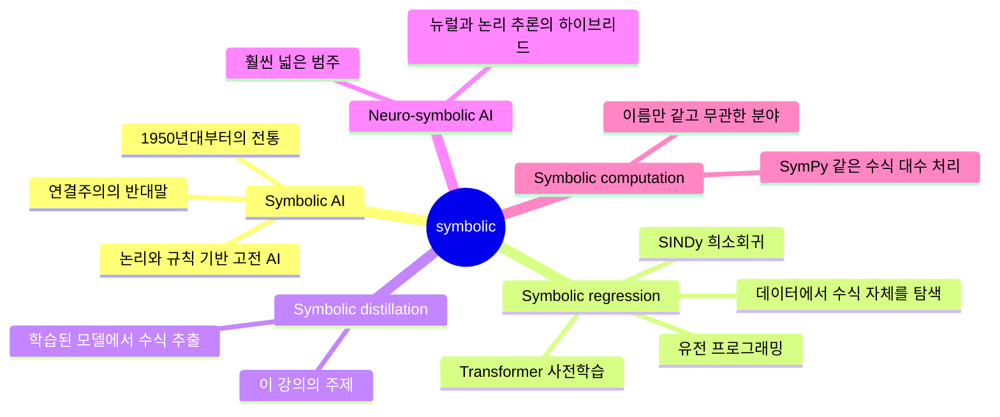
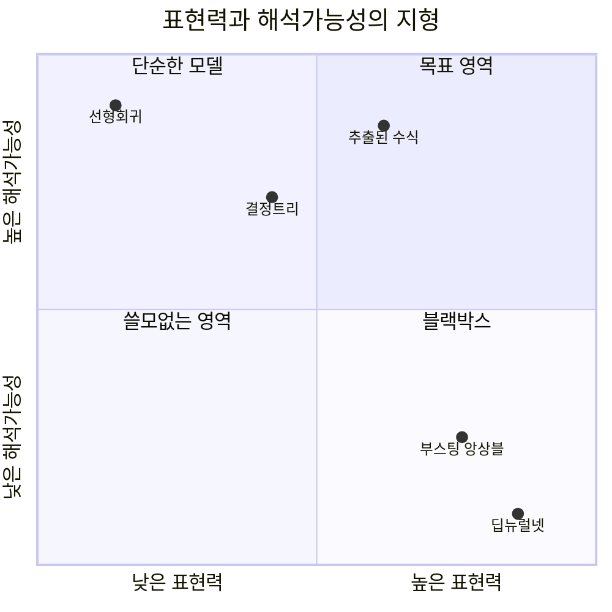
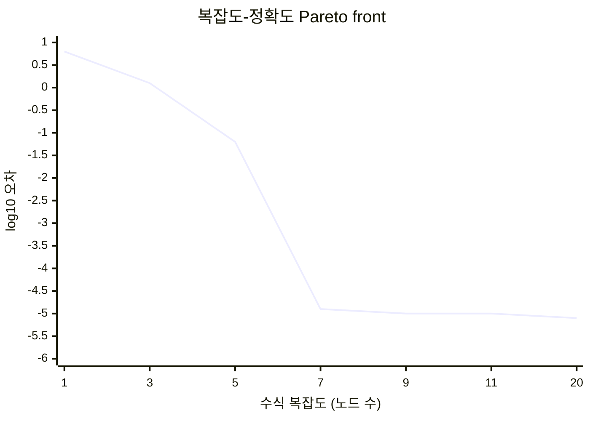
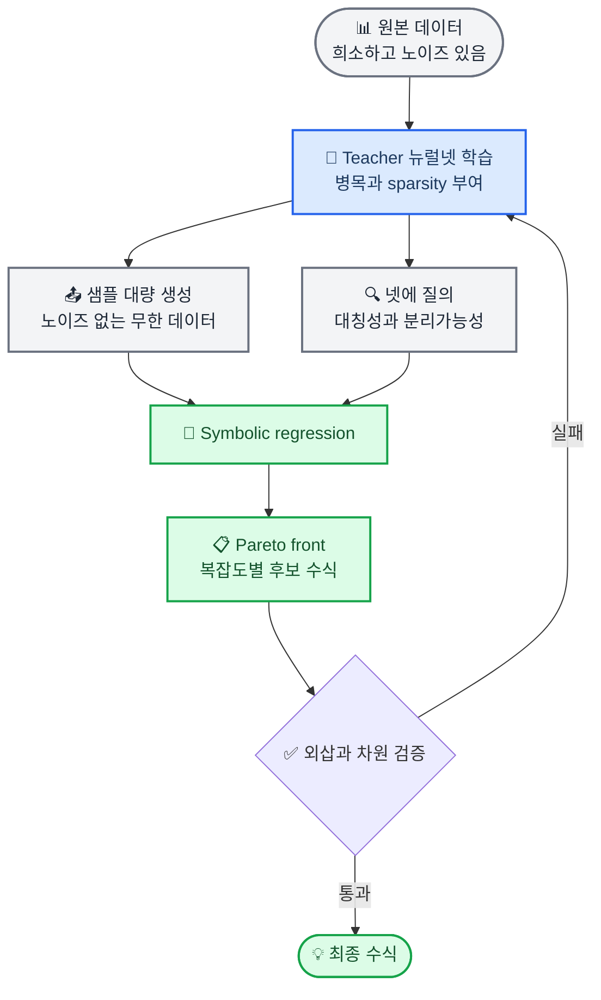
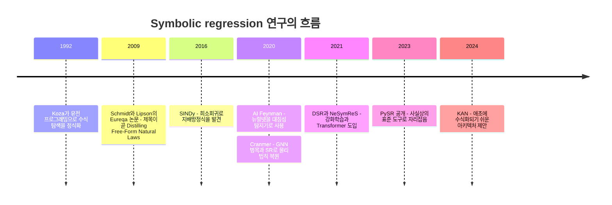

# Symbolic Distillation: 딥러닝 모델을 수식으로 바꾸기

_학부 강의 자료 — 블랙박스 뉴럴넷에서 사람이 읽을 수 있는 닫힌 형식(closed-form) 수식을 추출하는 방법_

---

## 🎯 강의 목표와 선수 지식

### 이 강의가 끝나면 학생은

- [ ] Symbolic regression(SR)과 symbolic distillation의 차이를 설명할 수 있다
- [ ] **"뉴럴넷은 이미 수식이다"** 라는 명제가 왜 참이며, 왜 그럼에도 이 분야가 존재하는지 말할 수 있다
- [ ] 왜 데이터에서 바로 수식을 찾지 않고 딥러닝을 중간에 끼우는지 네 가지 이유를 댈 수 있다
- [ ] 병목(bottleneck)이 왜 이 방법의 성패를 가르는지 설명할 수 있다
- [ ] PySR로 간단한 distillation 실험을 직접 돌릴 수 있다

### 선수 지식

| 필요한 것 | 수준 | 없어도 되는 것 |
| --- | --- | --- |
| **다층 퍼셉트론** | 순전파 수식을 쓸 수 있는 정도 | 역전파 유도 |
| **경사하강법** | 개념 수준 | 최적화 이론 |
| **과적합·일반화** | 개념 수준 | 통계학습이론 |
| **선형회귀** | 최소제곱의 의미 | 정규방정식 유도 |

> 📌 **한 줄 요약:** Symbolic distillation은 학습된 뉴럴넷을 *교사(teacher)* 로 두고, **수식을 학생(student)으로 삼아** 같은 함수를 다시 배우게 하는 것이다. 목표는 정확도가 아니라 **압축**이다.

---

## 🔭 도입: 주전원과 타원

강의는 이 이야기로 시작하는 것이 가장 좋다. 이 분야의 문제의식이 통째로 들어 있다.

### 프톨레마이오스의 주전원

고대·중세 천문학은 행성의 운동을 **주전원(epicycle)** — 원 위에 얹힌 원, 그 위에 또 얹힌 원 — 으로 설명했다. 예측이 안 맞으면? **원을 하나 더 얹었다.**

그리고 이 방법은 실제로 **잘 작동했다.** 주전원을 충분히 쌓으면 어떤 주기 운동이든 원하는 정확도로 맞출 수 있다. 이는 사실상 푸리에 급수와 같은 구조이기 때문이다[^2].

> 💡 **여기서 멈추고 학생에게 질문하라:** "정확하게 예측하는데 왜 이걸 틀린 이론이라고 하나요?"

### 케플러의 타원

케플러는 티코 브라헤의 화성 관측 데이터를 8년간 붙들고 있다가, 원을 쌓는 대신 **다른 모양**을 찾아냈다[^1].

```text
r = a(1 - e²) / (1 + e·cos θ)
```

파라미터는 단 두 개(`a`, `e`)다. 주전원 수십 개보다 **더 정확했고**, 결정적으로 관측한 적 없는 영역에서도 **맞았다.**

### 두 방법의 비교

| | 주전원 | 타원 |
| --- | --- | --- |
| **파라미터 수** | 수십 개 (계속 추가 가능) | 2개 |
| **관측 영역 내 정확도** | 높음 (원하는 만큼) | 높음 |
| **관측 영역 밖** | 붕괴 | 성립 |
| **왜 그런지 설명** | 없음 | 뉴턴 역학으로 유도됨 |
| **현대적 대응물** | **딥러닝 모델** | **추출된 수식** |

마지막 행이 이 강의의 전부다. 딥러닝은 21세기의 주전원이고, symbolic distillation은 그 안에서 타원을 찾아내려는 시도다.

<details>
<summary><strong>💬 Speaker Notes</strong></summary>

- 이 비유를 너무 밀어붙이지는 말 것. 딥러닝이 "틀렸다"는 주장이 아니다. 주전원도 항해와 달력 계산에는 훌륭하게 쓰였다.
- 핵심 대비는 **"정확도"가 아니라 "압축"** 이다. 두 모델 모두 데이터를 맞춘다. 하나는 짧고 하나는 길다.
- 학생들이 "그럼 딥러닝을 버리자는 거냐"고 물으면 → 아니다. 6장에서 딥러닝이 **없으면 안 되는** 이유가 나온다고 예고할 것.
- 소요 시간 목표: 8분.

</details>

---

## 🗺️ 용어 정리: 'symbolic'이 붙은 것들

학생들이 가장 많이 헷갈리는 지점이다. 먼저 지도를 그려주고 시작하자.

_아래 마인드맵은 'symbolic'이라는 수식어가 붙는 다섯 분야의 관계를 보여준다. 이 강의의 주제는 가운데 가지 하나뿐이다. (마인드맵은 accTitle/accDescr을 지원하지 않는다.)_



### 정확한 정의

| 용어 | 정의 | 이 강의와의 관계 |
| --- | --- | --- |
| **Symbolic AI** | 기호와 논리 규칙으로 추론하는 고전 AI 패러다임 | 어원만 공유 |
| **Symbolic regression** | 데이터에 맞는 **수식의 구조와 계수를 함께** 탐색 | 핵심 도구 |
| **Symbolic distillation** | 학습된 모델을 수식으로 추출 | **주제** |
| **Neuro-symbolic AI** | 뉴럴넷 + 논리/프로그램 추론 결합 | 상위 범주 |
| **Symbolic computation** | 수식을 수치가 아닌 기호로 조작 (SymPy, Mathematica) | 무관 |

### Symbolic regression이란

일반 회귀와의 차이를 명확히 하고 넘어가자.

| 방법 | 무엇을 찾는가 | 결과물 |
| --- | --- | --- |
| **선형회귀** | 계수만 | `y = 3.2x + 1.1` |
| **딥러닝** | 수백만 개 가중치 | 블랙박스 함수 |
| **Symbolic regression** | **연산자 조합 + 계수** | `y = 3.2·x²/(1+eˣ)` |

탐색 공간이 실수 벡터가 아니라 **연산자 트리**(`+, -, ×, ÷, sin, exp, √` 의 조합)다. 이산적이고 조합 폭발이 일어나며, 실제로 일반적인 SR 문제는 **NP-hard**임이 증명되어 있다[^5].

### 지형 속에서 SR의 위치

_아래 사분면은 대표적인 모델들을 표현력과 해석가능성 두 축으로 배치한 것이다. 추출된 수식이 노리는 자리는 오른쪽 위다. (사분면 차트는 accTitle/accDescr을 지원하지 않는다.)_



---

## 🧠 핵심 역설: 뉴럴넷은 이미 수식이다

여기가 이 강의에서 학생들이 반드시 넘어야 할 고비다. 대부분의 학생은 "딥러닝 모델을 수식으로 바꾼다"를 **불투명한 것을 투명하게 만드는 변환**으로 상상하고 들어온다. 그 상상을 먼저 깨야 한다.

### 그냥 써보자

입력 1개, 은닉 유닛 3개, ReLU를 쓰는 아주 작은 신경망을 수식으로 적으면:

```text
y = w₁·max(0, a₁x + b₁)
  + w₂·max(0, a₂x + b₂)
  + w₃·max(0, a₃x + b₃)
  + c
```

**끝이다.** 완전하고, 정확하고, 닫힌 형식의 수식이다. 변환할 것이 없다 — **이미 수식이니까.**

큰 모델도 똑같다.

```text
y = W₃·σ(W₂·σ(W₁x + b₁) + b₂) + b₃
```

이것도 수식이다. 다만 항이 수백만 개일 뿐이다.

> ⚠️ **학생이 반드시 짚고 넘어가야 할 것:** "수식으로 바꾼다"는 목표는 그 자체로는 **이미 달성되어 있고, 아무 가치가 없다.**

### 정확한 변환은 이미 여러 방법으로 풀려 있다

뉴럴넷을 정확한 수학적 형태로 다시 쓰는 방법은 하나가 아니다. 전부 가능하고, 전부 읽을 수 없다.

| 방법 | 결과 | 왜 쓸모없나 |
| --- | --- | --- |
| **그대로 펼쳐 쓰기** | 정확한 닫힌 형식 | 항이 수백만~수천억 개 |
| **조각별 선형함수** | ReLU 망은 입력공간을 다면체로 분할한 정확한 조각별 선형함수 | 조각 수가 깊이에 대해 **지수적**으로 증가[^4] |
| **결정트리로 변환** | ReLU 망과 정확히 동치인 트리 | 트리 크기가 지수적[^18] |

세 방법 모두 **오차가 0인 완벽한 변환**이다. 그리고 셋 다 아무것도 알려주지 않는다.

### 그래서 진짜 목적함수는 '단순성'이다

이 관찰에서 이 분야 전체의 정의가 따라나온다.

> 📌 **단순성은 부수적 미덕이 아니라 목적함수 그 자체다.** 단순성 제약을 빼는 순간 문제는 사라진다 — 답이 이미 나와 있고, 그 답이 쓸모없을 뿐이다.

그래서 **모든** SR 방법은 예외 없이 두 목표를 동시에 최적화한다.

```text
minimize:   오차(accuracy)   +   λ · 복잡도(complexity)
```

이를 형식화한 것이 **최소 서술 길이(MDL, Minimum Description Length)** 원리다. *수식이 데이터를 압축해야 한다*는 것. 압축이 없으면 발견도 없다. AI Feynman 계열이 이 원리를 명시적으로 채택한다[^9].

### Pareto front 읽는 법

그래서 SR 도구는 답을 **하나** 주지 않는다. **복잡도별 최적 수식 목록**을 준다.

_아래 차트는 전형적인 Pareto front다. 가로축은 수식의 복잡도(연산자 노드 수), 세로축은 로그 스케일 오차다. 복잡도 7 부근에서 오차가 급락한 뒤 평평해지는 '무릎'이 보인다. (XY 차트는 accTitle/accDescr을 지원하지 않는다.)_



**무릎(knee)이 답이다.** 복잡도 7에서 오차가 5자리 떨어지고, 그 뒤로 아무리 복잡하게 만들어도 개선이 없다. 이는 "복잡도 7짜리 수식이 데이터의 구조를 전부 설명했다"는 뜻이다. 그 뒤의 항들은 노이즈를 외우는 중이다.

<details>
<summary><strong>💬 Speaker Notes</strong></summary>

- 이 장이 강의의 지적 핵심이다. 시간을 아끼지 말 것. 목표 15분.
- 칠판에서 실제로 3-유닛 ReLU 망을 손으로 펼쳐 써 보이면 효과가 크다. 학생들이 "어? 진짜 수식이네" 하는 순간이 있다.
- Pareto front의 무릎 개념은 이후 실습에서 바로 쓰인다. `model_selection="best"`가 하는 일이 이 무릎 찾기다.
- 자주 나오는 질문: "λ는 어떻게 정하나요?" → 정하지 않는다. front 전체를 뽑고 사람이 고른다. 이게 SR이 다른 정규화와 다른 점.

</details>

---

## 🔬 Symbolic Distillation

이제 본론이다.

### 정의

> **Symbolic distillation**: 학습된 뉴럴넷을 *교사(teacher)* 로 두고, **수식을 학생(student)** 으로 삼아 그 함수를 다시 배우게 하는 것.

Hinton의 **knowledge distillation**(큰 넷 → 작은 넷)[^11]과 구조가 정확히 같다. 다른 점은 학생이 작은 네트워크가 아니라 **수식**이라는 것뿐이다.

| | Knowledge distillation | Symbolic distillation |
| --- | --- | --- |
| **교사** | 큰 뉴럴넷 | 뉴럴넷 |
| **학생** | 작은 뉴럴넷 | **닫힌 형식 수식** |
| **얻는 것** | 추론 속도 | **해석가능성 + 외삽** |
| **학생의 표현력** | 여전히 블랙박스 | 사람이 읽을 수 있음 |

### 두 수식을 나란히 놓고 보기

같은 함수(두 입자 사이의 힘)를 두 방식으로 표현한 것이다.

**① 뉴럴넷이 이미 가지고 있는 수식**

```text
F = W₃·tanh(W₂·tanh(W₁·[m₁, m₂, r] + b₁) + b₂) + b₃
```

- 파라미터 4,096개
- 학습 영역 정확도: **완벽** (이것이 모델 자체이므로)
- `r`이 어디에 어떻게 들어갔는지 읽을 수 없음

**② Symbolic distillation으로 뽑아낸 수식**

```text
F = 6.67e-11 · m₁m₂ / r²
```

- 파라미터 1개
- 학습 영역 정확도: **근사** (99.9% 수준)
- 모든 항이 의미를 가짐 — 질량의 곱, 거리의 역제곱

학습 데이터 영역 안에서 **두 함수는 사실상 같다.** 그런데 하나는 4,096개고 하나는 1개다. **그 차이가 전부다.**

### 무엇이 다른가

| | 뉴럴넷 자체 수식 | 추출된 수식 |
| --- | --- | --- |
| **어휘(연산자)** | `{행렬곱, tanh}` 뿐 | `{+, ×, ÷, sin, exp, log, √, ^}` |
| **구조의 출처** | **아키텍처** | **데이터** |
| **구조가 주는 정보** | 없음 | **구조 자체가 답** |
| **크기** | 파라미터 10⁶~10⁹ | 10⁰~10¹ |
| **학습 영역 정확도** | 완벽 | 근사 |
| **외삽** | 붕괴 | 성립 |
| **항의 의미** | 개별 뉴런 해석 불가 | 항마다 의미 있음 |

가장 중요한 줄은 **"구조의 출처"** 다.

뉴럴넷의 수식은 문제가 중력이든 주가 예측이든 고양이 분류든 **똑같이 생겼다.** 모양이 아키텍처에서 나오기 때문이다. 정보는 전부 가중치 숫자 안에 흩어져 있다.

반면 추출된 수식은 문제마다 **모양이 다르다.** `1/r²`이라는 형태 자체가 "역제곱 법칙"이라는 발견이다.

> 📌 **구조가 곧 지식이다(structure is the knowledge).** 이 문장을 판서할 것.

### 프레이밍: 변환이 아니라 번역이다

학생들에게 가장 잘 먹히는 표현은 이것이다.

> 같은 함수를 **{행렬곱, ReLU}라는 어휘**에서 → **{+, ×, sin, exp, ...}라는 인간의 수학 어휘**로 **다시 쓰는 일**.

두 어휘 모두 만능 근사자(universal approximator)이므로 표현력 자체는 동등하다[^3]. 차이는 **어느 어휘로 썼을 때 문장이 짧아지느냐**뿐이다.

중력 법칙은 뉴럴넷 어휘로 쓰면 4,096 단어, 수학 어휘로 쓰면 5 단어다.

그리고 이 번역은 **짧아질 때만 의미가 있다.** 번역했는데 원문보다 길면 번역할 이유가 없다. 앞 장의 "정확히 펼쳐 쓰기"가 정확히 그 경우다 — 완벽한 번역이지만 더 길어서 무가치하다.

### 전체 파이프라인



**3단계가 이름의 유래다.** 교사 넷에서 샘플을 뽑아 학생을 가르치는 그 지점이 곧 *distillation*이다.

---

## 💡 왜 딥러닝을 중간에 끼우는가

학생에게서 반드시 나오는 질문이다.

> "1단계 데이터에서 바로 4단계 SR을 하면 되지 않나요? 뉴럴넷은 왜 거치죠?"

좋은 질문이고, 답이 명확하다. 넷을 끼우면 **원본 데이터로는 할 수 없는 네 가지**가 생긴다.

### ① 노이즈 제거 (denoising)

SR은 노이즈에 극도로 취약하다. 노이즈 낀 점들에 수식을 맞추면 그 노이즈를 설명하려고 이상한 항이 붙는다.

뉴럴넷은 데이터를 **매끄럽게 보간**한다. 넷이 먼저 부드러운 함수를 만들어 주면, SR은 노이즈가 아니라 신호에 대해 탐색하게 된다.

### ② 무한 데이터 생성

원본 데이터가 1,000개뿐이어도, 학습된 넷에는 **아무 입력이나 넣을 수 있다.** SR에 100만 개를 줄 수 있다.

SR은 데이터가 많을수록 후보 수식을 빠르게 걸러낼 수 있으므로 이는 큰 이득이다.

### ③ 질의 가능성 (queryable) — 가장 중요

**데이터는 물어볼 수 없지만, 넷에는 물어볼 수 있다.**

| 질문 | 넷으로 확인하는 방법 |
| --- | --- |
| `x₁`을 바꾸면 출력이 어떻게 변하나 | 편미분 (자동미분으로 즉시) |
| 이 함수는 `x₁ ↔ x₂` 대칭인가 | 두 입력을 바꿔 넣어 출력 비교 |
| `f(x,y) = g(x)·h(y)`로 분리되나 | 한 변수를 고정하고 곡선 모양 비교 |
| 특정 변수가 무시되고 있나 | 그 축에 대한 기울기가 0인지 확인 |

**AI Feynman**[^9]이 하는 일이 정확히 이것이다. 넷 위에서 **실험**을 해서 대칭성과 분리가능성을 찾아내고, 그에 따라 문제를 **재귀적으로 쪼갠다.** 6변수 문제를 3변수 문제 둘로 나누면 탐색 공간은 지수적으로 줄어든다.

### ④ 모듈 분해

GNN처럼 구조화된 넷을 쓰면, "전체 시스템"이라는 거대한 문제가 "입자 쌍 사이의 상호작용"이라는 작은 조각들로 자동으로 쪼개진다. 다음 장의 주제다.

> 📌 **정리:** 딥러닝의 역할은 예측기가 아니라 **"미분 가능하고 질의 가능한, 데이터의 대리자(surrogate)"** 다.

---

## 🏆 사례 연구: GNN에서 뉴턴 법칙 복원하기

이 분야의 결정적 논문은 Cranmer 외(NeurIPS 2020)의 *"Discovering Symbolic Models from Deep Learning with Inductive Biases"* 다[^10].

### 문제

거대한 MLP 전체를 하나의 수식으로 바꾸는 것은 **사실상 불가능하다.** 입력 차원이 조금만 커져도 탐색 공간이 폭발한다. 그러면 어떻게 해야 하나?

### 해법: 쪼개서 정복하기

```mermaid
flowchart LR
    accTitle: Recovering Newton Law from a Graph Network
    accDescr: A pipeline where a graph network learns particle interactions with a low dimensional message bottleneck, then symbolic regression is applied to the message function alone in order to recover the inverse square force law.

    sim([📊 N-body 시뮬레이션<br/>궤적 데이터]) --> gnn[🧠 Graph Network 학습]
    gnn --> msg[🔒 메시지 벡터에 L1 부여<br/>정보를 2-3차원으로 압축]
    msg --> pick[🔍 메시지 함수 하나만 추출<br/>입력은 질량과 거리뿐]
    pick --> sr[🧪 Symbolic regression<br/>저차원이라 탐색 가능]
    sr --> law([💡 F = G·m₁m₂/r²])

    classDef neural fill:#dbeafe,stroke:#2563eb,stroke-width:2px,color:#1e3a5f
    classDef symbolic fill:#dcfce7,stroke:#16a34a,stroke-width:2px,color:#14532d

    class gnn,msg neural
    class sr,law symbolic
```



핵심 아이디어를 네 단계로 정리하면:

1. **문제 구조에 맞는 귀납 편향(inductive bias)을 가진 모델을 쓴다.** 입자 시스템이면 GNN — GNN의 "메시지 함수"가 곧 입자 간 힘에 자연스럽게 대응한다
2. **메시지 벡터에 L1/sparsity 압력을 걸어 병목을 만든다.** 정보가 2~3차원으로 압축되도록 강제한다
3. **통째로가 아니라, 그 작은 모듈 하나에만 SR을 적용한다.** 입력이 저차원이니 탐색이 감당 가능해진다
4. **조각 수식들을 다시 조립한다**

### 병목이 왜 결정적인가

| 병목 없을 때 | 병목 있을 때 |
| --- | --- |
| 메시지 벡터가 128차원 | 메시지 벡터가 2차원 |
| SR 입력 변수 128개 | SR 입력 변수 2개 |
| 탐색 공간 폭발 → 실패 | 탐색 가능 → 성공 |
| 정보가 여러 축에 분산 | 물리적으로 의미 있는 축으로 정렬 |

> ⚠️ **이 강의에서 가져갈 실전 교훈:** SR을 적용하려면 모델을 **"저차원 병목을 가진 모듈들"** 로 쪼개야 한다. 이것이 지금도 이 분야의 표준 레시피다.

### 결과

이 방법으로 논문은 시뮬레이션 데이터에서 **역제곱 법칙, 용수철 법칙, 전하 상호작용** 등 알려진 힘의 법칙을 복원해냈다. 그리고 여기서 멈추지 않고, 암흑물질 헤일로 데이터에 같은 절차를 적용해 **기존에 알려지지 않은 해석적 공식**을 찾아냈다.

### 반직관적인 결과: 근사가 원본을 이긴다

논문에서 가장 놀라운 부분은 이것이다.

> **추출된 수식이 학습 분포 밖(외삽 영역)에서 원본 GNN보다 더 정확했다.**

근사한 쪽이 원본을 이긴다는 것이 이상해 보이지만, 이유는 명확하다.

- 파라미터 1개짜리 `1/r²`은 **틀릴 자유도가 없다.** 매우 강한 귀납 편향이 걸린 것과 같다
- 반면 넷은 학습 영역에서 오차를 줄이려고 온갖 잔재주를 부리고, 그 잔재주가 영역 밖에서 전부 깨진다
- **오컴의 면도날이 실제로 성능으로 나타나는 사례**다

그래서 symbolic distillation의 목적은 해석가능성만이 아니다. **일반화 성능 자체를 올리는 방법**이기도 하다.

<details>
<summary><strong>💬 Speaker Notes</strong></summary>

- 도입부의 주전원-타원 비유를 여기서 회수하라. "타원이 주전원보다 관측 영역 밖에서 정확했던 것과 정확히 같은 현상"이라고 명시적으로 연결할 것.
- "근사가 원본을 이긴다"는 학생들이 잘 안 믿는다. 편향-분산 분해로 한 번 더 설명해주면 납득한다: 수식은 편향이 크지만 분산이 거의 0이다.
- 시간이 부족하면 암흑물질 부분은 생략 가능. 역제곱 복원까지만 해도 메시지는 전달된다.
- 소요 시간 목표: 12분.

</details>

---

## ⚠️ 한계와 흔한 오해

솔직하게 다루지 않으면 학생들이 이 방법을 만능으로 오해한다.

### 오해 바로잡기

| 오해 | 실제 |
| --- | --- |
| "GPT를 수식으로 바꿀 수 있다" | **불가능하다.** 언어 모델에는 애초에 짧은 수식이 존재하지 않는다 |
| "정확한 변환이 목표다" | 정확한 변환은 이미 공짜로 가능하고 무가치하다. 목표는 **압축**이다 |
| "SR이 딥러닝을 대체한다" | 아니다. SR은 딥러닝을 **필요로 한다** (6장) |
| "수식이 나오면 법칙을 발견한 것이다" | 아니다. **그럴듯한 오버피팅 수식이 아주 잘 나온다.** 검증이 필수다 |
| "해석가능하니까 정확도는 포기한 것" | 외삽 영역에서는 오히려 더 정확할 수 있다 |

### 실제 한계

- **차원의 저주** — 입력 변수가 대략 5~10개를 넘어가면 급격히 어려워진다. 그래서 병목이 필수다
- **노이즈 취약성** — 실측 데이터에서 깔끔한 법칙이 나오지 않는 경우가 훨씬 많다
- **도메인 제약** — 물리·화학·천문·역학처럼 **간결한 법칙이 존재할 것으로 기대되는** 영역이 주 무대다. 이미지 인식이나 자연어에는 적용 대상이 없다
- **전체 모델 불가** — 모듈 단위, 저차원 병목이 있는 곳에서만 작동한다
- **탐색 비용** — NP-hard 문제다[^5]. 변수가 늘면 계산 시간이 급증한다

### 검증 체크리스트

수식을 찾았다고 끝이 아니다. 학생이 실습에서 반드시 확인해야 할 것:

- [ ] **외삽 테스트** — 학습 범위 밖 데이터에서 여전히 맞는가
- [ ] **차원 일관성** — 단위가 물리적으로 맞아떨어지는가 (`F`의 단위가 정말 힘인가)
- [ ] **극한 거동** — `r → 0`, `r → ∞`에서 상식적인 값이 나오는가
- [ ] **재현성** — 랜덤 시드를 바꿔도 같은 형태의 수식이 나오는가
- [ ] **간결성** — Pareto front의 무릎에 있는가, 아니면 꼬리 쪽인가

---

## 🔧 실습: PySR로 직접 해보기

**PySR**[^15]이 현재 사실상 표준 도구다. Julia 백엔드에 Python 프론트엔드를 얹은 구조라 빠르다.

### 설치

```bash
pip install pysr
python -c "import pysr; pysr.install()"   # Julia 백엔드 준비 (최초 1회)
```

### 실습 A — 데이터에서 바로 SR

먼저 딥러닝 없이 SR만 돌려본다.

```python
import numpy as np
from pysr import PySRRegressor

# 학생이 맞혀야 할 정답:  y = 2.5·cos(x1) + x0² - 0.5
rng = np.random.default_rng(0)
X = rng.uniform(-3, 3, (2000, 2))
y = 2.5 * np.cos(X[:, 1]) + X[:, 0] ** 2 - 0.5

model = PySRRegressor(
    niterations=100,
    binary_operators=["+", "-", "*", "/"],
    unary_operators=["cos", "exp", "square"],
    maxsize=20,                  # 수식 복잡도 상한
    model_selection="best",      # Pareto front의 '무릎' 선택
)
model.fit(X, y)

print(model)            # 복잡도별 후보 수식 표 (= Pareto front)
print(model.sympy())    # 최종 선택된 수식을 SymPy 객체로
```

### 실습 B — Symbolic distillation

이제 노이즈를 섞고, 뉴럴넷을 중간에 끼워 차이를 관찰한다. **이것이 이 강의의 핵심 실습이다.**

```python
import torch, torch.nn as nn

# 1) 현실적인 상황: 데이터가 적고 노이즈가 있다
X_small = rng.uniform(-3, 3, (300, 2))
y_noisy = (2.5 * np.cos(X_small[:, 1]) + X_small[:, 0] ** 2 - 0.5
           + rng.normal(0, 0.3, 300))

# 2) Teacher 뉴럴넷 학습 — 노이즈를 매끄럽게 보간한다
net = nn.Sequential(nn.Linear(2, 64), nn.Tanh(),
                    nn.Linear(64, 64), nn.Tanh(),
                    nn.Linear(64, 1))
opt = torch.optim.Adam(net.parameters(), lr=1e-2)
Xt = torch.tensor(X_small, dtype=torch.float32)
yt = torch.tensor(y_noisy, dtype=torch.float32).unsqueeze(1)

for _ in range(3000):
    opt.zero_grad()
    loss = ((net(Xt) - yt) ** 2).mean()
    loss.backward()
    opt.step()

# 3) ★ Distillation — 교사에게서 깨끗한 데이터를 무한히 뽑는다
X_dense = rng.uniform(-3, 3, (50_000, 2))
with torch.no_grad():
    y_smooth = net(torch.tensor(X_dense, dtype=torch.float32)).numpy().ravel()

# 4) 그 위에서 SR
model.fit(X_dense, y_smooth)
print(model.sympy())
```

### 관찰 포인트

학생에게 **두 결과를 비교시켜라.**

| 비교 항목 | 노이즈 데이터에 직접 SR | Distillation 경유 |
| --- | --- | --- |
| 찾은 수식의 복잡도 | 높음 (노이즈 설명 항이 붙음) | 낮음 |
| 정답 형태 복원 여부 | 실패하는 경우가 많음 | 대체로 복원 |
| 외삽 오차 | 큼 | 작음 |

> 💡 **핵심 실습 질문:** "왜 데이터를 300개에서 50,000개로 늘렸는데, 정보량은 하나도 늘지 않았는데도 결과가 좋아졌을까?" (답: 정보량은 그대로지만 **노이즈가 제거되고 함수가 매끄러워졌다.** SR은 신호 대 잡음비에 극도로 민감하다.)

### 다른 도구들

| 도구 | 용도 |
| --- | --- |
| **PySR** | 범용 SR. 사실상 표준 |
| **PySINDy** | 동역학계·미분방정식 전용 (`ẋ = f(x)`)[^8] |
| **pykan** | KAN 구현. `auto_symbolic()`으로 스플라인을 기호 함수로 스냅[^16] |
| **SRBench** | 방법 간 성능 비교용 표준 벤치마크[^17] |

---

## 📚 정리와 더 읽을 거리

### 세 문장 요약

1. 뉴럴넷은 **이미 수식**이므로, "수식으로 바꾸기"의 목표는 변환이 아니라 **압축**이다
2. Symbolic distillation은 넷을 **교사**로, 수식을 **학생**으로 삼는 knowledge distillation의 변종이며, 딥러닝은 **노이즈를 지우고 질의에 답하는 데이터의 대리자** 역할을 한다
3. 성패는 **저차원 병목**을 만들 수 있느냐에 달려 있고, 성공하면 해석가능성뿐 아니라 **외삽 성능까지** 얻는다

### 연구의 흐름

_아래 타임라인은 symbolic regression과 distillation 연구의 주요 이정표다. (타임라인은 accTitle/accDescr을 지원하지 않는다.)_



### 읽을 순서

| 순서 | 논문 | 왜 읽나 |
| --- | --- | --- |
| 1 | Schmidt & Lipson 2009[^7] | 이 분야의 출발점. 읽기 쉽다 |
| 2 | **Cranmer et al. 2020**[^10] | **이 강의의 핵심 논문. 반드시 읽을 것** |
| 3 | Udrescu & Tegmark 2020[^9] | 넷을 질의 도구로 쓰는 발상 |
| 4 | Cranmer 2023 (PySR)[^15] | 실습 도구의 설계 문서 |
| 5 | La Cava et al. 2021[^17] | 방법들의 실제 성능 비교 |

### 과제 아이디어

<details>
<summary><strong>📋 과제 제안 3종</strong></summary>

**과제 1 — 노이즈 실험 (기초)**
실습 B에서 노이즈 표준편차를 `0.0, 0.1, 0.3, 1.0`으로 바꿔가며, 직접 SR과 distillation 경유 SR의 성공률을 각각 20회 반복 측정해 비교하라. 어느 지점에서 distillation의 이득이 사라지는가?

**과제 2 — 차원의 저주 확인 (중급)**
입력 변수를 2개에서 8개까지 늘려가며(잉여 변수는 정답 수식에 쓰이지 않는 더미 변수로) PySR의 탐색 시간과 성공률을 측정하라. 그래프로 그려 폭발 지점을 찾아라.

**과제 3 — 병목의 효과 (심화)**
간단한 2입자 시뮬레이션 데이터로 작은 GNN을 학습시키되, 메시지 차원을 `2, 8, 32, 128`로 바꿔가며 학습하라. 각 경우 메시지 함수에 SR을 적용해 힘의 법칙이 복원되는지 확인하고, Cranmer의 주장을 재현하라.

</details>

---

## 📖 References

[^1]: Stanford Encyclopedia of Philosophy. "Johannes Kepler." https://plato.stanford.edu/entries/kepler/

[^2]: Hanson, N. R. (1960). "The Mathematical Power of Epicyclical Astronomy." _Isis_, 51(2), 150–158. https://www.jstor.org/stable/226846

[^3]: Cybenko, G. (1989). "Approximation by superpositions of a sigmoidal function." _Mathematics of Control, Signals and Systems_, 2, 303–314. https://link.springer.com/article/10.1007/BF02551274

[^4]: Montúfar, G., Pascanu, R., Cho, K., & Bengio, Y. (2014). "On the Number of Linear Regions of Deep Neural Networks." _NeurIPS_. https://arxiv.org/abs/1402.1869

[^5]: Virgolin, M., & Pissis, S. P. (2022). "Symbolic Regression is NP-hard." _TMLR_. https://arxiv.org/abs/2207.01018

[^6]: Koza, J. R. (1992). _Genetic Programming: On the Programming of Computers by Means of Natural Selection_. MIT Press. https://mitpress.mit.edu/9780262527910/genetic-programming/

[^7]: Schmidt, M., & Lipson, H. (2009). "Distilling Free-Form Natural Laws from Experimental Data." _Science_, 324(5923), 81–85. https://www.science.org/doi/10.1126/science.1165893

[^8]: Brunton, S. L., Proctor, J. L., & Kutz, J. N. (2016). "Discovering governing equations from data by sparse identification of nonlinear dynamical systems." _PNAS_, 113(15). https://www.pnas.org/doi/10.1073/pnas.1517384113

[^9]: Udrescu, S.-M., & Tegmark, M. (2020). "AI Feynman: A physics-inspired method for symbolic regression." _Science Advances_, 6(16). https://www.science.org/doi/10.1126/sciadv.aay2631

[^10]: Cranmer, M., Sanchez-Gonzalez, A., Battaglia, P., Xu, R., Cranmer, K., Spergel, D., & Ho, S. (2020). "Discovering Symbolic Models from Deep Learning with Inductive Biases." _NeurIPS_. https://arxiv.org/abs/2006.11287

[^11]: Hinton, G., Vinyals, O., & Dean, J. (2015). "Distilling the Knowledge in a Neural Network." https://arxiv.org/abs/1503.02531

[^12]: Petersen, B. K., et al. (2021). "Deep symbolic regression: Recovering mathematical expressions from data via risk-seeking policy gradients." _ICLR_. https://arxiv.org/abs/1912.04871

[^13]: Biggio, L., Bendinelli, T., Neitz, A., Lucchi, A., & Parascandolo, G. (2021). "Neural Symbolic Regression that Scales." _ICML_. https://arxiv.org/abs/2106.06427

[^14]: Kamienny, P.-A., d'Ascoli, S., Lample, G., & Charton, F. (2022). "End-to-end symbolic regression with transformers." _NeurIPS_. https://arxiv.org/abs/2204.10532

[^15]: Cranmer, M. (2023). "Interpretable Machine Learning for Science with PySR and SymbolicRegression.jl." https://arxiv.org/abs/2305.01582

[^16]: Liu, Z., Wang, Y., Vaidya, S., Ruehle, F., Halverson, J., Soljačić, M., Hou, T. Y., & Tegmark, M. (2024). "KAN: Kolmogorov-Arnold Networks." https://arxiv.org/abs/2404.19756

[^17]: La Cava, W., et al. (2021). "Contemporary Symbolic Regression Methods and their Relative Performance." _NeurIPS Datasets and Benchmarks_. https://arxiv.org/abs/2107.14351

[^18]: Aytekin, C. (2022). "Neural Networks are Decision Trees." https://arxiv.org/abs/2210.05189
