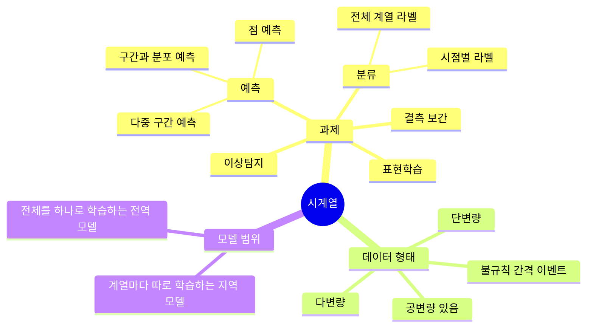
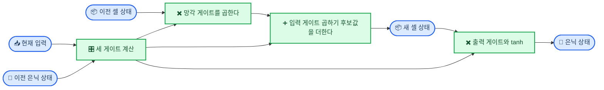
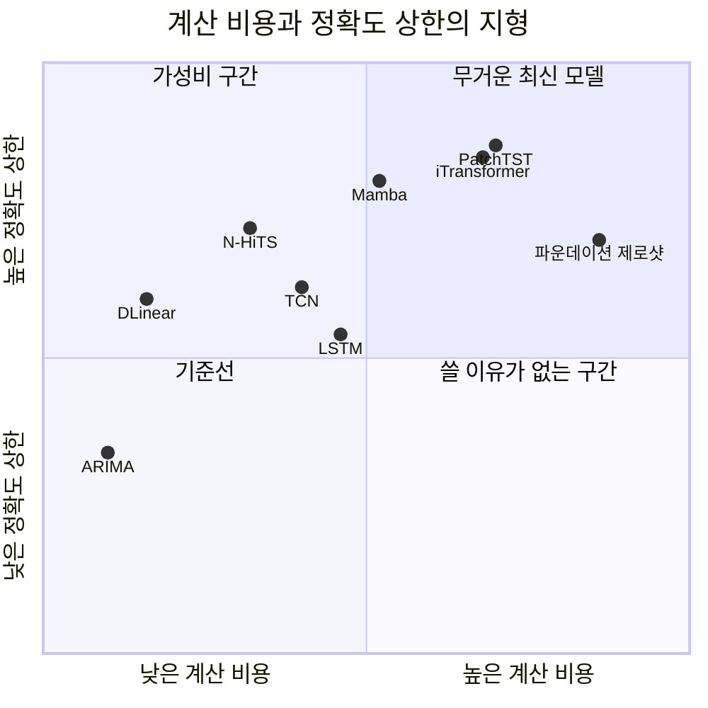
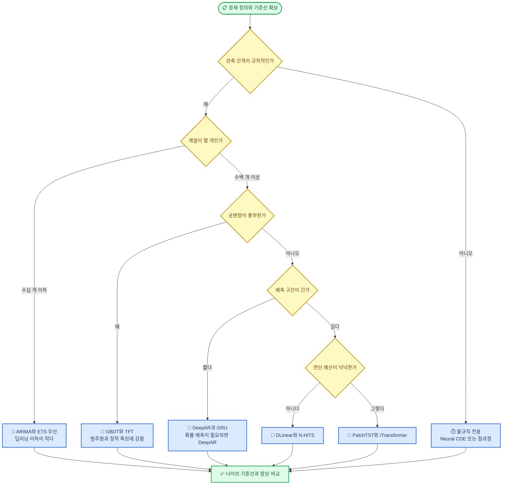
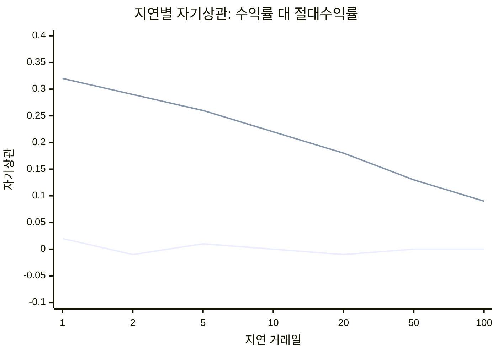
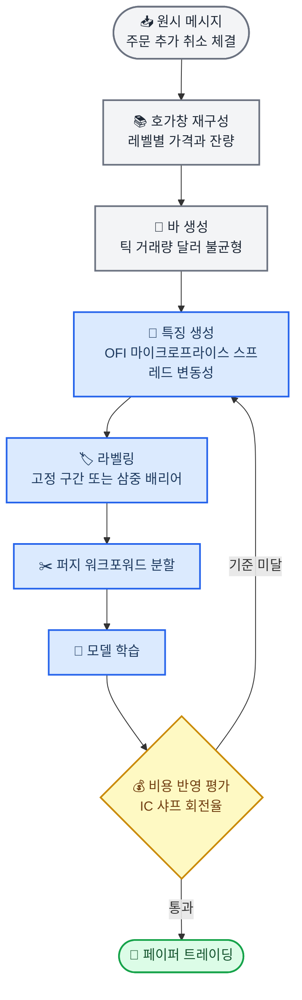
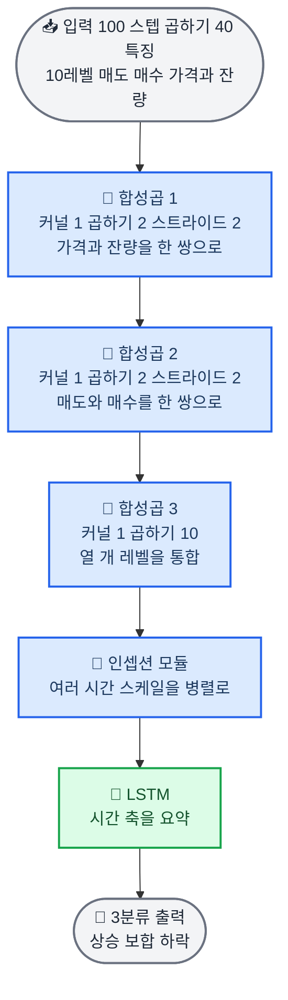
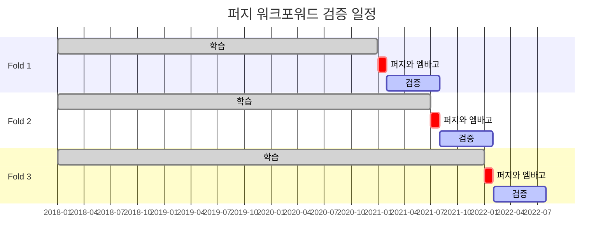
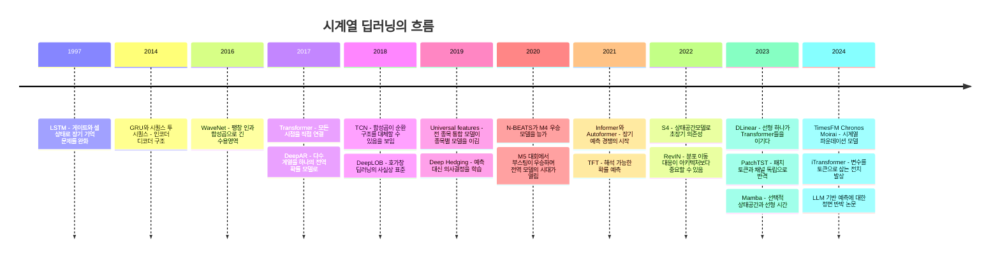

# 시계열 딥러닝: 순서가 있는 데이터를 학습하는 모델들

_학부 강의 자료 — RNN에서 Transformer와 파운데이션 모델까지, 그리고 가장 어려운 응용인 금융 시계열_

---

## 🎯 강의 목표와 선수 지식

### 이 강의가 끝나면 학생은

- [ ] 시계열 데이터가 왜 일반 표 데이터와 근본적으로 다른지 **세 가지 이유**로 설명할 수 있다
- [ ] RNN · CNN · Transformer · 상태공간모델이 각각 **어떤 귀납 편향**을 갖는지 비교할 수 있다
- [ ] 왜 2023년에 **선형 모델 하나가 Transformer들을 이겼는지**, 그 논쟁이 무엇을 남겼는지 말할 수 있다
- [ ] 문제 조건이 주어졌을 때 **어떤 모델부터 시도할지** 결정 트리를 따라 고를 수 있다
- [ ] 금융 시계열의 **정형화된 사실(stylized facts)** 을 근거로 "무엇이 예측 가능하고 무엇이 불가능한지" 판별할 수 있다
- [ ] 호가창(LOB) 데이터에 딥러닝을 적용하는 대표 구조(DeepLOB)를 설명할 수 있다
- [ ] **데이터 누수 없는 시계열 검증 프로토콜**(퍼지 워크포워드)을 직접 구현할 수 있다

### 선수 지식

| 필요한 것 | 수준 | 없어도 되는 것 |
| --- | --- | --- |
| **다층 퍼셉트론** | 순전파와 역전파를 개념적으로 이해 | 최적화 이론 |
| **합성곱 신경망** | 커널·스트라이드·수용영역의 의미 | 최신 비전 아키텍처 |
| **선형회귀와 R²** | 결정계수를 해석할 수 있는 정도 | 계량경제학 |
| **확률분포 기초** | 평균·분산·정규분포 | 시계열 계량이론 |
| **NumPy와 PyTorch** | 텐서 shape를 따라갈 수 있는 정도 | 분산학습 |

> 📌 **한 줄 요약:** 시계열 딥러닝의 역사는 *"시간 축의 무엇을 하나의 토큰으로 볼 것인가"* 를 바꿔온 역사다. 그리고 금융 시계열은 그 모든 모델이 **신호 대 잡음비 앞에서 겸손해지는** 시험장이다.

### 강의 구성

| 부 | 장 | 내용 | 목표 시간 |
| --- | --- | --- | --- |
| **1부** | 2~9장 | 시계열 딥러닝 모델 전반 | 75분 |
| **2부** | 10~14장 | 금융 시계열 — 주식·틱·호가창 | 75분 |
| **실습** | 15장 | PyTorch 실습 4종 | 별도 세션 |

---

## 🌊 도입: 셔플 테스트

강의는 이 실험으로 시작하는 것이 가장 좋다. 판서 없이 코드 세 줄이면 된다.

### 데이터의 행을 뒤섞어 보자

```python
X_shuffled, y_shuffled = shuffle(X, y)   # 행 순서를 무작위로 섞는다
```

| 데이터 | 섞으면 어떻게 되나 |
| --- | --- |
| 붓꽃 분류 (꽃잎 길이 → 품종) | **아무 일도 없다.** 정확도 동일 |
| 집값 예측 (평수·위치 → 가격) | **아무 일도 없다.** 정확도 동일 |
| 주가 데이터 (어제까지 → 내일) | **문제 자체가 소멸한다** |

> 💡 **여기서 멈추고 질문하라:** "왜 앞의 두 개는 섞어도 되고 뒤의 하나는 안 될까요?"

답은 간단하다. 앞의 두 데이터에서 **행 순서는 정보가 아니지만**, 시계열에서 **순서 자체가 정보의 전부**이기 때문이다. 일반 지도학습이 암묵적으로 깔고 있는 i.i.d.(독립 동일 분포) 가정이 시계열에서는 처음부터 성립하지 않는다.

### 시계열이 추가로 요구하는 네 가지

| 성질 | 무슨 뜻인가 | 모델에 요구되는 것 |
| --- | --- | --- |
| **자기상관** | 오늘 값이 어제 값과 상관되어 있다 | 과거 구간을 입력으로 받아야 한다 |
| **추세와 계절성** | 장기 방향 + 주기적 반복이 겹쳐 있다 | 여러 시간 스케일을 동시에 봐야 한다 |
| **비정상성** | 평균·분산이 시간에 따라 변한다 | 정규화와 분포 이동 대응이 필요하다 |
| **인과성** | 미래를 보면 안 된다 | 데이터 분할·패딩·정규화 전부 시간 방향을 지켜야 한다 |

앞의 세 개는 **모델링 문제**이고, 마지막 하나는 **위생 문제**다. 그리고 학부생이 실제로 망하는 지점은 거의 언제나 마지막 하나다.

> ⚠️ **이 강의에서 가장 많이 반복될 문장:** 시계열 딥러닝에서 성능을 결정하는 것은 모델 선택이 아니라 **정규화·분할·라벨링을 시간 방향으로 올바르게 했는가**이다.

<details>
<summary><strong>💬 Speaker Notes</strong></summary>

- 셔플 테스트는 실제로 노트북을 띄워 두 번 돌려 보이면 효과가 압도적이다. 붓꽃 96% → 96%, 주가 예측 → 의미 없는 숫자.
- "순서가 정보다"라는 문장을 칠판 왼쪽 위에 써 두고 강의 내내 남겨둘 것. 뒤의 모든 아키텍처가 이 문장을 어떻게 구현하는가의 변주다.
- 학생이 "그럼 시간 자체를 특징으로 넣으면 되지 않나요?"라고 물으면 → 좋은 질문이라고 인정하고, 그것이 실제로 하나의 접근(시간 특징 + GBDT)이며 M5 대회 우승 방식이라고 예고할 것. 6장에서 회수한다.
- 소요 시간 목표: 8분.

</details>

---

## 🗺️ 문제 정의와 용어 지도

모델 이야기를 하기 전에 **무엇을 푸는 문제인지** 먼저 나눠야 한다. 학생들이 "시계열 = 예측"이라고만 알고 오기 때문이다.

_아래 마인드맵은 시계열 딥러닝이 다루는 과제와 데이터 형태를 정리한 것이다. 이 강의의 무게중심은 예측과 분류 두 가지다. (마인드맵은 accTitle/accDescr을 지원하지 않는다.)_



### 예측 문제의 정확한 형태

가장 흔한 형태인 예측을 텐서 shape로 못박고 가자. 이걸 확실히 해두면 뒤의 모든 논문 그림이 읽힌다.

```text
입력  X : (배치 B, 관측 구간 L, 변수 개수 C)
출력  Y : (배치 B, 예측 구간 H, 타깃 개수 K)

L = lookback window (과거를 얼마나 볼까)
H = forecast horizon (미래를 얼마나 내다볼까)
```

학습 데이터는 **슬라이딩 윈도우**로 만든다. 길이 T짜리 계열 하나에서 `T - L - H + 1`개의 샘플이 나온다.

```text
원본:  ●●●●●●●●●●●●●●●●●●●●●●●●   (T = 24)

샘플1: [====L====][==H==]
샘플2:  [====L====][==H==]
샘플3:   [====L====][==H==]
                              ...
```

> ⚠️ **여기서 첫 번째 함정이 나온다.** 인접한 샘플들은 거의 같은 데이터를 공유한다. 이 샘플들을 무작위로 훈련/검증에 나누면 **사실상 정답을 보여준 것**이다. 시계열 분할은 반드시 **시간 경계**로 잘라야 한다.

### 반드시 구분해야 할 용어

| 용어 | 정의 | 왜 중요한가 |
| --- | --- | --- |
| **단변량 / 다변량** | 계열 변수가 하나 / 여럿 | 다변량이면 변수 간 상호작용을 모델링할지 결정해야 한다 |
| **공변량(covariate)** | 타깃 외 부가 입력 | **미래에도 알 수 있는 것**(요일, 공휴일, 예정된 프로모션)과 **과거만 아는 것**(어제 기온)을 반드시 구분 |
| **정적 특징** | 시간에 따라 안 변하는 속성 | 종목의 섹터, 매장의 지역 등. 전역 모델의 핵심 입력 |
| **지역 모델** | 계열 하나마다 파라미터 따로 | ARIMA. 계열이 짧으면 유리 |
| **전역 모델** | 모든 계열이 파라미터 공유 | 딥러닝. 계열 수가 많을 때 압도적 |
| **자기회귀 추론** | 한 스텝씩 예측해 되먹임 | 오차 누적. 학습-추론 불일치(exposure bias) |
| **직접 다중 구간** | H개를 한 번에 출력 | 오차 누적 없음. 현재의 표준 |

> 📌 **딥러닝이 시계열에서 이긴 진짜 이유는 새 아키텍처가 아니라 '전역 모델'이라는 발상이다.** 월마트 매장 3만 개의 판매를 각각 ARIMA로 맞추는 대신, 하나의 네트워크가 3만 개를 전부 학습하면 계열 하나당 데이터가 적어도 서로에게서 배울 수 있다.

---

## 📐 출발점: 고전 모델은 아직 강하다

딥러닝 강의에서 이 장을 건너뛰면 학생들이 평생 잘못된 기준선을 쓴다.

### 반드시 알아야 할 세 개의 기준선

| 모델 | 수식 또는 아이디어 | 언제 이기나 |
| --- | --- | --- |
| **나이브** | `ŷ_{t+1} = y_t` | 랜덤워크에 가까운 데이터. **금융에서는 이기기가 매우 어렵다** |
| **계절 나이브** | `ŷ_{t+h} = y_{t+h-m}` (주기 m) | 강한 주기성. 전력·교통·소매 |
| **ARIMA / ETS** | 자기회귀 + 이동평균 + 차분 / 지수평활 | 계열이 짧고 개수가 적을 때 |

### M4와 M5 대회가 알려준 것

시계열 예측 분야에는 수십 년 된 공개 경진대회 계보(M-competition)가 있고, 이것이 사실상 이 분야의 실증적 판정단이다.

| 대회 | 데이터 | 우승 | 교훈 |
| --- | --- | --- | --- |
| **M3 (2000)** | 3,003개 계열 | 단순 지수평활 계열 | 복잡한 모델이 단순한 모델을 못 이겼다 |
| **M4 (2018)** | 10만 개 계열 | **ES-RNN** — 지수평활과 RNN의 하이브리드[^1] | 순수 ML은 부진, **하이브리드와 앙상블**이 이겼다 |
| **M5 (2020)** | 월마트 판매 3만여 계열 | **LightGBM 기반 부스팅**[^2] | 공변량이 풍부한 실무 데이터에서는 **GBDT가 여전히 강력**하다 |

2018년 Makridakis 연구진은 당시 널리 쓰이던 머신러닝 방법들이 단순 통계 방법보다 **더 나쁘면서 계산은 훨씬 비쌌다**는 결과를 발표해 이 분야에 찬물을 끼얹었다[^3]. 이 논문은 지금도 읽을 가치가 있다.

### 그래서 딥러닝은 언제 이기는가

| 조건 | 딥러닝 유리 | 고전 모델 유리 |
| --- | --- | --- |
| **계열 개수** | 수백~수백만 개 | 수십 개 이하 |
| **계열 길이** | 길다 (수천 시점 이상) | 짧다 (수십~수백) |
| **공변량** | 많고 이질적 (텍스트, 범주형, 정적 특징) | 없거나 단순 |
| **비선형·교차 상호작용** | 중요하다 | 거의 없다 |
| **예측 구간** | 길다 (다중 구간) | 짧다 (1스텝) |
| **분포 형태** | 계열마다 다르고 복잡 | 정규 근사가 통한다 |

> 💡 **실무 규칙:** 새 프로젝트에서 제일 먼저 하는 일은 `계절 나이브`와 `AutoARIMA` 점수를 표에 적는 것이다. 딥러닝 모델이 이 두 줄을 못 이기면 그 프로젝트는 아직 시작도 안 한 것이다.

<details>
<summary><strong>💬 Speaker Notes</strong></summary>

- M5에서 GBDT가 이긴 사실을 숨기지 말 것. 학생들이 "그럼 딥러닝은 왜 배우나요"라고 물으면 → 조건표를 다시 짚고, 특히 **호가창·센서·오디오처럼 입력 자체가 고차원 구조를 갖는 경우** GBDT가 손도 못 댄다는 점을 강조.
- ES-RNN이 하이브리드였다는 점이 중요하다. 정규화(지수평활)를 통계 모델이 담당하고 비선형 패턴을 RNN이 담당한 구조인데, 이는 뒤에 나올 RevIN의 사상과 같다.
- 소요 시간 목표: 10분.

</details>

---

## 🔁 1세대: 순환 신경망 — RNN, LSTM, GRU

### 아이디어

순환 신경망은 "시간을 따라 상태를 굴린다"는 발상이다. 은닉 상태 `h_t`가 과거 전체의 요약본 역할을 한다.

```text
h_t = tanh(W_x · x_t + W_h · h_{t-1} + b)
y_t = W_y · h_t
```

이 한 줄이 시계열 딥러닝의 출발점이다[^4]. 같은 `W`를 모든 시점에 재사용하므로 계열 길이가 달라도 되고, 파라미터 수가 길이에 무관하다.

### 문제: 기울기가 사라진다

`h_t`를 `h_1`까지 역전파하려면 `W_h`를 **L번 곱해야 한다.** 고윳값이 1보다 작으면 지수적으로 0에 수렴하고, 1보다 크면 발산한다[^5].

```text
∂h_L/∂h_1 = W_h^(L-1) · (활성함수 미분들의 곱)
```

결과적으로 바닐라 RNN은 실질적으로 **10~20 스텝 정도밖에 기억하지 못한다.**

### LSTM의 해법: 덧셈으로 만든 고속도로

LSTM[^6]은 은닉 상태와 별도로 **셀 상태 `c_t`** 를 두고, 그 경로에서 행렬곱을 제거했다.

```text
c_t = f_t ⊙ c_{t-1}  +  i_t ⊙ g_t
```

`c_{t-1}`에 곱해지는 것은 행렬이 아니라 **0~1 사이 스칼라 게이트** `f_t`뿐이다. `f_t ≈ 1`이면 정보가 그대로 흘러간다. 기울기가 지수적으로 죽는 대신 **덧셈으로 누적**된다.



| 게이트 | 하는 일 | 직관 |
| --- | --- | --- |
| **망각 게이트 f** | 이전 셀 상태를 얼마나 남길지 | "이 정보는 아직 유효한가" |
| **입력 게이트 i** | 새 정보를 얼마나 쓸지 | "이번 입력은 기억할 가치가 있나" |
| **출력 게이트 o** | 셀 상태 중 얼마를 밖으로 낼지 | "지금 이 결정에 필요한 부분은 어디인가" |

### GRU: 더 적은 부품으로

GRU[^7]는 게이트를 두 개(리셋·업데이트)로 줄이고 셀 상태와 은닉 상태를 합쳤다. 파라미터가 약 25% 적고 학습이 빠르며, 대부분의 시계열 과제에서 **LSTM과 성능 차이가 유의미하지 않다.**

> 💡 **실무 규칙:** 데이터가 적으면 GRU, 아주 길고 복잡한 의존이 있으면 LSTM. 어느 쪽인지 모르겠으면 GRU로 시작하라.

### RNN 계열의 구조적 한계

| 한계 | 왜 문제인가 |
| --- | --- |
| **순차 계산** | 시점 t를 계산하려면 t-1이 끝나야 한다. GPU 병렬화가 원천적으로 막힌다 |
| **정보 병목** | 아무리 긴 과거도 고정 크기 벡터 하나에 압축된다 |
| **긴 의존** | 게이트로 완화했을 뿐 해결한 것이 아니다. 수백 스텝은 여전히 어렵다 |
| **학습 불안정** | 기울기 클리핑 없이는 자주 발산한다 |

이 네 가지가 다음 세대들이 각각 공략한 표적이다.

<details>
<summary><strong>💬 Speaker Notes</strong></summary>

- 게이트 수식을 전부 판서할 필요는 없다. `c_t = f⊙c_{t-1} + i⊙g` 이 한 줄만 크게 쓰고 "여기 곱셈이 행렬이 아니라 스칼라"라는 점만 확실히 짚으면 된다.
- 학생들이 LSTM 그림(게이트가 얽힌 도식)을 보고 겁먹는 경우가 많다. "부품이 세 개인 이유는 남길까·넣을까·꺼낼까 세 가지 결정이 필요해서"라고 설명하면 대부분 납득한다.
- ResNet의 skip connection과 같은 원리라는 점을 연결해주면 이해가 빨라진다. 둘 다 **덧셈 경로가 기울기 고속도로**다.
- 소요 시간 목표: 12분.

</details>

---

## 🌀 2세대: 합성곱 — 1D CNN, 팽창 합성곱, TCN

### 발상의 전환

"과거를 상태에 담아 굴리는" 대신, **과거 구간을 통째로 놓고 필터를 미끄러뜨리면** 어떨까?

1D 합성곱 필터 하나는 사실 **학습되는 이동평균 필터**다. `[0.33, 0.33, 0.33]`이면 3일 이동평균이고, `[-1, 0, 1]`이면 미분(변화율)이며, `[1, -2, 1]`이면 2차 미분이다. 기술적 지표를 사람이 정하는 대신 데이터가 정하게 하는 셈이다.

### 두 가지 필수 장치

**① 인과 합성곱(causal convolution)** — 미래를 못 보게 왼쪽에만 패딩한다.

```text
일반 합성곱:   ... x_{t-1}  x_t  x_{t+1} ...  →  y_t     ❌ 미래 참조
인과 합성곱:   ... x_{t-2} x_{t-1} x_t      →  y_t     ✅
```

**② 팽창 합성곱(dilated convolution)** — 층마다 간격을 2배로 벌려 수용영역을 지수적으로 키운다[^8].

```text
층 4 (d=8)  ●───────────────●
층 3 (d=4)  ●───────●───────●
층 2 (d=2)  ●───●───●───●───●
층 1 (d=1)  ●─●─●─●─●─●─●─●─●
입력        x1 x2 x3 ... ... ... ... ... x16
```

층 수 `n`, 커널 크기 `k`일 때 수용영역은 대략 `1 + 2(k-1)(2ⁿ - 1)`. **층 4개로 16 스텝, 10개로 2,000 스텝**을 커버한다. 로그 시간에 긴 과거를 본다.

### TCN

Bai 등은 팽창 인과 합성곱 + 잔차 연결 + 가중치 정규화를 묶어 **TCN**이라 명명하고, 여러 시퀀스 과제에서 LSTM/GRU와 대등하거나 더 낫다는 것을 보였다[^9]. 이 논문의 제목이 사실상 결론이다 — 순환 구조가 시퀀스 모델링의 필수 조건은 아니다.

| | RNN 계열 | TCN |
| --- | --- | --- |
| **학습 병렬화** | 불가 (순차) | **가능** (전 시점 동시) |
| **수용영역** | 이론상 무한, 실제로는 짧음 | **설계로 정확히 지정** |
| **기울기 경로** | 시간 축을 따라 L번 | 깊이 축을 따라 log L번 |
| **추론 메모리** | 상태 벡터 하나 | 수용영역만큼의 버퍼 |
| **약점** | 느리고 불안정 | 수용영역 밖은 원천적으로 못 봄 |

> 📌 **핵심 대비:** RNN은 *기억*으로 과거에 접근하고, CNN은 *창(window)* 으로 접근한다. 기억은 무한하지만 흐릿하고, 창은 유한하지만 선명하다.

<details>
<summary><strong>💬 Speaker Notes</strong></summary>

- 필터 `[-1, 0, 1]`이 미분이라는 점을 실제로 숫자 넣어 계산해 보이면 "CNN이 기술적 지표를 학습한다"는 말이 구체화된다. 금융 파트의 복선이기도 하다.
- 팽창 그림은 판서로 직접 그릴 것. 층마다 선이 두 배로 벌어지는 걸 손으로 그려야 지수 증가가 체감된다.
- 소요 시간 목표: 10분.

</details>

---

## 🎯 3세대: Attention과 Transformer 계열

### 왜 attention인가

RNN의 정보 병목과 CNN의 유한 수용영역을 동시에 없애는 방법이 있다. **모든 시점 쌍을 직접 연결하는 것.**

```text
Attention(Q, K, V) = softmax(Q Kᵀ / √d) V
```

시점 t가 시점 s를 참조하는 데 드는 경로 길이는 **거리와 무관하게 1**이다[^10]. 그리고 전 시점을 행렬곱 한 번으로 처리하므로 완전히 병렬화된다.

### 그런데 시계열에 그대로 쓰면 세 가지가 어긋난다

| 문제 | 내용 | 대응 |
| --- | --- | --- |
| **O(L²) 비용** | 길이 1,000이면 100만 개 쌍. 장기 예측에 치명적 | 희소·저차원 근사 attention |
| **순서 정보 없음** | attention은 집합 연산이라 순서를 모른다 | 위치 인코딩. 하지만 시계열에서는 약한 처방이다 |
| **점 하나는 의미가 없다** | 단어 하나는 뜻이 있지만 **시점 하나의 값은 뜻이 없다** | 패치 단위 토큰화 |

세 번째가 가장 본질적이다. 이 계보의 발전사는 결국 **"무엇을 하나의 토큰으로 볼 것인가"** 를 바꿔온 역사로 읽어야 한다.

### 무엇을 토큰으로 삼는가

| 모델 | 토큰 단위 | 핵심 아이디어 |
| --- | --- | --- |
| **Informer** (2021)[^11] | 시점 | ProbSparse attention으로 O(L log L). 긴 구간 예측 벤치마크의 출발점 |
| **Autoformer** (2021)[^12] | 시점 | attention을 **자기상관**으로 교체 + 추세·계절 분해를 구조에 내장 |
| **FEDformer** (2022)[^13] | 주파수 성분 | 푸리에·웨이블릿 영역에서 소수 주파수만 골라 attention |
| **Crossformer** (2023)[^14] | 시간 패치 × 변수 | 시간 축과 변수 축 **양쪽으로** attention |
| **PatchTST** (2023)[^15] | **시간 패치** | 16개 시점을 한 토큰으로 묶고, **변수 채널을 독립 처리**. 판을 뒤집었다 |
| **iTransformer** (2024)[^16] | **변수 하나 전체** | 축을 아예 전치. 토큰 = 한 변수의 전체 시계열, attention = 변수 간 상관 |
| **TimesNet** (2023)[^17] | 2D로 접은 주기 블록 | 1D 계열을 주기 길이로 접어 2D 이미지처럼 보고 2D 합성곱 |

> 💡 **PatchTST의 두 가지 발명을 학생에게 반드시 각인시켜라.**
> ① **패치화** — 시점 하나가 아니라 구간을 토큰으로. 시퀀스 길이가 1/16로 줄어 O(L²) 문제가 완화되고, 토큰 하나가 "국소 패턴"이라는 의미를 갖게 된다.
> ② **채널 독립** — 100개 변수를 섞지 않고 같은 모델에 따로 통과시킨다. 반직관적이지만 과적합이 크게 줄어든다.

### 비정상성이라는 진짜 적

Transformer 계열 논문들이 실제로 얻은 성능 향상의 상당 부분은 attention이 아니라 **정규화**에서 나왔다.

**RevIN**(Reversible Instance Normalization)[^18]은 입력 윈도우마다 평균·분산을 빼고 나눈 뒤, 출력에서 다시 되돌린다. 열 줄짜리 코드다.

```python
# 입력 윈도우 단위 정규화 → 모델 → 역정규화
mu, sigma = x.mean(1, keepdim=True), x.std(1, keepdim=True) + 1e-5
y = model((x - mu) / sigma) * sigma + mu
```

> ⚠️ **이것이 이 강의 1부에서 가장 실용적인 조언이다.** 어떤 모델을 쓰든 윈도우 단위 정규화를 붙여라. 대부분의 경우 모델을 바꾸는 것보다 이득이 크다. Non-stationary Transformer[^19]는 이 아이디어를 attention 내부까지 확장한 것이다.

---

## ⚔️ 반격: 선형 모델 하나면 되는 것 아닌가

### DLinear 사건

2022년, Zeng 등은 도발적인 제목의 논문을 냈다 — *"Are Transformers Effective for Time Series Forecasting?"*[^20]

그들이 제시한 모델은 이렇다.

```text
1) 입력을 이동평균으로 추세와 계절 성분으로 분해
2) 각각에 선형층 하나씩 (L → H)
3) 더한다.  끝.
```

**이 모델이 당시 장기 예측 벤치마크 대부분에서 Informer·Autoformer·FEDformer를 이겼다.**

### 왜 이런 일이 벌어졌나

| 원인 | 설명 |
| --- | --- |
| **attention은 순열 불변** | 위치 인코딩으로 순서를 주입하지만, 시계열에서 순서는 부가 정보가 아니라 본체다 |
| **벤치마크가 선형적** | 전력·교통·기상 데이터는 강한 주기성이 지배적이라 선형 사상으로 상당 부분이 설명된다 |
| **정규화 부재** | 당시 Transformer 구현들이 분포 이동 처리를 제대로 하지 않았다 |
| **벤치마크 과적합** | 같은 데이터셋 몇 개에 수십 편이 튜닝을 반복했다 |

### 논쟁이 남긴 것

이 논문 이후 PatchTST와 iTransformer가 정규화와 토큰화를 고쳐서 DLinear를 다시 이겼다. 그러니 "Transformer가 졌다"가 결론은 아니다. 남은 것은 **위생 규칙**이다.

> 📌 **DLinear가 남긴 세 줄 교훈**
> ① 선형 기준선 없이 발표된 시계열 딥러닝 결과는 믿지 마라.
> ② 성능 향상이 아키텍처에서 왔는지 정규화에서 왔는지 분리해서 보고하라.
> ③ 벤치마크 몇 개의 소수점 개선은 발견이 아니다.

### 순수 MLP 계열: 단순함이 강한 이유

| 모델 | 구조 | 강점 |
| --- | --- | --- |
| **N-BEATS** (2020)[^21] | 기저 확장 + 이중 잔차 스태킹. 완전 MLP | M4 우승 모델을 능가. **추세·계절 기저를 쓰면 해석 가능** |
| **N-HiTS** (2023)[^22] | 다중 해상도 샘플링 + 계층적 보간 | 긴 예측 구간에서 N-BEATS 대비 **연산 수십 배 절감** |
| **TSMixer** (2023)[^23] | 시간 방향 MLP와 변수 방향 MLP를 교대 | 구현이 단순하고 빠르며 정확도가 경쟁력 있음 |
| **DLinear** (2023)[^20] | 분해 + 선형 2개 | **기준선의 표준.** 파라미터 2·L·H개 |

_아래 사분면은 대표 모델들을 계산 비용과 달성 가능한 정확도 상한 두 축으로 대략 배치한 것이다. 정확한 수치가 아니라 상대적 위치를 보기 위한 그림이다. (사분면 차트는 accTitle/accDescr을 지원하지 않는다.)_



<details>
<summary><strong>💬 Speaker Notes</strong></summary>

- 이 장은 학생들에게 **논문을 의심하는 법**을 가르치는 자리다. 시간을 아끼지 말 것.
- "선형 모델 하나가 SOTA를 이겼다"는 사실은 학생들에게 충격적으로 다가온다. 그 충격을 냉소가 아니라 방법론적 엄밀함으로 착지시켜야 한다. 냉소로 끝나면 실패한 강의다.
- 여유가 있으면 DLinear를 실제로 15줄로 짜서 보여줄 것. 실습 B에 코드가 있다.
- 소요 시간 목표: 12분.

</details>

---

## 🧬 4세대: 상태공간모델 — S4와 Mamba

### 발상: 연속시간 시스템을 배우자

제어이론의 선형 상태공간 방정식에서 출발한다.

```text
h'(t) = A h(t) + B x(t)          (상태가 어떻게 변하는가)
y(t)  = C h(t) + D x(t)          (상태에서 출력을 어떻게 뽑는가)
```

이것을 이산화하면 **RNN처럼 재귀적으로도** 계산할 수 있고, 동시에 **CNN처럼 하나의 긴 컨볼루션 커널로도** 계산할 수 있다. 여기가 결정적이다.

| 계산 방식 | 언제 쓰나 | 이득 |
| --- | --- | --- |
| **컨볼루션 형태** | 학습 시 | 전 시점 병렬 처리 |
| **재귀 형태** | 추론 시 | 시점당 O(1) 메모리와 연산 |

RNN의 장점(상수 메모리 추론)과 CNN의 장점(병렬 학습)을 **동시에** 가진다.

### S4와 HiPPO

핵심은 행렬 `A`를 아무렇게나 초기화하면 안 된다는 것이다. **HiPPO** 이론[^24]은 과거 신호를 직교 다항식 기저로 최적 압축하는 `A`를 유도했고, **S4**[^25]는 이를 효율적으로 계산 가능하게 만들어 Long Range Arena 벤치마크에서 수천~수만 스텝의 의존성을 처리해냈다.

### Mamba: 입력에 따라 변하는 상태공간

S4의 파라미터는 입력과 무관한 고정값이라 "지금 이 토큰이 중요하니 더 오래 기억하자" 같은 선택을 못 한다. **Mamba**[^26]는 `B`, `C`, 그리고 시간 간격 `Δ`를 **입력의 함수**로 만들고(selective SSM), 병렬 스캔을 GPU 메모리 계층에 맞춰 구현해 선형 시간에 이를 달성했다.

### 네 계보 총정리 — 이 표가 1부의 결론이다

| | RNN / LSTM | TCN | Transformer | SSM / Mamba |
| --- | --- | --- | --- | --- |
| **학습 병렬화** | ❌ 순차 | ✅ | ✅ | ✅ 스캔 |
| **길이에 대한 비용** | O(L) | O(L log L) | **O(L²)** | **O(L)** |
| **두 시점 간 최단 경로** | O(L) | O(log L) | **O(1)** | O(L) |
| **추론 시 상태 메모리** | **O(1)** | O(수용영역) | O(L) KV 캐시 | **O(1)** |
| **귀납 편향** | 최근성 편향 | 지역성·다중 스케일 | 거의 없음 (전부 학습) | 감쇠하는 장기 기억 |
| **데이터 요구량** | 중간 | 중간 | **많음** | 중간 |
| **잘 맞는 상황** | 짧은 계열, 온라인 | 고정 수용영역, 실시간 | 대규모 데이터, 다변량 | **초장기 컨텍스트, 스트리밍** |

> 📌 **판서할 문장:** 아키텍처 선택은 "어떤 편향을 공짜로 얻고 어떤 것을 데이터로 사야 하는가"의 문제다. 데이터가 적으면 편향을 사고(CNN/SSM), 데이터가 많으면 편향을 버려라(Transformer).

---

## 🌍 5세대: 시계열 파운데이션 모델

### 발상

LLM처럼, **수십억 시점의 이종 시계열로 사전학습한 뒤 처음 보는 계열을 제로샷으로 예측**할 수 있을까? 2023~2024년에 이 질문에 대한 답이 쏟아졌다.

| 모델 | 기관 | 접근 | 특징 |
| --- | --- | --- | --- |
| **TimesFM**[^27] | Google | 디코더 전용, 패치 입력·출력 | 2천억 시점 사전학습. 제로샷으로 지도학습 모델에 근접 |
| **Chronos**[^28] | Amazon | **값을 이산 토큰으로 양자화**해 T5로 학습 | 시계열을 말 그대로 "언어"로 취급 |
| **Moirai**[^29] | Salesforce | any-variate attention, 다중 패치 크기 | 변수 개수가 제각각인 데이터를 한 모델로 |
| **Lag-Llama**[^30] | 오픈소스 | 지연값 특징 + 디코더 전용 | 확률 예측, 파인튜닝 친화적 |
| **TimeGPT**[^31] | Nixtla | 상용 API | 진입 장벽이 가장 낮음 |

### LLM을 그대로 쓰는 계열, 그리고 그에 대한 반박

GPT-2 같은 사전학습 언어모델을 얼리고 입출력 층만 갈아끼우는 접근(GPT4TS[^32], Time-LLM[^33])도 한때 유행했다. 그런데 2024년 NeurIPS에 이를 정면으로 반박하는 논문이 나왔다 — **언어모델 블록을 통째로 제거하거나 무작위 행렬로 바꿔도 성능이 떨어지지 않았다**[^34].

> ⚠️ **학생에게 전할 교훈:** "LLM을 붙였더니 좋아졌다"는 주장에는 반드시 **LLM을 제거한 ablation**을 요구하라. 이것이 과학적 사고의 실전 훈련이다.

### 실무에서 어떻게 쓰나

| 상황 | 권장 |
| --- | --- |
| 새 데이터, 시간 없음 | 파운데이션 모델 **제로샷을 기준선으로** 먼저 찍는다 |
| 계열이 수천 개, 도메인 특성 강함 | 파인튜닝하거나 전용 전역 모델을 학습 |
| 계열이 몇 개, 짧음 | 여전히 ETS/ARIMA가 낫다 |
| **금융 수익률** | 기대를 낮춰라. 10장에서 이유를 설명한다 |

---

## 🧩 놓치면 안 되는 특수 구조 네 가지

### ① 확률 예측 — 점 하나로는 부족하다

재고, 인력, 리스크 관리에서 필요한 건 "내일 500개 팔린다"가 아니라 **"90% 확률로 380~640개"** 이다.

| 모델 | 방식 |
| --- | --- |
| **DeepAR**[^35] | 자기회귀 RNN이 분포의 **모수**(예: 음이항 분포의 평균·형상)를 출력하고 우도를 최대화. 몬테카를로로 경로 샘플링 |
| **MQ-RNN**[^36] | 여러 분위수를 직접 출력. **분위수 손실(pinball loss)** 로 학습 |
| **TFT**[^37] | 변수 선택 게이트 + LSTM + 해석 가능한 attention + 분위수 출력. **해석성과 성능을 동시에** 잡은 대표작 |

분위수 손실은 한 줄이다. 학부생도 바로 이해한다.

```python
def pinball(y, q_hat, q):          # q = 0.1, 0.5, 0.9 ...
    e = y - q_hat
    return torch.maximum(q * e, (q - 1) * e).mean()
```

### ② 다변량 구조 — 그래프로 보기

교통망, 센서망, 종목 간 관계처럼 변수들 사이에 **위상 구조**가 있으면 그래프 신경망이 유리하다.

| 모델 | 그래프를 어디서 얻나 |
| --- | --- |
| **DCRNN**[^38] | 도로망 거리로 주어진 그래프. 확산 합성곱 + GRU |
| **STGCN**[^39] | 주어진 그래프. 공간 GCN과 시간 CNN을 교대 |
| **MTGNN**[^40] | **그래프를 데이터에서 학습**한다. 인접행렬이 파라미터 |

MTGNN의 발상이 금융에서 특히 중요하다. 종목 간 관계를 사람이 정의하기 어렵기 때문이다.

### ③ 불규칙 간격 — 틱 데이터의 본질

일반 시계열 모델은 **관측이 균등 간격**이라고 가정한다. 의료 기록과 **금융 틱 데이터**는 그렇지 않다.

| 접근 | 아이디어 | 대표 |
| --- | --- | --- |
| **리샘플링** | 고정 간격으로 집계 | 가장 흔하지만 정보 손실 |
| **시간 간격을 특징으로** | Δt를 입력에 추가 | 가장 값싼 해법 |
| **연속시간 은닉상태** | 관측 사이를 미분방정식으로 채운다 | Neural ODE[^41], Latent ODE[^42], Neural CDE[^43] |
| **시간 인지 attention** | 연속 시간 임베딩으로 보간 | mTAND[^44] |
| **점과정** | **"언제 일어나는가" 자체를 모델링** | Hawkes 과정, Neural Hawkes[^45], Transformer Hawkes[^46] |

> 💡 마지막 줄에 밑줄을 그어라. 틱 데이터는 값의 시계열이기 이전에 **이벤트의 도착 과정**이다. 13장에서 다시 나온다.

### ④ 자기지도 표현학습

라벨이 비싸거나 없을 때, 시계열 자체로 표현을 배운다.

| 방법 | 프리텍스트 과제 |
| --- | --- |
| **마스크 복원** | 패치를 가리고 복원 (PatchTST의 사전학습 방식) |
| **대조 학습** | 같은 계열의 두 뷰를 가깝게, 다른 계열은 멀게 (TS2Vec[^47]) |
| **예측 사전학습** | 다음 구간 예측을 미리 학습해두고 분류에 전이 |

---

## 🧭 모델 선택 가이드



### 어떤 상황이든 지켜야 할 다섯 가지

- [ ] **시간 순 분할** — 무작위 셔플 분할은 금지
- [ ] **윈도우 단위 정규화** — RevIN 또는 최소한 롤링 표준화
- [ ] **나이브 기준선 병기** — 표의 첫 줄에 항상 적는다
- [ ] **다중 시드 반복** — 시계열 결과는 시드에 따라 크게 흔들린다
- [ ] **예측 구간별 성능 보고** — h=1과 h=96은 전혀 다른 문제다

<details>
<summary><strong>💬 Speaker Notes</strong></summary>

- 1부의 마무리다. 결정 트리를 한 장 인쇄해 나눠주면 학생들이 과제에서 실제로 쓴다.
- "어떤 모델이 제일 좋아요?"라는 질문에는 결정 트리를 가리키고, 그다음 4세대 비교표를 가리킬 것. 하나의 정답이 없다는 게 정답이다.
- 여기서 10분 쉬고 2부로 넘어가는 것을 권장한다.
- 소요 시간 목표: 8분.

</details>

---

## 💹 금융 시계열은 왜 특별히 어려운가

여기서부터 2부다. 지금까지 배운 모델을 그대로 주가에 얹으면 왜 실패하는지부터 이해해야 한다.

### 먼저, 학부생이 반드시 한 번은 빠지는 함정

주가 예측 프로젝트에서 R²가 0.99가 나왔다는 보고를 받으면, 교수는 코드를 볼 필요도 없이 무엇이 잘못됐는지 안다.

| 무엇을 예측했나 | 전형적 R² | 실제 의미 |
| --- | --- | --- |
| **내일 종가를 오늘 종가로** | 0.99 이상 | **정보 0.** "내일도 오늘과 비슷하다"를 배웠을 뿐 |
| **내일 수익률을 과거 수익률로** | 0.00 ~ 0.01 | 이것이 진짜 문제다 |
| **내일 변동성을 과거 변동성으로** | 0.3 ~ 0.6 | **실제로 예측 가능한 대상** |

> ⚠️ **규칙:** 금융 시계열의 타깃은 가격이 아니라 **수익률**이다. 가격은 단위근을 가진 비정상 계열이고, 가격을 가격으로 맞히는 문제는 나이브 예측기가 이미 완벽하게 푼다. 그래프에 예측선이 실제 가격을 한 칸 늦게 따라가는 그림이 나왔다면 그건 성공이 아니라 진단이다.

### 정형화된 사실 — 금융 데이터의 물리 법칙

Cont는 자산 수익률이 시장·기간·자산 종류를 가리지 않고 공통으로 보이는 통계적 성질들을 정리했다[^48]. 딥러닝 설계는 이 사실들 위에서 이뤄져야 한다.

| 정형화된 사실 | 내용 | 모델링에 주는 함의 |
| --- | --- | --- |
| **수익률 자기상관 부재** | 분 단위 이상에서 수익률의 선형 자기상관은 거의 0 | **방향 예측은 원래 거의 불가능하다** |
| **변동성 군집** | 큰 변동 뒤에 큰 변동. `\|r\|`의 자기상관은 수개월 지속 | **변동성은 강하게 예측 가능하다** |
| **두꺼운 꼬리** | 첨도가 정규분포보다 훨씬 큼 | MSE 손실은 극단값에 휘둘린다. Huber나 분위수 손실 고려 |
| **레버리지 효과** | 하락 시 변동성이 더 커짐 | 비대칭 모델링 필요 |
| **집계 정규성** | 시간 단위를 늘리면 정규분포에 가까워짐 | 틱과 일봉은 사실상 다른 통계적 세계다 |
| **거래량-변동성 상관** | 거래량과 변동성이 함께 움직임 | 거래량은 강력한 특징이다 |

_아래 차트는 두 번째와 첫 번째 사실을 대비한 것이다. 수익률 자체는 거의 상관이 없지만 그 절대값은 길게 상관이 남는다. 전형적인 형태를 보이기 위한 예시 값이며 실제 데이터의 측정치가 아니다. (XY 차트는 accTitle/accDescr을 지원하지 않는다.)_



> 📌 **이 그림 한 장이 2부 전체의 전략을 결정한다.** 아래 선(수익률)을 맞히려는 프로젝트는 대부분 실패하고, 위 선(변동성·리스크·유동성)을 맞히려는 프로젝트는 대부분 성공한다.

### 금융을 다른 시계열과 구분 짓는 다섯 가지

| 특성 | 일반 시계열 (전력·교통) | 금융 시계열 |
| --- | --- | --- |
| **신호 대 잡음비** | 높다. 주기성이 지배적 | **극히 낮다.** 설명 가능한 분산이 1% 미만인 경우가 흔하다 |
| **정상성** | 계절 조정으로 상당 부분 해결 | **체제 자체가 바뀐다** (2008, 2020-03, 금리 국면) |
| **데이터의 적대성** | 데이터는 중립적 | **참여자가 서로를 예측하려 한다.** 알려진 신호는 소멸한다 |
| **표본 수** | 센서 하나로 수백만 시점 | **일봉 30년이면 7,500개뿐** |
| **평가 기준** | MSE, MAPE | **위험 조정 수익.** 거래비용 차감 후에도 남아야 한다 |

### 알파 소멸이라는 특수 조건

이것이 금융을 다른 모든 응용과 구분 짓는 가장 근본적인 성질이다. 고양이 사진은 분류기가 잘 맞힌다고 해서 고양이가 모습을 바꾸지 않는다. 그러나 시장은 다르다.

```text
신호 발견 → 자금 유입 → 가격에 반영 → 신호 소멸
```

그래서 금융 모델의 성능은 **시간이 지나면 정의상 나빠진다.** 학술 논문에서 발표된 이상현상(anomaly)들이 발표 이후 수익률이 유의하게 감소한다는 것은 잘 알려진 실증 결과다. 이는 모델 버그가 아니라 시장의 성질이다.

### 그럼에도 딥러닝이 실제로 통하는 조건

낙담시키고 끝내면 안 된다. 다음 다섯 조건 중 **두 개 이상**에 해당하면 딥러닝이 실제로 값을 한다.

| 조건 | 왜 | 해당 사례 |
| --- | --- | --- |
| **표본이 많다** | 고빈도 또는 수천 종목의 횡단면 | 호가창 이벤트, 전 종목 패널 |
| **타깃의 SNR이 높다** | 방향 대신 다른 것을 맞힌다 | 변동성, 유동성, 체결 확률, 시장충격 |
| **입력이 구조를 갖는다** | CNN·GNN의 귀납 편향이 산다 | 호가창 격자, 종목 관계 그래프 |
| **좋은 특징이 이미 있다** | 딥러닝이 그 위에서 비선형을 얹는다 | 주문흐름 불균형(OFI) |
| **의사결정 문제다** | 예측이 아니라 정책 학습 | 최적 체결, 헤징, 마켓메이킹 |

<details>
<summary><strong>💬 Speaker Notes</strong></summary>

- 종가 예측 함정은 **반드시 실물 그래프로** 보여줄 것. 예측선이 실제선을 한 칸 늦게 따라가는 그림은 학생들이 인터넷에서 수없이 본 그림이고, 그게 실패의 증거라는 걸 알려주는 것만으로도 이 강의는 값을 한다.
- "그럼 주가 예측은 못 하는 건가요?"라는 질문이 반드시 나온다. → "방향은 거의 못 한다. 그런데 방향만이 돈이 되는 게 아니다"라고 답하고 마지막 표로 넘어갈 것.
- 시간이 부족하면 알파 소멸 부분을 줄여도 되지만, 정형화된 사실 표는 절대 생략하지 말 것. 2부 전체가 이 표에 걸려 있다.
- 소요 시간 목표: 15분.

</details>

---

## 🕯️ 금융 데이터의 계층: 일봉에서 호가창까지

"금융 데이터"는 하나가 아니다. 해상도에 따라 **완전히 다른 문제**가 된다.

| 계층 | 한 종목 하루 관측 수 | 형태 | 주된 과제 |
| --- | --- | --- | --- |
| **일봉 (OHLCV)** | 1 | 시가·고가·저가·종가·거래량 | 자산배분, 팩터 투자, 횡단면 랭킹 |
| **분봉** | 수백 | 집계 바 | 일중 패턴, 변동성 예측 |
| **틱 (체결)** | 수천~수백만 | **불규칙 시점**의 체결 가격·수량·방향 | 미시구조, 체결 강도 |
| **호가창 L2** | 수만~수백만 | 레벨별 가격·잔량 스냅샷 | **단기 가격 방향, 유동성** |
| **MBO / L3** | 수백만 이상 | 개별 주문의 추가·취소·체결 메시지 | 큐 동역학, 최적 체결 |

### 호가창(LOB)이 딥러닝과 궁합이 좋은 이유

호가창 스냅샷 하나는 이렇게 생겼다.

```text
        가격      잔량
매도 3  10,150     820
매도 2  10,100   1,240
매도 1  10,050     310      ← 최우선 매도호가
─────────────────────────   중간가 = 10,025
매수 1  10,000     450      ← 최우선 매수호가
매수 2   9,950   1,180
매수 3   9,900     760
```

10레벨 양방향이면 `10 × 2 × 2 = 40`개 숫자다. 여기에 시간 축 100 스텝을 쌓으면 **100 × 40 격자**가 되고, 이건 사실상 이미지다.

| 호가창의 구조 | 왜 딥러닝에 유리한가 |
| --- | --- |
| **인접 레벨 간 국소 상관** | 합성곱의 지역성 편향이 정확히 들어맞는다 |
| **가격과 잔량의 쌍 구조** | 커널 크기를 설계로 반영할 수 있다 |
| **관측 수가 압도적** | 하루에 수만 샘플. 딥러닝이 굶지 않는다 |
| **SNR이 상대적으로 높다** | 초 단위 중간가 변화는 주문흐름으로 상당 부분 설명된다 |

> 💡 **일봉 딥러닝이 어려운 이유가 여기서 대비된다.** 30년 일봉은 7,500개인데 파라미터는 수십만 개다. 반면 호가창은 하루치만으로도 수만 샘플이 나온다. **금융 딥러닝의 주 무대가 고빈도인 것은 우연이 아니다.**

### 바(bar) 만들기 — 시간으로 자르지 마라

틱 데이터를 고정 간격 시계열로 바꿀 때, 가장 자연스러운 선택인 **시간 바(1분봉)** 가 사실은 가장 나쁜 선택이다.

| 바 종류 | 자르는 기준 | 성질 |
| --- | --- | --- |
| **시간 바** | 1분마다 | 정보 도착과 무관. 새벽엔 빈 바, 개장 직후엔 정보 과밀. **이분산이 심하고 정규성이 나쁘다** |
| **틱 바** | 체결 N건마다 | 활동량에 비례해 샘플링 |
| **거래량 바** | 누적 수량 N마다 | 유동성에 비례 |
| **달러 바** | 누적 거래대금 N마다 | **가격 수준 변화에 강건.** 장기 데이터에 특히 유리 |
| **불균형 바** | 매수-매도 불균형이 임계를 넘을 때 | **정보 기반 거래를 포착**. 이벤트 주도 샘플링 |

이 아이디어는 López de Prado가 체계화했다[^49]. 요점은 **"시장의 시계는 물리적 시간이 아니라 정보 도착"** 이라는 것이다. 달러 바로 만든 수익률 계열은 시간 바보다 정규분포에 가깝고 자기상관이 낮다 — 즉 표준적인 통계·머신러닝 가정에 더 가까워진다.

### 전체 파이프라인



> ⚠️ **화살표가 `eval`에서 `feat`으로 되돌아가는 고리를 주목시켜라.** 이 고리를 여러 번 돌수록 **백테스트 과적합**이 쌓인다. 14장에서 이 문제를 정면으로 다룬다.

---

## 🏗️ 금융 딥러닝 모델 지도

과제별로 정리한다. "주가 예측 모델" 하나가 있는 게 아니라, **과제마다 다른 모델이 표준**이다.

### ① 호가창 단기 방향 예측 — DeepLOB

이 분야의 표준 참조점은 Zhang, Zohren, Roberts의 **DeepLOB**이다[^50]. 입력은 100 스텝 × 40 특징이고, 출력은 중간가가 **오를지·보합일지·내릴지** 3분류다.



**이 구조에서 배워야 할 것은 커널 크기가 도메인 지식이라는 점이다.**

| 층 | 커널 | 도메인 의미 |
| --- | --- | --- |
| 합성곱 1 | `1×2`, 스트라이드 2 | 나란히 있는 (가격, 잔량)을 하나의 개념으로 묶는다 |
| 합성곱 2 | `1×2`, 스트라이드 2 | 매도 쪽과 매수 쪽을 대칭적으로 결합한다 |
| 합성곱 3 | `1×10` | 10개 호가 레벨 전체를 한 번에 요약한다 |
| 인셉션 | `1×1`, `3×1`, `5×1` 병렬 | 서로 다른 시간 스케일의 패턴을 동시에 본다 |
| LSTM | — | 남은 시간 축의 순서 의존성을 담당 |

> 📌 **판서할 문장:** 좋은 금융 딥러닝 모델은 시장 미시구조를 아키텍처에 새긴 모델이다. `1×2` 커널 하나가 "가격과 잔량은 짝"이라는 지식을 공짜로 준다.

**평가는 FI-2010 벤치마크**[^51]에서 이뤄지는 것이 관례다. 나스닥 노르딕 5개 종목의 10일치 호가창 데이터로, 정규화와 라벨 정의가 표준화되어 있다. 후속으로 Transformer를 얹은 TransLOB[^52], 다중 구간 예측[^53] 등이 이어졌다.

### ② 보편 모델 — 종목별로 따로 학습하지 마라

Sirignano과 Cont의 결과는 금융 딥러닝에서 가장 중요한 실증 발견 중 하나다[^54][^55]. 수십억 건의 나스닥 호가창 데이터로 학습했을 때, **전 종목을 하나로 학습한 "보편 모델"이 종목별 개별 모델보다 일관되게 더 정확했다.**

이것이 뜻하는 바는 두 가지다.

- 가격 형성 메커니즘에는 **종목을 가로지르는 공통 구조**가 있다
- 1부에서 말한 **전역 모델의 논리가 금융에서도 그대로 성립한다** — 종목 하나의 데이터는 딥러닝에 부족하지만, 5,000 종목을 합치면 충분하다

### ③ 특징이 모델을 이긴다 — 주문흐름 불균형

Cont, Kukanov, Stoikov는 **주문흐름 불균형(OFI)** 이라는 단일 변수가 단기 가격 변화의 상당 부분을 선형으로 설명한다는 것을 보였다[^56].

```text
OFI = (최우선 매수 잔량 증가) - (최우선 매도 잔량 증가)
```

딥러닝의 역할은 이 변수를 **대체하는 것이 아니라 확장하는 것**이다. Kolm, Turiel, Westray는 여러 레벨과 여러 예측 구간의 OFI를 신경망에 넣어 성능을 끌어올렸다[^57].

> 💡 **학부생에게 줄 조언:** 금융 딥러닝 프로젝트에서 시간의 80%는 모델이 아니라 특징에 써야 한다. OFI, 마이크로프라이스, 스프레드, 큐 불균형, 실현변동성 — 이 다섯 개를 먼저 만들고 시작하라.

### ④ 변동성 예측 — 딥러닝이 가장 확실하게 이기는 영역

수익률과 달리 변동성은 지속성이 강하므로 예측 가능하다. 기준선이 매우 강하다는 점을 먼저 알려줘야 한다.

| 모델 | 성격 | 비고 |
| --- | --- | --- |
| **GARCH(1,1)**[^58] | 조건부 분산의 자기회귀 | 파라미터 3개. **이기기 어려운 기준선** |
| **HAR-RV**[^59] | 일·주·월 실현변동성의 선형 결합 | 회귀 하나인데 매우 강력하다 |
| **LSTM / TFT** | 다변량·비선형·다중 구간 | 여러 자산과 공변량을 함께 쓸 때 이득 |
| **분위수 신경망** | 예측 구간을 직접 출력 | VaR 추정에 직결 |

### ⑤ 횡단면 랭킹 — 회귀가 아니라 순위 문제다

포트폴리오를 짤 때 필요한 것은 "삼성전자가 내일 +0.3%"가 아니라 **"오늘 살 상위 50종목"** 이다. 문제를 회귀가 아니라 **랭킹**으로 두는 순간 성능이 크게 좋아진다.

| 접근 | 내용 |
| --- | --- |
| **Gu, Kelly, Xiu (2020)**[^60] | 미국 주식 60년 패널에 여러 ML을 비교. **얕은 신경망이 선형 모델을 압도.** 월별 아웃오브샘플 R²가 0.4% 수준인데도 그것이 최고 성능이며 경제적으로 유의미하다 |
| **Temporal Relational Ranking**[^61] | LSTM + 종목 관계 그래프 + **순위 손실**. 회귀 손실보다 투자 성과가 좋음 |
| **관계 그래프 계열** | 산업·공급망·동시 언급 관계를 GNN으로 |

> ⚠️ **R² 0.4%라는 숫자를 학생에게 반드시 각인시켜라.** 인터넷 튜토리얼의 "주가 예측 정확도 95%"가 왜 거짓인지 이 한 줄이 설명한다. 최고 수준 학술 연구의 성과가 0.4%다.

### ⑥ 예측을 건너뛰고 의사결정을 배우기

| 문제 | 접근 | 대표 연구 |
| --- | --- | --- |
| **최적 체결** | 대량 주문을 쪼개 시장충격을 최소화 | 강화학습 체결[^62] |
| **헤징** | 거래비용이 있는 현실에서 옵션 헤지 비율 학습 | **Deep Hedging**[^63] — 블랙숄즈 가정 없이 위험 목적함수를 직접 최적화 |
| **포지션 결정** | 수익률 예측 대신 **샤프비율을 직접 손실로** | 거래 강화학습[^64] |

> 📌 **핵심:** 금융에서 `MSE`를 줄이는 것과 돈을 버는 것은 다른 문제다. 큰 움직임을 놓치고 작은 움직임만 맞히면 MSE는 좋지만 수익은 없다. **목적함수를 문제에 맞게 다시 쓰는 것**이 금융 딥러닝의 성숙한 태도다.

### ⑦ 데이터가 부족할 때 — 합성 시계열 생성

백테스트 가능한 과거는 하나뿐이라는 것이 근본적 제약이다. **QuantGAN**[^65]은 TCN 기반 생성기로 두꺼운 꼬리와 변동성 군집 같은 정형화된 사실을 재현하는 합성 수익률을 만든다. TimeGAN 같은 범용 시계열 GAN도 같은 목적으로 쓰인다.

> ⚠️ 합성 데이터로 **검증**하면 순환 논리가 된다. 생성 모델은 훈련 데이터 증강과 스트레스 시나리오 생성에는 쓸 수 있어도, 최종 성과 판정에는 쓸 수 없다.

<details>
<summary><strong>💬 Speaker Notes</strong></summary>

- DeepLOB 커널 표가 이 장의 하이라이트다. "왜 하필 1×2인가"를 학생이 스스로 답하게 만들면 아키텍처 설계의 감각이 생긴다.
- Sirignano-Cont의 보편 모델 결과와 1부의 전역 모델 개념을 명시적으로 이어줄 것. 같은 이야기의 금융판이다.
- Gu-Kelly-Xiu의 R² 0.4%는 판서할 것. 강의 전체에서 학생들이 가장 오래 기억하는 숫자가 된다.
- 시간이 부족하면 ⑦번은 생략 가능.
- 소요 시간 목표: 20분.

</details>

---

## 📡 틱 데이터: 값의 시계열이 아니라 이벤트의 흐름

틱 데이터를 다룰 때 학생들이 가장 먼저 하는 일이 "1분봉으로 리샘플링"인데, 그 순간 이 데이터의 가장 중요한 정보가 사라진다.

### 무엇이 사라지는가

| 틱 데이터가 가진 정보 | 1분봉으로 바꾸면 |
| --- | --- |
| **체결이 언제 일어났는가** (도착 시각) | 소멸 |
| **체결이 몰렸는가 흩어졌는가** (군집) | 소멸 |
| **매수 주도인가 매도 주도인가** (체결 방향) | 부분 소멸 |
| **호가창의 어느 쪽을 때렸는가** | 소멸 |
| 1분간 시가·고가·저가·종가 | 유지 |

> 💡 **핵심 질문을 학생에게 던져라:** "1분에 3건 체결된 것과 300건 체결된 것은 같은 1분인가?" 아니다. 두 번째 1분에는 정보가 훨씬 많이 도착했다. 그런데 시간 바는 둘을 같은 한 줄로 만든다.

### 세 가지 정공법

**① Δt를 특징으로 명시한다** — 가장 값싸고 효과적이다.

```text
입력 벡터 = [가격 변화, 수량, 체결 방향, log(Δt), 스프레드, ...]
```

직전 이벤트로부터 경과 시간에 로그를 씌워 넣는 것만으로 대부분의 모델이 불규칙성을 어느 정도 흡수한다.

**② 연속시간 은닉 상태** — 관측과 관측 사이를 미분방정식이 채운다. Neural CDE[^43]는 불규칙 관측을 제어 경로로 삼아 은닉 상태를 연속적으로 굴린다. 이론적으로 가장 깔끔하지만 계산이 무겁다.

**③ 점과정으로 모델링한다** — 이것이 틱 데이터의 정공법이다.

### Hawkes 과정 — 체결이 체결을 부른다

시장에서 체결은 무작위로 흩어져 오지 않고 **뭉쳐서** 온다. 자기여기(self-exciting) 점과정이 이를 정확히 포착한다[^66].

```text
λ(t) = μ  +  Σ_{t_i < t}  α · exp(-β (t - t_i))
       ↑                   ↑
    기저 강도          과거 이벤트가 남긴 여진
```

- `μ` — 외생적으로 도착하는 기본 주문 흐름
- `α` — 한 번의 체결이 다음 체결을 얼마나 유발하는가 (**전염력**)
- `β` — 그 영향이 얼마나 빨리 식는가 (**기억 감쇠**)

`α/β`가 1에 가까울수록 시장은 **자기 반응적**이 된다. 이 비율은 시장 내생성의 척도로 쓰인다.

### 신경망 점과정

고전 Hawkes는 강도 함수의 모양을 지수 감쇠로 **미리 고정**한다. 여기가 딥러닝이 들어갈 자리다.

| 모델 | 무엇을 신경망으로 대체했나 |
| --- | --- |
| **Neural Hawkes**[^45] | 연속시간 LSTM이 강도 `λ(t)`를 직접 출력. 억제 효과도 표현 가능 |
| **Transformer Hawkes**[^46] | attention으로 장기 이벤트 의존성 포착. 대규모 이벤트열에 유리 |

| 무엇을 예측하나 | 실무 용도 |
| --- | --- |
| **다음 이벤트까지의 시간** | 체결 대기 시간, 큐 소진 예측 |
| **다음 이벤트의 종류** | 매수 체결인가 매도 체결인가, 취소인가 |
| **구간 내 이벤트 강도** | 유동성 예측, 마켓메이킹 호가 조정 |

> 📌 **정리:** 틱 데이터에 딥러닝을 쓸 때 첫 질문은 "어떤 모델을 쓸까"가 아니라 **"이것을 값의 시계열로 볼 것인가, 이벤트의 흐름으로 볼 것인가"** 다. 답에 따라 완전히 다른 도구를 쓴다.

---

## ⚖️ 학습과 검증 프로토콜 — 여기서 대부분이 무너진다

모델이 아니라 **절차**를 다루는 장이다. 그리고 실무에서 프로젝트의 성패를 실제로 가르는 장이다.

### 라벨을 어떻게 만들 것인가

| 방법 | 정의 | 문제와 대안 |
| --- | --- | --- |
| **고정 구간 수익률** | `y = sign(p_{t+h} - p_t)` | 가장 단순. 변동성 국면을 무시해 라벨이 불균형해진다 |
| **임계값 3분류** | `\|수익률\| < α`면 보합 | LOB 연구의 표준. **α 선택에 결과가 크게 좌우된다** |
| **변동성 정규화** | 수익률을 국면 변동성으로 나눈다 | 국면 간 비교 가능해진다. 강력히 권장 |
| **삼중 배리어**[^49] | 익절선·손절선·시간 만료 중 먼저 닿는 것 | **실제 거래 방식과 라벨이 일치**한다 |
| **메타 라벨링**[^49] | 1차 모델이 "방향", 2차 모델이 "베팅할까 말까" | 정밀도를 크게 올린다. 실무에서 널리 쓰임 |

### 데이터 누수 유형 — 체크리스트로 외울 것

| 누수 유형 | 어떻게 일어나나 | 방지 |
| --- | --- | --- |
| **미래 참조(look-ahead)** | 전체 데이터로 표준화, 전체 기간 PCA, 미래 포함 이동평균 | 모든 통계량을 **학습 구간에서만** 계산해 롤링 적용 |
| **생존 편향** | 상장폐지 종목을 뺀 현재 종목 리스트 사용 | 시점별 유니버스(point-in-time) 사용 |
| **발표 시차** | 재무제표를 **실제 공시일이 아니라 결산일** 기준으로 병합 | point-in-time 데이터베이스 |
| **라벨 중첩** | 5일 수익률 라벨은 인접 5개 샘플과 겹친다 | **퍼지(purge)** 로 겹치는 구간 제거 |
| **정규화 누수** | 검증 구간 통계로 스케일링 | 스케일러도 학습 구간에서만 fit |
| **재조정 편향** | 지수 편입/편출을 소급 적용 | 시점별 구성종목 |

> ⚠️ **가장 흔한 단 하나의 실수:** `StandardScaler().fit_transform(전체데이터)`. 이 한 줄로 대부분의 학부 프로젝트가 무효가 된다.

### 퍼지 워크포워드 검증

시계열에서는 K-fold를 쓸 수 없다. 그리고 단순 시간순 분할만으로도 부족하다 — **라벨이 겹치기 때문**이다. 5일 수익률을 라벨로 쓰면 학습 마지막 샘플과 검증 첫 샘플이 같은 미래를 공유한다.

해법은 두 가지 간격이다.

- **퍼지(purge)** — 라벨 구간이 겹치는 학습 샘플을 제거
- **엠바고(embargo)** — 검증 구간 직전에 추가 완충 구간을 둔다 (자기상관 잔존 대비)



| 분할 방식 | 시계열에 적합한가 |
| --- | --- |
| 무작위 K-fold | ❌ 미래로 과거를 예측하게 된다 |
| 시간순 단일 분할 | ⚠️ 가능하지만 검증 구간이 한 국면뿐이라 운에 좌우된다 |
| **워크포워드 (확장창)** | ✅ 실전과 가장 유사 |
| **워크포워드 (고정창)** | ✅ 오래된 국면을 잊게 하고 싶을 때 |
| **퍼지 + 엠바고 결합** | ✅ **라벨이 겹치면 필수** |

### 평가 지표 — MSE만 보면 안 된다

| 지표 | 정의 | 언제 보나 |
| --- | --- | --- |
| **MSE / MAE** | 예측 오차 | 변동성·수요 예측 |
| **방향 정확도** | 부호를 맞힌 비율 | **52%면 우수하다.** 60% 이상이면 누수를 의심하라 |
| **IC / RankIC** | 예측과 실현 수익률의 (순위) 상관 | **횡단면 알파의 표준 지표.** 일별 0.03이면 훌륭 |
| **ICIR** | IC 평균 ÷ IC 표준편차 | 신호의 안정성 |
| **샤프 비율** | 초과수익 ÷ 변동성 | 전략 성과의 요약 |
| **최대낙폭(MDD)** | 고점 대비 최대 하락 | 실제로 견딜 수 있는지 |
| **회전율(turnover)** | 포지션 교체 비율 | **비용을 결정한다** |
| **비용 차감 후 수익** | 수수료·스프레드·시장충격 반영 | 유일하게 진짜인 숫자 |

> 💡 **회전율의 무게를 체감시키는 계산:** 일별 회전율 100%, 왕복 비용 10bp인 전략은 연간 약 250 × 0.1% = **25%의 비용**을 먹는다. 연 20% 총수익 전략이 순손실이 된다. 학생들이 이 계산을 직접 해보게 하라.

### 백테스트 과적합 — 다중 검정의 함정

```text
전략 100개를 시도한다 → 그중 최고는 순전히 우연으로도 샤프 2가 나온다
```

이것은 비유가 아니라 계산 가능한 통계다. Bailey와 López de Prado는 시도 횟수를 반영해 샤프비율을 할인하는 **디플레이티드 샤프비율**을 제안했고[^67], 관련 논문에서는 **백테스트 시도 횟수를 보고하지 않는 성과 발표는 무의미하다**고까지 주장한다[^68].

| 방어 수단 | 방법 |
| --- | --- |
| **시도 횟수 기록** | 실험 로그를 남기고 최종 보고에 명시 |
| **홀드아웃 봉인** | 마지막 2년은 프로젝트 종료 직전 **딱 한 번만** 연다 |
| **디플레이티드 샤프** | 시도 횟수로 보정한 유의성 검정 |
| **경제적 근거 우선** | 왜 이 신호가 존재해야 하는지 먼저 설명할 수 있어야 한다 |

<details>
<summary><strong>💬 Speaker Notes</strong></summary>

- 이 장이 2부의 지적 핵심이다. 모델 장보다 시간을 더 써도 좋다.
- 회전율 계산은 반드시 칠판에서 함께 할 것. 25%라는 숫자가 나오는 순간 강의실 분위기가 바뀐다.
- "전략 100개 중 최고는 우연히도 좋다"는 다중 검정 문제는 통계 수업에서 배운 본페로니 보정과 연결해주면 즉시 이해된다.
- 홀드아웃 봉인 규칙은 과제 채점 기준에 실제로 넣을 것을 권한다. 학생들이 지키게 하는 유일한 방법이다.
- 소요 시간 목표: 20분.

</details>

---

## ⚠️ 한계와 흔한 오해

### 오해 바로잡기

| 오해 | 실제 |
| --- | --- |
| "딥러닝으로 주가를 예측할 수 있다" | 방향 정확도 **52~53%면 세계 최고 수준**이다. 논문의 65%, 블로그의 95%는 대부분 데이터 누수다 |
| "R²가 0.99 나왔다" | 종가를 종가로 예측한 것이다. **수익률로 바꿔서 다시 측정하라** |
| "백테스트 샤프가 4다" | 거래비용·슬리피지·시장충격 미반영 + 다중 검정. 실전에서 1 이상이면 훌륭하다 |
| "Transformer가 LSTM보다 항상 낫다" | DLinear 사건을 상기하라. 데이터가 적으면 단순한 모델이 이긴다 |
| "파운데이션 모델을 쓰면 된다" | 사전학습 코퍼스는 전력·교통·소매다. **수익률은 거의 마팅게일**이라 제로샷 예측기는 사실상 나이브 예측을 출력한다 |
| "데이터가 많으니 딥러닝이 유리하다" | 일봉은 종목당 수천 개뿐이다. 고빈도는 많지만 노이즈도 그만큼 많다 |
| "복잡한 모델이 복잡한 시장에 맞다" | 시장이 복잡한 것과 **예측 가능한 구조가 복잡한 것**은 다르다 |
| "정확도가 오르면 수익도 오른다" | 작은 움직임만 맞히고 큰 움직임을 놓치면 정확도는 높고 수익은 음수다 |

### 실제 한계

- **비정상성과 체제 변화** — 2020년 3월에 학습된 모델은 2021년에 다른 세계에 있다. 재학습 주기가 설계의 일부여야 한다
- **알파 소멸** — 성능 저하는 버그가 아니라 시장의 성질이다. 모니터링과 폐기 기준을 미리 정해야 한다
- **거래비용의 벽** — 고빈도로 갈수록 신호는 강해지지만 비용도 커진다. 이 두 곡선이 만나는 지점이 실현 가능 영역이다
- **데이터 비용과 접근성** — 호가창·MBO 데이터는 비싸고, 학계 재현이 어렵다
- **설명 책임** — 금융은 규제 산업이다. 블랙박스 모델의 의사결정을 설명하지 못하면 실제 운용이 불가능한 경우가 있다
- **재현성 위기** — 금융 ML 논문의 상당수가 데이터·코드 비공개이고, 공개된 것도 누수를 포함한 경우가 있다

### 프로젝트 제출 전 검증 체크리스트

- [ ] 타깃이 **가격이 아니라 수익률 또는 변동성**인가
- [ ] 모든 정규화 통계가 **학습 구간에서만** 계산되었는가
- [ ] 분할이 **시간순**이며 라벨 중첩만큼 **퍼지**되었는가
- [ ] **나이브 기준선**(전날 값 유지, 항상 상승 예측)과 나란히 비교했는가
- [ ] **거래비용을 차감**한 성과를 보고했는가
- [ ] **시도한 전략 개수**를 기록했는가
- [ ] 시드를 바꿔 **5회 이상 반복**하고 분산을 보고했는가
- [ ] 성능이 **특정 종목·특정 연도에만** 몰려 있지 않은가

---

## 🔧 실습: 네 개의 노트북

환경은 `torch`, `numpy`, `pandas`, `scikit-learn`, `scipy`만 있으면 된다.

```bash
pip install torch numpy pandas scikit-learn scipy matplotlib
pip install neuralforecast statsforecast    # 실습 B의 비교군용 (선택)
```

### 실습 A — 종가 예측 함정 재현하기

**이 실습을 안 해본 학생은 반드시 이 함정에 빠진다.** 첫 시간에 무조건 돌리게 하라.

```python
import numpy as np, pandas as pd
from sklearn.linear_model import LinearRegression
from sklearn.metrics import r2_score

# 완전한 랜덤워크. 정의상 예측 가능한 정보가 '전혀' 없다.
rng = np.random.default_rng(0)
ret   = rng.normal(0, 0.01, 2000)
price = 100 * np.exp(np.cumsum(ret))
df = pd.DataFrame({"p": price})

# ① 가격으로 가격을 예측한다  →  경이로운 R²
df["p_lag1"] = df.p.shift(1)
d1 = df.dropna()
m1 = LinearRegression().fit(d1[["p_lag1"]], d1.p)
print("가격 예측 R²  :", round(r2_score(d1.p, m1.predict(d1[["p_lag1"]])), 4))

# ② 수익률로 수익률을 예측한다  →  진실
df["r"] = df.p.pct_change()
df["r_lag1"] = df.r.shift(1)
d2 = df.dropna()
m2 = LinearRegression().fit(d2[["r_lag1"]], d2.r)
print("수익률 예측 R²:", round(r2_score(d2.r, m2.predict(d2[["r_lag1"]])), 4))

# ③ 나이브 기준선과 비교한다
naive_mse = ((d1.p - d1.p_lag1) ** 2).mean()
model_mse = ((d1.p - m1.predict(d1[["p_lag1"]])) ** 2).mean()
print("나이브 MSE / 모델 MSE:", round(naive_mse, 4), "/", round(model_mse, 4))
```

**예상 출력**

```text
가격 예측 R²  : 0.9964
수익률 예측 R²: 0.0001
나이브 MSE / 모델 MSE: 0.6685 / 0.6676
```

> 💡 **토론 질문:** "데이터를 만들 때 우리는 미래에 대한 정보를 **하나도** 넣지 않았다. 순수한 랜덤워크다. 그런데 R²가 0.996이 나왔다. 이 숫자는 무엇을 측정한 것인가? 그리고 나이브 MSE와 모델 MSE가 사실상 같다는 사실은 무엇을 뜻하는가?"

### 실습 B — DLinear와 LSTM을 같은 조건에서 비교

두 모델 전체가 40줄이다. 학생이 코드를 읽고 이해할 수 있는 크기라는 점이 중요하다.

```python
import torch, torch.nn as nn, torch.nn.functional as F

class DLinear(nn.Module):
    """추세와 계절로 분해한 뒤 선형층 두 개. 파라미터는 2·L·H개뿐."""
    def __init__(self, L, H, kernel=25):
        super().__init__()
        self.kernel  = kernel
        self.trend   = nn.Linear(L, H)
        self.season  = nn.Linear(L, H)

    def moving_avg(self, x):                       # x: (B, L)
        pad = self.kernel // 2
        xp  = F.pad(x.unsqueeze(1), (pad, pad), mode="replicate")
        return F.avg_pool1d(xp, self.kernel, stride=1).squeeze(1)

    def forward(self, x):                          # x: (B, L) → (B, H)
        t = self.moving_avg(x)
        s = x - t
        return self.trend(t) + self.season(s)


class LSTMForecaster(nn.Module):
    def __init__(self, C, H, hidden=64, layers=2):
        super().__init__()
        self.rnn  = nn.LSTM(C, hidden, num_layers=layers, batch_first=True)
        self.head = nn.Linear(hidden, H)

    def forward(self, x):                          # x: (B, L, C) → (B, H)
        out, _ = self.rnn(x)
        return self.head(out[:, -1])               # 마지막 시점의 은닉 상태만 사용
```

**윈도우 단위 정규화를 붙이는 부분이 이 실습의 핵심이다.**

```python
def revin_forward(model, x):
    """RevIN: 윈도우마다 표준화하고 출력에서 되돌린다."""
    mu    = x.mean(dim=1, keepdim=True)
    sigma = x.std(dim=1, keepdim=True) + 1e-5
    y = model((x - mu) / sigma)
    return y * sigma + mu
```

**비교표를 반드시 채우게 하라.**

| 모델 | 정규화 없음 | RevIN 적용 | 파라미터 수 (L=96, H=24 기준) |
| --- | --- | --- | --- |
| 계절 나이브 | — | — | 0 |
| DLinear | ? | ? | **4,656** |
| LSTM | ? | ? | 52,504 |

> ⚠️ 대부분의 데이터에서 **DLinear + RevIN이 LSTM을 이긴다.** 학생이 이 결과를 직접 만들어내는 것이 이 실습의 목적이다.

### 실습 C — DeepLOB 축약판

FI-2010 데이터[^51]는 공개되어 있어 학부 실습에 적합하다. 아래는 논문 구조를 학습 가능한 최소 형태로 줄인 것이다.

```python
import torch, torch.nn as nn

def cb(cin, cout, k, s=(1, 1)):
    """합성곱 블록: 공간 결합 한 번 + 시간 합성곱 두 번."""
    return nn.Sequential(
        nn.Conv2d(cin, cout, k, stride=s), nn.LeakyReLU(0.01), nn.BatchNorm2d(cout),
        nn.Conv2d(cout, cout, (4, 1)),     nn.LeakyReLU(0.01), nn.BatchNorm2d(cout),
    )

class DeepLOB(nn.Module):
    """입력 (B, 1, T=100, F=40).  40 = 10레벨 × (매도가, 매도량, 매수가, 매수량)"""
    def __init__(self, n_class=3):
        super().__init__()
        self.b1 = cb(1,  32, (1, 2), s=(1, 2))    # 40 → 20 : (가격, 잔량)을 한 쌍으로
        self.b2 = cb(32, 32, (1, 2), s=(1, 2))    # 20 → 10 : 매도와 매수를 한 쌍으로
        self.b3 = cb(32, 32, (1, 10))             # 10 →  1 : 열 개 레벨을 통합

        # 인셉션: 서로 다른 시간 스케일을 병렬로 본다
        self.i1 = nn.Sequential(nn.Conv2d(32, 64, (1, 1)), nn.LeakyReLU(0.01),
                                nn.Conv2d(64, 64, (3, 1), padding=(1, 0)), nn.LeakyReLU(0.01))
        self.i2 = nn.Sequential(nn.Conv2d(32, 64, (1, 1)), nn.LeakyReLU(0.01),
                                nn.Conv2d(64, 64, (5, 1), padding=(2, 0)), nn.LeakyReLU(0.01))
        self.i3 = nn.Sequential(nn.MaxPool2d((3, 1), stride=(1, 1), padding=(1, 0)),
                                nn.Conv2d(32, 64, (1, 1)), nn.LeakyReLU(0.01))

        self.lstm = nn.LSTM(192, 64, batch_first=True)
        self.fc   = nn.Linear(64, n_class)

    def forward(self, x):
        h = self.b3(self.b2(self.b1(x)))                       # (B, 32, T', 1)
        h = torch.cat([self.i1(h), self.i2(h), self.i3(h)], 1)  # (B, 192, T', 1)
        h = h.squeeze(-1).permute(0, 2, 1)                      # (B, T', 192)
        out, _ = self.lstm(h)
        return self.fc(out[:, -1])                              # (B, 3)
```

> 💡 **파라미터는 약 13만 개다.** DeepLOB이 강력한 이유는 모델이 커서가 아니라 **커널 설계에 도메인 지식이 들어가 있어서**다. 같은 파라미터 수의 평범한 MLP와 비교해보게 하면 이 점이 분명해진다.

**라벨 정의를 직접 만들어보게 하라.** 이것이 코드보다 중요하다.

```python
def lob_labels(mid, k=50, alpha=2e-4):
    """중간가의 향후 k 스텝 평균과 직전 k 스텝 평균을 비교해 3분류."""
    import numpy as np
    m_prev = np.convolve(mid, np.ones(k) / k, mode="valid")[:-k]
    m_next = np.convolve(mid, np.ones(k) / k, mode="valid")[k:]
    ratio  = (m_next - m_prev) / m_prev
    y = np.ones_like(ratio, dtype=int)          # 1 = 보합
    y[ratio >  alpha] = 2                       # 2 = 상승
    y[ratio < -alpha] = 0                       # 0 = 하락
    return y
```

> 💡 **실습 과제:** `alpha`를 `1e-4, 2e-4, 5e-4`로 바꿔가며 클래스 비율과 정확도를 표로 만들어라. **정확도가 올라갈 때 그것이 모델이 좋아진 것인지 보합 클래스가 늘어난 것인지** 구분하라. (혼동행렬을 반드시 볼 것.)

### 실습 D — 퍼지 워크포워드와 IC 평가

```python
import numpy as np
from scipy.stats import spearmanr

def purged_walk_forward(n, n_splits=5, test_frac=0.15, embargo_frac=0.01, label_span=5):
    """시간순 분할 + 라벨 중첩 퍼지 + 엠바고."""
    idx      = np.arange(n)
    test_len = int(n * test_frac)
    embargo  = int(n * embargo_frac)
    for k in range(n_splits):
        test_end   = n - (n_splits - 1 - k) * test_len
        test_start = test_end - test_len
        train_end  = test_start - label_span - embargo      # ★ 퍼지 + 엠바고
        if train_end <= 0:
            continue
        yield idx[:train_end], idx[test_start:test_end]


def rank_ic(pred, actual, date_index):
    """날짜별 횡단면 순위상관의 평균(IC)과 안정성(ICIR)."""
    ics = []
    for d in np.unique(date_index):
        m = date_index == d
        if m.sum() < 10:
            continue
        ics.append(spearmanr(pred[m], actual[m])[0])
    ics = np.asarray(ics)
    return ics.mean(), ics.mean() / ics.std()


def net_return(signal, ret, cost_bps=10.0):
    """회전율에 따른 거래비용을 차감한 순수익."""
    turnover = np.abs(np.diff(signal, prepend=0)).sum() / len(signal)
    gross    = (signal * ret).mean()
    return gross - turnover * cost_bps / 1e4
```

> ⚠️ **`net_return`을 반드시 쓰게 하라.** `gross`만 보고하는 순간 그 결과는 의미가 없다.

### 도구와 데이터

| 라이브러리 | 용도 |
| --- | --- |
| **Darts** | 통계 모델과 딥러닝 모델을 하나의 API로. 입문에 최적 |
| **NeuralForecast** (Nixtla) | N-BEATS, N-HiTS, PatchTST, TFT 등 최신 모델 구현 |
| **StatsForecast** (Nixtla) | AutoARIMA와 ETS 초고속 기준선 |
| **GluonTS** (AWS) | DeepAR의 원 구현. 확률 예측 중심 |
| **PyTorch Forecasting** | TFT 레퍼런스 구현 |
| **tsai** | 시계열 분류·회귀 (InceptionTime 등) |
| **sktime / aeon** | scikit-learn 스타일 시계열 파이프라인 |
| **Time-Series-Library** (칭화대) | Informer, Autoformer, TimesNet, iTransformer 공식 벤치마크 코드 |

| 금융 전용 | 용도 |
| --- | --- |
| **mlfinlab 계열** | 삼중 배리어, 메타 라벨링, 퍼지 CV 구현 |
| **vectorbt / backtesting.py** | 벡터화 백테스트 |
| **FI-2010** | 공개 호가창 벤치마크. 학부 실습용 |
| **LOBSTER / Databento** | 실제 호가창·MBO 데이터 (유료) |
| **yfinance / pykrx** | 일봉 데이터 (미국 / 한국) |

---

## 📚 정리와 더 읽을 거리

### 다섯 문장 요약

1. 시계열은 **순서가 정보**이므로 i.i.d. 가정이 깨지고, 분할·정규화·라벨링이 전부 시간 방향을 지켜야 한다
2. 아키텍처의 계보는 **기억(RNN) → 창(CNN) → 전연결(Transformer) → 선택적 상태(SSM)** 로 이어지며, 각각 다른 귀납 편향을 공짜로 주거나 데이터로 사게 한다
3. Transformer 계열의 실제 발전은 attention 자체가 아니라 **무엇을 토큰으로 볼 것인가(시점 → 패치 → 변수)** 와 **정규화(RevIN)** 에서 나왔고, DLinear 사건이 그것을 증명했다
4. 금융 시계열에서 **수익률의 방향은 거의 예측 불가능**하지만 변동성·유동성·호가창 단기 동역학은 상당히 예측 가능하며, 딥러닝의 성공 사례는 대부분 후자에 몰려 있다
5. 금융 딥러닝의 성패를 가르는 것은 모델이 아니라 **데이터 누수 없는 검증 절차와 비용을 차감한 평가**다

### 연구의 흐름

_아래 타임라인은 시계열 딥러닝과 금융 응용의 주요 이정표다. (타임라인은 accTitle/accDescr을 지원하지 않는다.)_



### 읽을 순서

| 순서 | 논문 | 왜 읽나 |
| --- | --- | --- |
| 1 | Bai et al. 2018 (TCN)[^9] | 합성곱과 순환의 비교가 명료하다. 입문용으로 가장 읽기 쉽다 |
| 2 | **Zeng et al. 2023 (DLinear)**[^20] | **방법론적 비판을 배우는 데 최적. 반드시 읽을 것** |
| 3 | Nie et al. 2023 (PatchTST)[^15] | 토큰화 발상의 전환. 짧고 명확하다 |
| 4 | Lim et al. 2021 (TFT)[^37] | 실무에 가장 가까운 설계. 해석성까지 |
| 5 | **Zhang et al. 2019 (DeepLOB)**[^50] | **금융 딥러닝의 표준 참조점. 아키텍처와 도메인 지식의 결합** |
| 6 | Gu, Kelly & Xiu 2020[^60] | 금융 ML의 실증 기준선. 숫자에 대한 감각이 생긴다 |
| 7 | López de Prado 2018[^49] | 라벨링과 검증. 실무자가 되려면 필수 |

### 과제 아이디어

<details>
<summary><strong>📋 과제 제안 4종</strong></summary>

**과제 1 — 누수 사냥 (기초)**
인터넷에서 "LSTM 주가 예측" 튜토리얼 코드를 하나 가져와, **데이터 누수를 최소 세 군데 찾아 표로 정리**하라. 각 누수를 고친 뒤 성능이 어떻게 변하는지 보고하고, 마지막에 나이브 기준선과 비교하라.

**과제 2 — 정규화가 아키텍처를 이긴다 (기초)**
공개 데이터셋 하나에 DLinear, LSTM, PatchTST를 각각 RevIN 적용/미적용으로 학습하라. 6개 결과를 표로 만들고, **"모델을 바꾼 효과"와 "정규화를 붙인 효과" 중 무엇이 큰지** 결론을 내려라.

**과제 3 — 예측 가능한 것 찾기 (중급)**
같은 종목 데이터에서 ① 다음날 수익률 부호, ② 다음날 실현변동성, ③ 다음날 거래량 세 가지를 각각 같은 모델로 예측하라. 세 과제의 R²와 방향 정확도를 비교하고, **정형화된 사실 표의 어느 항목이 이 결과를 설명하는지** 서술하라.

**과제 4 — 호가창과 비용의 경계 (심화)**
FI-2010 데이터로 DeepLOB을 학습한 뒤, 예측 신호를 실제 거래로 옮겼을 때의 순수익을 왕복 비용 `0, 1, 3, 5, 10 bp`에 대해 각각 계산하라. **어느 비용 수준에서 전략이 죽는지** 그래프로 그리고, 그 지점이 의미하는 바를 논하라.

</details>

---

## 📖 References

[^1]: Smyl, S. (2020). "A hybrid method of exponential smoothing and recurrent neural networks for time series forecasting." _International Journal of Forecasting_, 36(1), 75–85. https://doi.org/10.1016/j.ijforecast.2019.03.017

[^2]: Makridakis, S., Spiliotis, E., & Assimakopoulos, V. (2022). "M5 accuracy competition: Results, findings, and conclusions." _International Journal of Forecasting_, 38(4), 1346–1364. https://doi.org/10.1016/j.ijforecast.2021.11.013

[^3]: Makridakis, S., Spiliotis, E., & Assimakopoulos, V. (2018). "Statistical and Machine Learning forecasting methods: Concerns and ways forward." _PLoS ONE_, 13(3), e0194889. https://journals.plos.org/plosone/article?id=10.1371/journal.pone.0194889

[^4]: Elman, J. L. (1990). "Finding Structure in Time." _Cognitive Science_, 14(2), 179–211. https://onlinelibrary.wiley.com/doi/10.1207/s15516709cog1402_1

[^5]: Bengio, Y., Simard, P., & Frasconi, P. (1994). "Learning long-term dependencies with gradient descent is difficult." _IEEE Transactions on Neural Networks_, 5(2), 157–166. https://ieeexplore.ieee.org/document/279181

[^6]: Hochreiter, S., & Schmidhuber, J. (1997). "Long Short-Term Memory." _Neural Computation_, 9(8), 1735–1780. https://direct.mit.edu/neco/article/9/8/1735/6109

[^7]: Cho, K., van Merriënboer, B., Gulcehre, C., Bahdanau, D., Bougares, F., Schwenk, H., & Bengio, Y. (2014). "Learning Phrase Representations using RNN Encoder–Decoder for Statistical Machine Translation." _EMNLP_. https://arxiv.org/abs/1406.1078

[^8]: van den Oord, A., Dieleman, S., Zen, H., Simonyan, K., Vinyals, O., Graves, A., Kalchbrenner, N., Senior, A., & Kavukcuoglu, K. (2016). "WaveNet: A Generative Model for Raw Audio." https://arxiv.org/abs/1609.03499

[^9]: Bai, S., Kolter, J. Z., & Koltun, V. (2018). "An Empirical Evaluation of Generic Convolutional and Recurrent Networks for Sequence Modeling." https://arxiv.org/abs/1803.01271

[^10]: Vaswani, A., Shazeer, N., Parmar, N., Uszkoreit, J., Jones, L., Gomez, A. N., Kaiser, Ł., & Polosukhin, I. (2017). "Attention Is All You Need." _NeurIPS_. https://arxiv.org/abs/1706.03762

[^11]: Zhou, H., Zhang, S., Peng, J., Zhang, S., Li, J., Xiong, H., & Zhang, W. (2021). "Informer: Beyond Efficient Transformer for Long Sequence Time-Series Forecasting." _AAAI_. https://arxiv.org/abs/2012.07436

[^12]: Wu, H., Xu, J., Wang, J., & Long, M. (2021). "Autoformer: Decomposition Transformers with Auto-Correlation for Long-Term Series Forecasting." _NeurIPS_. https://arxiv.org/abs/2106.13008

[^13]: Zhou, T., Ma, Z., Wen, Q., Wang, X., Sun, L., & Jin, R. (2022). "FEDformer: Frequency Enhanced Decomposed Transformer for Long-term Series Forecasting." _ICML_. https://arxiv.org/abs/2201.12740

[^14]: Zhang, Y., & Yan, J. (2023). "Crossformer: Transformer Utilizing Cross-Dimension Dependency for Multivariate Time Series Forecasting." _ICLR_. https://openreview.net/forum?id=vSVLM2j9eie

[^15]: Nie, Y., Nguyen, N. H., Sinthong, P., & Kalagnanam, J. (2023). "A Time Series is Worth 64 Words: Long-term Forecasting with Transformers." _ICLR_. https://arxiv.org/abs/2211.14730

[^16]: Liu, Y., Hu, T., Zhang, H., Wu, H., Wang, S., Ma, L., & Long, M. (2024). "iTransformer: Inverted Transformers Are Effective for Time Series Forecasting." _ICLR_. https://arxiv.org/abs/2310.06625

[^17]: Wu, H., Hu, T., Liu, Y., Zhou, H., Wang, J., & Long, M. (2023). "TimesNet: Temporal 2D-Variation Modeling for General Time Series Analysis." _ICLR_. https://arxiv.org/abs/2210.02186

[^18]: Kim, T., Kim, J., Tae, Y., Park, C., Choi, J.-H., & Choo, J. (2022). "Reversible Instance Normalization for Accurate Time-Series Forecasting against Distribution Shift." _ICLR_. https://openreview.net/forum?id=cGDAkQo1C0p

[^19]: Liu, Y., Wu, H., Wang, J., & Long, M. (2022). "Non-stationary Transformers: Exploring the Stationarity in Time Series Forecasting." _NeurIPS_. https://arxiv.org/abs/2205.14415

[^20]: Zeng, A., Chen, M., Zhang, L., & Xu, Q. (2023). "Are Transformers Effective for Time Series Forecasting?" _AAAI_. https://arxiv.org/abs/2205.13504

[^21]: Oreshkin, B. N., Carpov, D., Chapados, N., & Bengio, Y. (2020). "N-BEATS: Neural basis expansion analysis for interpretable time series forecasting." _ICLR_. https://arxiv.org/abs/1905.10437

[^22]: Challu, C., Olivares, K. G., Oreshkin, B. N., Garza, F., Mergenthaler-Canseco, M., & Dubrawski, A. (2023). "N-HiTS: Neural Hierarchical Interpolation for Time Series Forecasting." _AAAI_. https://arxiv.org/abs/2201.12886

[^23]: Chen, S.-A., Li, C.-L., Yoder, N., Arik, S. O., & Pfister, T. (2023). "TSMixer: An All-MLP Architecture for Time Series Forecasting." https://arxiv.org/abs/2303.06053

[^24]: Gu, A., Dao, T., Ermon, S., Rudra, A., & Ré, C. (2020). "HiPPO: Recurrent Memory with Optimal Polynomial Projections." _NeurIPS_. https://arxiv.org/abs/2008.07669

[^25]: Gu, A., Goel, K., & Ré, C. (2022). "Efficiently Modeling Long Sequences with Structured State Spaces." _ICLR_. https://arxiv.org/abs/2111.00396

[^26]: Gu, A., & Dao, T. (2023). "Mamba: Linear-Time Sequence Modeling with Selective State Spaces." https://arxiv.org/abs/2312.00752

[^27]: Das, A., Kong, W., Sen, R., & Zhou, Y. (2024). "A decoder-only foundation model for time-series forecasting." _ICML_. https://arxiv.org/abs/2310.10688

[^28]: Ansari, A. F., Stella, L., Turkmen, C., Zhang, X., Mercado, P., Shen, H., et al. (2024). "Chronos: Learning the Language of Time Series." _TMLR_. https://arxiv.org/abs/2403.07815

[^29]: Woo, G., Liu, C., Kumar, A., Xiong, C., Savarese, S., & Sahoo, D. (2024). "Unified Training of Universal Time Series Forecasting Transformers." _ICML_. https://arxiv.org/abs/2402.02592

[^30]: Rasul, K., Ashok, A., Williams, A. R., Khorasani, A., Adamopoulos, G., Bhagwatkar, R., et al. (2023). "Lag-Llama: Towards Foundation Models for Time Series Forecasting." https://arxiv.org/abs/2310.08278

[^31]: Garza, A., & Mergenthaler-Canseco, M. (2023). "TimeGPT-1." https://arxiv.org/abs/2310.03589

[^32]: Zhou, T., Niu, P., Wang, X., Sun, L., & Jin, R. (2023). "One Fits All: Power General Time Series Analysis by Pretrained LM." _NeurIPS_. https://arxiv.org/abs/2302.11939

[^33]: Jin, M., Wang, S., Ma, L., Chu, Z., Zhang, J. Y., Shi, X., et al. (2024). "Time-LLM: Time Series Forecasting by Reprogramming Large Language Models." _ICLR_. https://arxiv.org/abs/2310.01728

[^34]: Tan, M., Merrill, M. A., Gupta, V., Althoff, T., & Hartvigsen, T. (2024). "Are Language Models Actually Useful for Time Series Forecasting?" _NeurIPS_. https://arxiv.org/abs/2406.16964

[^35]: Salinas, D., Flunkert, V., Gasthaus, J., & Januschowski, T. (2020). "DeepAR: Probabilistic forecasting with autoregressive recurrent networks." _International Journal of Forecasting_, 36(3), 1181–1191. https://arxiv.org/abs/1704.04110

[^36]: Wen, R., Torkkola, K., Narayanaswamy, B., & Madeka, D. (2017). "A Multi-Horizon Quantile Recurrent Forecaster." https://arxiv.org/abs/1711.11053

[^37]: Lim, B., Arık, S. Ö., Loeff, N., & Pfister, T. (2021). "Temporal Fusion Transformers for interpretable multi-horizon time series forecasting." _International Journal of Forecasting_, 37(4), 1748–1764. https://arxiv.org/abs/1912.09363

[^38]: Li, Y., Yu, R., Shahabi, C., & Liu, Y. (2018). "Diffusion Convolutional Recurrent Neural Network: Data-Driven Traffic Forecasting." _ICLR_. https://arxiv.org/abs/1707.01926

[^39]: Yu, B., Yin, H., & Zhu, Z. (2018). "Spatio-Temporal Graph Convolutional Networks: A Deep Learning Framework for Traffic Forecasting." _IJCAI_. https://arxiv.org/abs/1709.04875

[^40]: Wu, Z., Pan, S., Long, G., Jiang, J., Chang, X., & Zhang, C. (2020). "Connecting the Dots: Multivariate Time Series Forecasting with Graph Neural Networks." _KDD_. https://arxiv.org/abs/2005.11650

[^41]: Chen, R. T. Q., Rubanova, Y., Bettencourt, J., & Duvenaud, D. (2018). "Neural Ordinary Differential Equations." _NeurIPS_. https://arxiv.org/abs/1806.07366

[^42]: Rubanova, Y., Chen, R. T. Q., & Duvenaud, D. (2019). "Latent ODEs for Irregularly-Sampled Time Series." _NeurIPS_. https://arxiv.org/abs/1907.03907

[^43]: Kidger, P., Morrill, J., Foster, J., & Lyons, T. (2020). "Neural Controlled Differential Equations for Irregular Time Series." _NeurIPS_. https://arxiv.org/abs/2005.08926

[^44]: Shukla, S. N., & Marlin, B. M. (2021). "Multi-Time Attention Networks for Irregularly Sampled Time Series." _ICLR_. https://arxiv.org/abs/2101.10318

[^45]: Mei, H., & Eisner, J. (2017). "The Neural Hawkes Process: A Neurally Self-Modulating Multivariate Point Process." _NeurIPS_. https://arxiv.org/abs/1612.09328

[^46]: Zuo, S., Jiang, H., Li, Z., Zhao, T., & Zha, H. (2020). "Transformer Hawkes Process." _ICML_. https://arxiv.org/abs/2002.09291

[^47]: Yue, Z., Wang, Y., Duan, J., Yang, T., Huang, C., Tong, Y., & Xu, B. (2022). "TS2Vec: Towards Universal Representation of Time Series." _AAAI_. https://arxiv.org/abs/2106.10466

[^48]: Cont, R. (2001). "Empirical properties of asset returns: stylized facts and statistical issues." _Quantitative Finance_, 1(2), 223–236. https://doi.org/10.1080/713665670

[^49]: López de Prado, M. (2018). _Advances in Financial Machine Learning_. Wiley. https://www.wiley.com/en-us/Advances+in+Financial+Machine+Learning-p-9781119482086

[^50]: Zhang, Z., Zohren, S., & Roberts, S. (2019). "DeepLOB: Deep Convolutional Neural Networks for Limit Order Books." _IEEE Transactions on Signal Processing_, 67(11), 3001–3012. https://arxiv.org/abs/1808.03668

[^51]: Ntakaris, A., Magris, M., Kanniainen, J., Gabbouj, M., & Iosifidis, A. (2018). "Benchmark dataset for mid-price forecasting of limit order book data with machine learning methods." _Journal of Forecasting_, 37(8), 852–866. https://arxiv.org/abs/1705.03233

[^52]: Wallbridge, J. (2020). "Transformers for Limit Order Books." https://arxiv.org/abs/2003.00130

[^53]: Zhang, Z., & Zohren, S. (2021). "Multi-Horizon Forecasting for Limit Order Books: Novel Deep Learning Approaches and Hardware Acceleration using Intelligent Processing Units." https://arxiv.org/abs/2105.10430

[^54]: Sirignano, J. (2019). "Deep learning for limit order books." _Quantitative Finance_, 19(4), 549–570. https://arxiv.org/abs/1601.01987

[^55]: Sirignano, J., & Cont, R. (2019). "Universal features of price formation in financial markets: perspectives from deep learning." _Quantitative Finance_, 19(9), 1449–1459. https://arxiv.org/abs/1803.06917

[^56]: Cont, R., Kukanov, A., & Stoikov, S. (2014). "The Price Impact of Order Book Events." _Journal of Financial Econometrics_, 12(1), 47–88. https://arxiv.org/abs/1011.6402

[^57]: Kolm, P. N., Turiel, J., & Westray, N. (2023). "Deep Order Flow Imbalance: Extracting Alpha at Multiple Horizons from the Limit Order Book." _Mathematical Finance_, 33(4), 1044–1081. https://papers.ssrn.com/sol3/papers.cfm?abstract_id=3900141

[^58]: Bollerslev, T. (1986). "Generalized autoregressive conditional heteroskedasticity." _Journal of Econometrics_, 31(3), 307–327. https://doi.org/10.1016/0304-4076(86)90063-1

[^59]: Corsi, F. (2009). "A Simple Approximate Long-Memory Model of Realized Volatility." _Journal of Financial Econometrics_, 7(2), 174–196. https://doi.org/10.1093/jjfinec/nbp001

[^60]: Gu, S., Kelly, B., & Xiu, D. (2020). "Empirical Asset Pricing via Machine Learning." _The Review of Financial Studies_, 33(5), 2223–2273. https://doi.org/10.1093/rfs/hhaa009

[^61]: Feng, F., He, X., Wang, X., Luo, C., Liu, Y., & Chua, T.-S. (2019). "Temporal Relational Ranking for Stock Prediction." _ACM Transactions on Information Systems_, 37(2). https://arxiv.org/abs/1809.09441

[^62]: Nevmyvaka, Y., Feng, Y., & Kearns, M. (2006). "Reinforcement Learning for Optimized Trade Execution." _ICML_. https://www.cis.upenn.edu/~mkearns/papers/rlexec.pdf

[^63]: Buehler, H., Gonon, L., Teichmann, J., & Wood, B. (2019). "Deep hedging." _Quantitative Finance_, 19(8), 1271–1291. https://arxiv.org/abs/1802.03042

[^64]: Zhang, Z., Zohren, S., & Roberts, S. (2020). "Deep Reinforcement Learning for Trading." _The Journal of Financial Data Science_, 2(2), 25–40. https://arxiv.org/abs/1911.10107

[^65]: Wiese, M., Knobloch, R., Korn, R., & Kretschmer, P. (2020). "Quant GANs: deep generation of financial time series." _Quantitative Finance_, 20(9), 1419–1440. https://arxiv.org/abs/1907.06673

[^66]: Bacry, E., Mastromatteo, I., & Muzy, J.-F. (2015). "Hawkes processes in finance." _Market Microstructure and Liquidity_, 1(1). https://arxiv.org/abs/1502.04592

[^67]: Bailey, D. H., & López de Prado, M. (2014). "The Deflated Sharpe Ratio: Correcting for Selection Bias, Backtest Overfitting and Non-Normality." _The Journal of Portfolio Management_, 40(5), 94–107. https://papers.ssrn.com/sol3/papers.cfm?abstract_id=2460551

[^68]: Bailey, D. H., Borwein, J. M., López de Prado, M., & Zhu, Q. J. (2014). "Pseudo-Mathematics and Financial Charlatanism: The Effects of Backtest Overfitting on Out-of-Sample Performance." _Notices of the AMS_, 61(5), 458–471. https://www.ams.org/notices/201405/rnoti-p458.pdf
